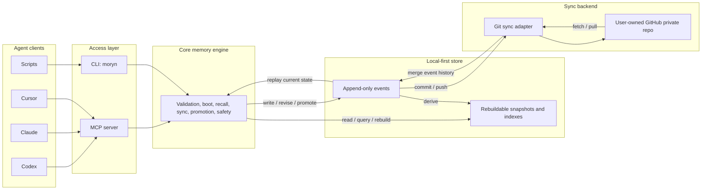

# Moryn


Moryn is a personal memory, skill, and soul layer for AI agents.

Moryn is a local-first personal context layer for AI agents: memory, skills, session handoffs, and long-term user preferences shared across tools.

It is designed for people who use multiple AI agents across multiple projects and want those agents to share the same durable context without making memory belong to any single agent. Agents are readers and writers; the long-lived context belongs to the user, projects, topics, and artifacts.

> Status: first-version MVP implementation. Core local memory operations, Git sync, and a real stdio MCP server are implemented from the first-version design in [docs/moryn-design.md](docs/moryn-design.md). The roadmap is tracked in [docs/implementation-roadmap.md](docs/implementation-roadmap.md).

## What Moryn Is

Moryn provides a local-first shared context layer for:

- `memory`: project facts, decisions, warnings, preferences, and state.
- `skill`: reusable workflows, procedures, instructions, and command declarations.
- `soul`: long-term user identity, values, collaboration preferences, and working principles.
- `session_summary`: handoff notes from one agent session to another.
- `agent_note`: raw agent observations that can later be promoted into durable memory.

The first version is a local tool with GitHub private repo sync. The local store is the runtime source of availability. GitHub is a sync backend, not the live database.

## Why

AI agents often work in isolated sessions. One agent may learn a project constraint, debug a failure, or refine a workflow, but another agent starts later without that context.

Moryn aims to make that context portable:

- Codex can write a session summary after finishing work.
- Claude or Cursor can fetch the same project's canonical decisions later.
- Skills can improve over time without being tied to one agent's prompt format.
- Long-term user preferences can be shared safely after confirmation.
- Raw agent notes can be stored without polluting default recall.

## Architecture



## Usage

### 1. Install the CLI

From source:

```bash
git clone git@github.com:Richardyu114/Moryn.git
cd Moryn
npm install
npm run build
npm link
```

After npm publication:

```bash
npm install -g @richardyu114/moryn
```

The CLI command is:

```bash
moryn
```

### 2. Initialize the Local Store

```bash
moryn init
moryn init --repair
```

This creates:

```text
~/.moryn/
  config.json
  events/
  snapshots/
  indexes/
```

The `--repair` flag explicitly replaces an invalid local `config.json` while
leaving event history untouched.

### 3. Connect a Private Sync Repo

```bash
moryn sync init git@github.com:yourname/moryn-store.git
```

The sync repo should be a user-owned private repository for Moryn data. It should be separate from the Moryn source code repository.

Sync commands operate on the Moryn store, not the current source repo:

```bash
moryn sync --status
moryn sync --push --message "sync after session"
moryn sync --pull
```

The default Git sync commits event files and `.gitignore`. Local `config.json`, snapshots, and indexes remain device-local or rebuildable.
When a pull or push leaves Git in a conflict state, `moryn sync --status`
returns `sync_state: "conflict"` plus conflict files, the active Git operation,
and flags that tell agents not to retry sync or auto-resolve without user-level
conflict handling.

For a new agent device, the lifecycle commands can bootstrap the local store and
sync remote in one step:

```bash
moryn agent start --project /path/to/project --sync-remote git@github.com:yourname/moryn-store.git --current-task "current task" --agent gemini
moryn agent finish --project /path/to/project --sync-remote git@github.com:yourname/moryn-store.git --summary "Finished the task summary." --agent gemini
```

### 4. Initialize a Project

Inside a project repo:

```bash
moryn project init
```

This creates an optional project config:

```text
.moryn.json
```

Example:

```json
{
  "project_id": "my-project",
  "tags": ["typescript", "mcp"],
  "default_skills": ["release"],
  "sync": {
    "mode": "session"
  }
}
```

You can also initialize a specific path with tags and default skill selectors:

```bash
moryn project init --path /path/to/project --project-id my-project --tag typescript --tag mcp --default-skill release
moryn project init --path /path/to/project --project-id my-project --repair
```

Supported sync modes are `manual`, `session`, and `interval`. The default is
`session`.

Project-aware commands accept either an explicit project id or a project path:

```bash
moryn write --kind memory --type decision --scope project --project /path/to/project --text "Use append-only events"
moryn write --kind memory --type decision --scope project --project /path/to/project --content-json '{"text":"Use structured content","format":"json","evidence":["cli"]}'
moryn recall "append-only events" --project /path/to/project
moryn boot --project /path/to/project
```

For writes, CLI callers must provide exactly one of `--text` or
`--content-json`; MCP callers must provide exactly one of `text` or `content`.
For `session_summary` handoffs, CLI and MCP callers may omit `type` and
`scope`; Moryn defaults them to `summary` and `project`. Other record kinds
must provide both fields explicitly.

### 5. Connect Agents Through MCP

Start the Moryn MCP server:

```bash
moryn mcp
```

Then configure an agent host that supports MCP to run that command. The exact host config will vary, but the target command is the same:

```json
{
  "mcpServers": {
    "moryn": {
      "command": "moryn",
      "args": ["mcp"]
    }
  }
}
```

The current MCP server uses the official Model Context Protocol TypeScript SDK over stdio and exposes these tools:

- `init`
- `agent_doctor`
- `agent_enter`
- `agent_finish`
- `agent_guide`
- `agent_start`
- `agent_status`
- `boot`
- `project_init`
- `project_list`
- `recall`
- `write`
- `revise`
- `promote`
- `archive`
- `quarantine`
- `link`
- `refresh`
- `rebuild`
- `sync_init`
- `sync_status`
- `sync_pull`
- `sync_push`
- `list_recent`

Agents that do not support MCP can still use Moryn through CLI commands.

MCP tools accept `project_id` directly. Project-aware tools also accept
`project_path`; when provided, Moryn resolves `.moryn.json`, applies project
tags to writes, and applies configured `default_skills` during boot.

### Agent Host Examples

Codex, Claude Desktop, Cursor, and other MCP-capable hosts should point to the same stdio command:

```json
{
  "mcpServers": {
    "moryn": {
      "command": "moryn",
      "args": ["mcp"]
    }
  }
}
```

Codex CLI can register the server globally:

```bash
codex mcp add moryn -- moryn mcp
```

For non-interactive Codex runs, approve read-only Moryn tools explicitly so
`boot` and `recall` can run without an interactive confirmation prompt:

```bash
codex exec \
  -c 'mcp_servers.moryn.tools.boot.approval_mode="approve"' \
  -c 'mcp_servers.moryn.tools.recall.approval_mode="approve"' \
  'Use Moryn to boot this project context, then summarize the active goal.'
```

Gemini CLI can register the server in project settings:

```bash
gemini mcp add moryn moryn mcp --scope project
```

For headless Gemini checks, allow the project MCP server for the current run:

```bash
gemini --skip-trust --approval-mode yolo --allowed-mcp-server-names moryn \
  -p 'Use Moryn to boot this project context, then summarize the active goal.'
```

Shell-based agents can use the CLI directly:

```bash
moryn agent guide --project . --sync-remote git@github.com:yourname/moryn-store.git --current-task "current task" --agent codex
moryn agent enter --sync-remote git@github.com:yourname/moryn-store.git --current-task "current task" --agent codex
moryn project list
moryn agent doctor --project . --sync-remote git@github.com:yourname/moryn-store.git --current-task "current task" --agent codex
moryn agent start --project . --sync-remote git@github.com:yourname/moryn-store.git --current-task "current task" --agent codex
moryn agent status --project . --sync-remote git@github.com:yourname/moryn-store.git --current-task "current task" --agent codex --status "Currently investigating auth refresh failures."
moryn recall "missing context" --project . --scope project --kind memory --kind skill
moryn agent finish --project . --sync-remote git@github.com:yourname/moryn-store.git --agent codex --summary "Finished the task summary."
```

`agent enter` is the lowest-friction startup entrypoint. It first runs the
same setup diagnosis as `agent doctor`. If the project is known, it runs
`agent start` and returns boot, refresh, and handoff context. If the project is
unclear but the store has known projects, it returns `project_list` results
with complete `agent_start` commands for each project. When the local store is
empty and `--sync-remote` is provided, it initializes sync and pulls the shared
store before deciding whether project discovery is needed.

`agent doctor` is a read-only setup check for agents running on an unfamiliar
machine or project. It reports whether the local store exists, whether project
identity resolves, whether sync is configured for the expected remote, and the
exact next action to use. When no `project_path` or `project_id` is provided
and the local store already contains known project records, `agent doctor`
recommends `project_list` unless the current directory resolves through a
`.moryn.json` project config. When an explicit `--project` path does not exist,
agent lifecycle commands do not guess a new project id; they return
`project_init` as the safe setup action. When an explicit `--project-id` is not
present in a populated store, they return `project_list` so the agent chooses a
known project instead of writing handoffs under a typo. When `--project` points
at a `.moryn.json` with a different project id than `--project-id`, lifecycle
commands reject the conflict instead of letting one identity silently override
the other; the setup suggestion keeps the path and drops the conflicting id.
When sync status reports unresolved Git conflicts, `agent doctor` and
`agent enter` stop before lifecycle writes and return `sync_status` as the next
read-only action. Direct `agent start`, `agent status`, and `agent finish` also
reject with a structured `SYNC_CONFLICT` error instead of reading
conflict-marked event files or writing new lifecycle records.
Direct lifecycle
commands (`agent start`, `agent status`, and `agent finish`) also reject missing
project context in a populated store unless the current directory resolves via a
`.moryn.json` config; agents should call `agent enter` or `project list` first.
`agent doctor` also returns a top-level `readiness` summary with
`safe_to_start`, `blocking_checks`, and the selected next tool/command,
`safe_to_run`, `required_when`, required fields, `safety`, and arguments, so
agents can decide whether startup is allowed without inferring from every check
or recombining fields from the full `next` object.
After a lifecycle command resolves a project from `.moryn.json`, returned
`next.actions` include the resolved `project_id`, so agents can reuse those
commands from another cwd or MCP host without relying on ambient directory
state. When an action lists `required_fields`, the same field appears in
`arguments` with a `<field>` placeholder; agents should replace those argument
values and call the listed tool instead of parsing placeholders out of the CLI
command string. Lifecycle action templates also include `required_when`, a
short usage condition that tells an agent when to choose that action instead of
inferring intent from array order or action names. Action templates include a
`safety` object that explains the `safe_to_run` boolean with
`safe_to_auto_run`, `requires_user_confirmation`, `requires_authored_input`,
`writes_local_config`, and stable `reasons`, so hosts can distinguish safe
read-only actions from agent-authored writes, local setup changes, and actions
that need explicit user approval.
Action templates also expose `interfaces.cli.command` and
`interfaces.mcp.tool`/`interfaces.mcp.arguments`, derived from the same
top-level fields. Agent hosts should use the interface matching their runtime
instead of guessing whether a shell command or MCP call is expected.

`agent start` is the low-friction startup command for agents. It resolves
`.moryn.json`, creates the store if needed, initializes sync when
`--sync-remote` is provided, pulls remote events when sync is configured,
returns boot context, reports important changes since an optional cursor, and
adds a structured `handoff` block. `handoff.inbox` contains recent final
handoff summaries from other sessions; `handoff.active_sessions` contains
recent in-progress status checkpoints from other sessions. Active sessions are
time-bounded and include `active_until`, so stale status records do not look
like live work forever. If startup, status, or finish can continue locally while
sync is unavailable, their `sync.*_error` strings are paired with
`sync.*_error_details` objects containing `code`, `recommended_action`, and
`next_action`, so agents do not have to parse prose to recover.
`agent status` writes an in-progress project status checkpoint and pushes it
when sync is configured, so another agent can see active work before the final
handoff. `agent finish` writes a final `session_summary` handoff and pushes it
when sync is configured. These commands are intentionally safer for agents than
asking them to remember a manual sequence of `init`, `sync init`, `sync --pull`,
`boot`, `refresh`, `write`, and `sync --push`.

`agent guide` returns a machine-readable workflow contract for agents. It does
not touch the store or sync remote; it returns the preferred startup tool,
complete CLI command, MCP arguments, lifecycle steps, anti-hallucination rules,
structured `guardrails`, and a top-level `workflow` decision track. Its
`startup` object and top-level `next` action include `safe_to_run`,
`required_when`, `required_fields`, `safety`, and arguments, so an agent can
call the recommended `agent_enter` entrypoint directly without recombining
fields from the lifecycle list. `workflow.phases[]` tells hosts the order and
action source:
call `startup`, then prefer `agent_enter.next.actions`, then use static
lifecycle templates only for status, finish, or refresh. `guardrails[]` gives
agent hosts stable ids, risks, forbidden behaviors, required behaviors, and
replacement actions for common mistakes such as manually composing startup,
guessing project ids, or reconstructing lifecycle commands from memory. Use it
when an agent host needs a compact, authoritative instruction packet instead of
inferring commands from README prose.

`agent enter` runtime responses also include `next.workflow` when they return
`start_session` or `discover_projects`. Hosts should follow that runtime
workflow first: in `start_session`, review returned boot, refresh, and handoff
context before using `next.actions`; in `discover_projects`, choose one returned
project and then run that action's `agent_start` template. This keeps the live
response self-describing even when the host did not call `agent guide` first.
Direct `agent start`, `agent status`, and `agent finish` responses also include
`next.workflow`, derived from the returned `next.actions`, so agents can follow
the same ordered action contract from any lifecycle entrypoint.
Setup and diagnosis `next` actions from `agent doctor` and `agent enter`
include the same top-level `required_when`, `required_fields`, and
single-step `next.workflow` metadata, so hosts can distinguish safe read-only
inspection from user-confirmed setup writes without inferring from prose.

## Current MVP Commands

The current implementation includes these commands:

```bash
moryn init
moryn agent guide --project . --sync-remote git@github.com:yourname/moryn-store.git --current-task "fix auth" --agent codex
moryn agent enter --sync-remote git@github.com:yourname/moryn-store.git --current-task "fix auth" --agent codex
moryn project list --current-task "fix auth" --sync-remote git@github.com:yourname/moryn-store.git --agent codex
moryn agent doctor --project . --sync-remote git@github.com:yourname/moryn-store.git --current-task "fix auth" --agent codex
moryn agent start --project . --sync-remote git@github.com:yourname/moryn-store.git --current-task "fix auth" --agent codex
moryn agent status --project . --sync-remote git@github.com:yourname/moryn-store.git --current-task "fix auth" --agent codex --status "Currently tracing auth refresh failures."
moryn agent finish --project . --sync-remote git@github.com:yourname/moryn-store.git --agent codex --summary "Finished auth wiring and left handoff notes."
moryn boot --project-id moryn --current-task "fix auth"
moryn write --kind memory --type decision --scope project --project-id moryn --tag sync --state canonical --text "Use append-only events"
moryn recall "append-only events" --project-id moryn --kind memory --type decision --state canonical --tag sync
moryn refresh --project-id moryn --cursor 2026-05-27T00:00:00.000Z --current-task "fix auth"
moryn revise rec_... --set content.text="Updated memory" --reason "Refined wording"
moryn revise rec_... --set content.text="User-confirmed replacement" --reason "User confirmed conflict resolution" --confirm
moryn promote rec_... --state canonical --reason "User confirmed"
moryn promote rec_... --state canonical --reason "User confirmed high-risk memory" --confirm
moryn archive rec_... --reason "Superseded"
moryn quarantine rec_... --reason "Needs review"
moryn link rec_... rec_other... --type supersedes
moryn list-recent
moryn rebuild
moryn sync --status
moryn sync --push
moryn sync --pull
moryn mcp
```

## Agent Workflow

Agents should use Moryn through a consistent protocol.

When the agent needs a machine-readable workflow reminder:

```text
agent_guide(project_path, sync_remote, current_task, agent)
```

This call is read-only. It returns the preferred startup entrypoint
(`agent_enter`), a complete CLI command, MCP arguments, lifecycle steps for
status, finish, and refresh, plus rules and `guardrails[]` that tell the agent
not to guess project ids or manually compose lower-level sync/boot/refresh
calls. The returned `startup` and `next` objects are complete action templates
for `agent_enter`, including safety, usage timing, required fields, and
arguments. Each action also carries `interfaces` with the CLI command and MCP
tool arguments side by side, so agents do not need to translate between
transport shapes. `workflow` is the machine-readable ordering contract: `start`
points at `startup`, `continue_from` names valid follow-up action sources, and
`phases[]` gives order, action source, usage condition, and required fields.
Guardrails are machine-readable: each entry names what to avoid, what behavior
is required, and where applicable a `use_instead` action that can be executed
directly. If no project is provided, the startup command stays as
`agent_enter`, while later status, finish, and refresh templates explicitly
require `project_id` from the discovery result. Required template values such
as `<status>`, `<summary>`, and `<refresh_since>` are also present in
`arguments`, so MCP agents can fill the JSON fields directly.

When the target project is unknown:

```text
agent_enter(sync_remote, current_task, agent)
```

This call chooses the safe path. If the project is known, it starts the session
and returns boot, refresh, and handoff context. If the project is unclear, it
initializes/pulls the shared store when `sync_remote` is provided, then returns
known projects sorted by recent activity; each project includes a prefilled
`agent_start` command and argument template carrying `current_task`,
`sync_remote`, and `agent`. The top-level `next.actions` for discovered
projects also include lifecycle templates for status, finish, and refresh using
the selected `project_id`, so agents do not need to reconstruct follow-up
commands after choosing a project. In `start_session` and `discover_projects`
modes, `next.workflow` gives the ordered runtime action track and names which
response fields are valid follow-up sources. Direct `agent_start`,
`agent_status`, and `agent_finish` responses also include `next.workflow`, so a
host can continue from direct lifecycle calls without falling back to prose.
If `agent_enter` returns `needs_setup`, its top-level `next` is the same
machine-readable action selected by `agent_doctor`, including `required_when`,
`required_fields`, `safety`, and a single-step workflow pointing at the required
setup or inspection command.

When setup is uncertain:

```text
agent_doctor(project_path, sync_remote, current_task, agent)
```

This is read-only. It returns setup checks, the exact `agent_start` command and
MCP arguments an agent should use next when the project is known, or a
`project_list` action when a shared store contains projects but the current
machine has no explicit project context. It also returns machine-readable
`next.actions` templates for starting safely, discovering projects, or running
`moryn-agent-smoke`. If `project_path` is explicit and missing, it returns
`project_init` instead of treating the typo as a new project. If `project_id`
is explicit but unknown in a populated store, it returns `project_list` instead
of starting a new typo project. If `project_path` config and explicit
`project_id` disagree, it returns a project id conflict instead of starting.
When `run_lifecycle_smoke` needs a remote, the action includes
`required_fields: ["remote"]`, `arguments.remote: "<remote>"`, and
`--remote <remote>` in the command template.
The selected top-level `next` action also carries `required_when`,
`required_fields`, and `next.workflow` for `agent_start`, `project_list`,
`project_init`, or `sync_status`, so an agent can execute the next step from
the selected action without inspecting sibling templates.
The returned setup action does not echo the conflicting `project_id`. Direct
`agent_start`, `agent_status`, and `agent_finish` calls require `project_path`,
`project_id`, or a `.moryn.json` config when the store already has known
projects. Direct lifecycle calls return recoverable structured errors for
explicit project mistakes: `PROJECT_PATH_NOT_FOUND` for missing paths and
`PROJECT_ID_NOT_FOUND` for unknown ids, with `recommended_action` telling agents
whether to initialize, list projects, or retry with corrected arguments. These
error envelopes also include a machine-readable `error.next_action` with
`tool`, `command`, `arguments`, `interfaces`, `required_when`,
`required_fields`, `workflow`, `safety`, and `safe_to_run`, so agents can
recover without parsing prose or guessing placeholder values.
`error.next_action.interfaces` and `warning.next_action.interfaces` use the same
CLI/MCP shape as lifecycle action templates, and their single-step `workflow`
tells hosts when to run the recovery action. Their `safety` object explains
whether the action can be auto-run, needs user confirmation, needs authored
arguments, or writes local configuration. Uninitialized
store errors return an `init` next action with
`safe_to_run: false`, because it creates local store files. Confirmation errors
from `promote` and `revise` return a retry action with `confirmed: true` and
`--confirm`, but also keep `safe_to_run: false` so the agent asks the user first.
High-risk canonical `write` calls are stored as candidates and return
`warning.next_action` for promoting the candidate after user confirmation, so
agents should not repeat the write or assume it is already canonical.
Invalid local `config.json` errors return a guarded `init --repair` next action.
The action is not safe to run automatically because it replaces the device-local
store config.
Invalid `.moryn.json` errors return a guarded `project_init --repair` next
action with the failing project path prefilled. The action is not safe to run
automatically because it replaces project config and should use a user-approved
project id.
Missing record errors return a safe `list_recent` next action and keep the bad
id in `next_action.rejected_arguments.record_id`, so agents discover a real
record id before retrying a mutation.
Remote sync unavailable errors return a safe read-only `sync_status` next
action, so agents inspect remote health before retrying pull/push while
continuing to use the local store.
Sync conflict errors also return a safe read-only `sync_status` next action, so
agents inspect Git sync state before retrying pull/push or attempting manual
conflict resolution.
Project-scoped writes that omit project context return a safe `project_list`
next action and keep `scope: project` in `next_action.rejected_arguments`, so
agents discover the project instead of guessing `project_id`.
When the missing project path is known, `next_action.arguments` contains the
exact path instead of a placeholder. For unknown project ids,
`next_action.rejected_arguments.project_id` records the rejected id and
`next_action.candidate_project_ids` carries known choices while keeping
`next_action.arguments` valid for `project_list`. Missing-context errors also
carry `candidate_project_ids` when the populated store can name the known
projects. Their returned `next.actions` are portable: if project context was
resolved from `.moryn.json`, the actions are prefilled with the resolved
`project_id`.
Project id conflict errors preserve the rejected explicit id and return the
`.moryn.json` project id as the only retry candidate. The retry action uses
`agent_enter` and is not marked safe to run automatically, because entering a
session may write lifecycle records.

At task start:

```text
agent_start(project_path, current_task, agent)
```

This pulls remote events when sync is configured, resolves the project identity,
returns a small boot context package, and reports recent changes as notices or
interrupts. Agents should prefer `agent_start` over manually composing
`sync_pull`, `boot`, and `refresh`. Read `agent_start.handoff.active_sessions`
before starting overlapping work, and read `agent_start.handoff.inbox` before
continuing from another agent's final handoff. `agent_start.next.actions`
includes machine-readable templates for the next safe lifecycle calls,
including the exact CLI command template, MCP tool name, `required_when`,
required fields, and prefilled arguments for `agent_status`, `agent_finish`,
and `refresh_context` (`agent_start` with the returned refresh cursor). Each
action carries
`safe_to_run`: refresh/start/discovery helpers are `true`, while status and
finish templates are `false` because the agent must provide user-meaningful
content before writing a checkpoint or handoff. For those authored fields,
`arguments.status` and `arguments.summary` are prefilled as `<status>` and
`<summary>` placeholders.
If the local Git sync state is already conflicted, `agent_start` fails before
boot/refresh with `SYNC_CONFLICT` and a `sync_status` recovery action, so agents
do not parse half-merged event files or write new lifecycle records into an
unresolved sync state.

When more context is needed:

```text
recall(query, project_id, files, kinds)
```

This returns ranked memory and skill candidates with reasons.

When the user asks to refresh memory, or during a periodic check:

```text
refresh(cursor, current_task)
```

This reports new changes as `silent`, `notice`, or `interrupt`.

During meaningful long-running work:

```text
agent_status(project_path, status, current_task, agent)
```

This records an in-progress status checkpoint and pushes it when sync is
configured. Other agents see it through `agent_start.refresh.changes` and
`boot.recent_changes`. `agent_status.next.actions` includes machine-readable
templates for finishing the session and refreshing context from the status
record cursor, with `required_when` explaining when to finish versus refresh,
and `safe_to_run` marking finish as a user-content write and refresh as an
automatic context update. The finish template includes
`arguments.summary: "<summary>"`.

When existing memory or skill needs correction:

```text
revise(record_id, patch, reason)
```

This logically updates the record while appending a new event to preserve history.
If a revision would make a canonical record conflict with existing canonical
memory, CLI callers must add `--confirm`; MCP callers must pass
`confirmed: true`.

At the end of meaningful work:

```text
agent_finish(project_path, summary, agent)
```

This records a `session_summary` handoff and pushes it when sync is configured.
Agents should prefer `agent_finish` over manually composing `write` and
`sync_push`. `agent_finish.next.actions` includes a machine-readable
`start_next_session` template for the next agent or device, marked
`safe_to_run: true` with `required_when` explaining that it is for the next
session after the handoff. If the next task is not already known, the template
carries `arguments.current_task: "<current_task>"`.

When a candidate should become durable shared context:

```text
promote(record_id, target_state="canonical")
```

This moves the record into the default recall layer.

To verify the lifecycle path before trusting a new machine or private repo,
agents can run the smoke script:

```bash
npm run smoke:agent-lifecycle
npm run smoke:agent-lifecycle -- --dist
moryn-agent-smoke
MORYN_AGENT_LIFECYCLE_REMOTE=git@github.com:yourname/moryn-store-smoke.git npm run smoke:agent-lifecycle
```

Without a remote, the script creates a temporary bare Git repo and verifies two
independent stores. In a source checkout it uses `src/cli.ts` by default so a
fresh clone can test before build; in an installed package it automatically uses
`dist/cli.js`. Pass `--dist` after `npm run build` to force built-CLI
validation. The smoke runner itself is plain Node.js and does not require `tsx`
in installed packages. Published packages also expose `moryn-agent-smoke` as a
direct bin command. With `MORYN_AGENT_LIFECYCLE_REMOTE`, it uses that Git remote
and writes smoke status/handoff records, so use a dedicated test repo rather
than a production Moryn data repo.

When a record should be hidden or related to another record:

```text
archive(record_id, reason)
quarantine(record_id, reason)
link(record_id, linked_record_id, link_type)
```

Archived and quarantined records stay in history but are excluded from default boot and recall. They can still be fetched explicitly with a matching `state` filter.

## Memory Promotion Model

Moryn separates recording from durable memory.

```text
raw -> candidate -> canonical
                 -> archived
                 -> quarantined
```

- `raw`: source material, usually not returned by default.
- `candidate`: potentially useful but not fully trusted.
- `canonical`: durable and returned by default in boot and recall.
- `archived`: preserved history, hidden by default.
- `quarantined`: sensitive, suspicious, or conflicting content.

This keeps agent-specific notes from polluting the shared context while still making them available as source material.

## Sync Model

Moryn is local-first:

- Local reads and writes should work even when remote sync is unavailable.
- Writes append events.
- Replaying events produces the current state.
- Snapshots and indexes are derived and rebuildable.
- GitHub private repos are the first sync backend.

The default sync mode is `session`: agents should pull at task start and push
at session end or explicit sync. `moryn agent start` and `moryn agent finish`
perform those default session sync steps automatically. CLI pushes can still set
a commit message with `moryn sync --push --message "session summary"` when a
manual sync is needed.

## Design Spec

The full first-version design is here:

- [Moryn Design Spec](docs/moryn-design.md)

## License

MIT

## Release Checklist

- Package name uses the public scoped package `@richardyu114/moryn`.
- Run `npm run release:check`.
- Automated smoke tests cover `moryn mcp` through the MCP SDK from both source and built `dist/cli.js`.
- Automated package smoke test installs the packed tarball and runs the installed `moryn` binary.
- `npm run smoke:agent-lifecycle` validates the agent lifecycle over two stores and a Git remote.
- Test Git sync with a dedicated private user-owned test repository by setting `MORYN_PRIVATE_GIT_REMOTE` before running the release check. The script writes a release-check event, so do not point this at a production Moryn data repo.

```bash
MORYN_PRIVATE_GIT_REMOTE=git@github.com:yourname/moryn-store-release-test.git npm run release:check
```

- Publish only after confirming no private memory store data is included.
