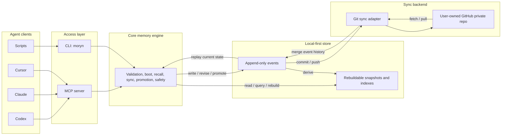

# Moryn


Moryn is a personal memory, skill, and soul layer for AI agents.

Moryn is a local-first personal context layer for AI agents: memory, skills, session handoffs, and long-term user preferences shared across tools.

It is designed for people who use multiple AI agents across multiple projects and want those agents to share the same durable context without making memory belong to any single agent. Agents are readers and writers; the long-lived context belongs to the user, projects, topics, and artifacts.

> Status: first-version MVP implementation. Core local memory operations, Git sync, and a real stdio MCP server are implemented from the first-version design in [docs/moryn-design.md](docs/moryn-design.md). The roadmap is tracked in [docs/implementation-roadmap.md](docs/implementation-roadmap.md).

## What Moryn Is

Moryn provides a local-first shared context layer for:

- `memory`: project facts, decisions, warnings, preferences, and state.
- `skill`: reusable workflows, procedures, instructions, and command declarations.
- `soul`: long-term user identity, values, collaboration preferences, and working principles.
- `session_summary`: handoff notes from one agent session to another.
- `agent_note`: raw agent observations that can later be promoted into durable memory.

The first version is a local tool with GitHub private repo sync. The local store is the runtime source of availability. GitHub is a sync backend, not the live database.

## Why

AI agents often work in isolated sessions. One agent may learn a project constraint, debug a failure, or refine a workflow, but another agent starts later without that context.

Moryn aims to make that context portable:

- Codex can write a session summary after finishing work.
- Claude or Cursor can fetch the same project's canonical decisions later.
- Skills can improve over time without being tied to one agent's prompt format.
- Long-term user preferences can be shared safely after confirmation.
- Raw agent notes can be stored without polluting default recall.

## Architecture



## Usage

### 1. Install the CLI

From source:

```bash
git clone git@github.com:Richardyu114/Moryn.git
cd Moryn
npm install
npm run build
npm link
```

After npm publication:

```bash
npm install -g @richardyu114/moryn
```

The CLI command is:

```bash
moryn
```

### 2. Initialize the Local Store

```bash
moryn init
moryn init --repair
```

This creates:

```text
~/.moryn/
  config.json
  events/
  snapshots/
  indexes/
```

Successful `moryn init` output includes `artifacts.config: "config.json"` and
`selection_sources` for `store`, `config`, `config.store_version`, and
`config.device_id`, so agents can verify setup without guessing the config path.

The `--repair` flag explicitly replaces an invalid local `config.json` while
leaving event history untouched.

### 3. Connect a Private Sync Repo

```bash
moryn sync init git@github.com:yourname/moryn-store.git
```

The sync repo should be a user-owned private repository for Moryn data. It should be separate from the Moryn source code repository.

Sync commands operate on the Moryn store, not the current source repo:

```bash
moryn sync --status
moryn sync --push --message "sync after session"
moryn sync --pull
```

The default Git sync commits event files and `.gitignore`. Local `config.json`, snapshots, and indexes remain device-local or rebuildable.
Successful `sync init`, `sync --pull`, and `sync --push` results include
`selection_sources` for `ok`, `committed`, `pushed`, `pulled`, and `message`, so
agents can inspect sync outcomes without guessing which flags may be present for
each operation. Library hosts can reuse the exported
`SYNC_RESULT_SELECTION_SOURCES` map from the package entrypoint as the canonical
field-path contract.
When a pull or push leaves Git in a conflict state, `moryn sync --status`
returns `sync_state: "conflict"` plus ordered `conflict.files`, keyed
`conflict.files_by_path`, the active Git operation, and flags that tell agents
not to retry sync or auto-resolve without user-level conflict handling.
Every sync status response also includes `selection_sources` for `configured`,
`remote`, `dirty`, `sync_state`, `ahead`, `behind`, `last_sync`, `last_commit`,
and conflict paths such as `conflict.files_by_path.<path>`, so agents can read
status and recovery details without guessing JSON fields.

For a new agent device, the lifecycle commands can bootstrap the local store and
sync remote in one step:

```bash
moryn agent start --project /path/to/project --sync-remote git@github.com:yourname/moryn-store.git --current-task "current task" --agent gemini
moryn agent finish --project /path/to/project --sync-remote git@github.com:yourname/moryn-store.git --summary "Finished the task summary." --agent gemini
```

### 4. Initialize a Project

Inside a project repo:

```bash
moryn project init
```

This creates an optional project config:

```text
.moryn.json
```

Example:

```json
{
  "project_id": "my-project",
  "tags": ["typescript", "mcp"],
  "default_skills": ["release"],
  "sync": {
    "mode": "session"
  }
}
```

You can also initialize a specific path with tags and default skill selectors:

```bash
moryn project init --path /path/to/project --project-id my-project --tag typescript --tag mcp --default-skill release
moryn project init --path /path/to/project --project-id my-project --repair
```

Supported sync modes are `manual`, `session`, and `interval`. The default is
`session`.
Successful `moryn project init` output includes
`artifacts.config: ".moryn.json"` and `selection_sources` for `path`, `config`,
`config.project_id`, `config.tags`, `config.default_skills`, and
`config.sync.mode`.

Project-aware commands accept either an explicit project id or a project path:

```bash
moryn write --kind memory --type decision --scope project --project /path/to/project --text "Use append-only events"
moryn write --kind memory --type decision --scope project --project /path/to/project --content-json '{"text":"Use structured content","format":"json","evidence":["cli"]}'
moryn recall "append-only events" --project /path/to/project
moryn boot --project /path/to/project
```

For writes, CLI callers must provide exactly one of `--text` or
`--content-json`; MCP callers must provide exactly one of `text` or `content`.
For `session_summary` handoffs, CLI and MCP callers may omit `type` and
`scope`; Moryn defaults them to `summary` and `project`. Other record kinds
must provide both fields explicitly.

### 5. Connect Agents Through MCP

Start the Moryn MCP server:

```bash
moryn mcp
```

Then configure an agent host that supports MCP to run that command. The exact host config will vary, but the target command is the same:

```json
{
  "mcpServers": {
    "moryn": {
      "command": "moryn",
      "args": ["mcp"]
    }
  }
}
```

The current MCP server uses the official Model Context Protocol TypeScript SDK over stdio and exposes these tools:

- `init`
- `agent_doctor`
- `agent_enter`
- `agent_finish`
- `agent_guide`
- `agent_start`
- `agent_status`
- `boot`
- `project_init`
- `project_list`
- `recall`
- `write`
- `revise`
- `promote`
- `archive`
- `quarantine`
- `link`
- `refresh`
- `rebuild`
- `sync_init`
- `sync_status`
- `sync_pull`
- `sync_push`
- `list_recent`

Agents that do not support MCP can still use Moryn through CLI commands.

MCP tools accept `project_id` directly. Project-aware tools also accept
`project_path`; when provided, Moryn resolves `.moryn.json`, applies project
tags to writes, and applies configured `default_skills` during boot.

### Agent Host Examples

Codex, Claude Desktop, Cursor, and other MCP-capable hosts should point to the same stdio command:

```json
{
  "mcpServers": {
    "moryn": {
      "command": "moryn",
      "args": ["mcp"]
    }
  }
}
```

Codex CLI can register the server globally:

```bash
codex mcp add moryn -- moryn mcp
```

For non-interactive Codex runs, approve read-only Moryn tools explicitly so
`boot` and `recall` can run without an interactive confirmation prompt:

```bash
codex exec \
  -c 'mcp_servers.moryn.tools.boot.approval_mode="approve"' \
  -c 'mcp_servers.moryn.tools.recall.approval_mode="approve"' \
  'Use Moryn to boot this project context, then summarize the active goal.'
```

Gemini CLI can register the server in project settings:

```bash
gemini mcp add moryn moryn mcp --scope project
```

For headless Gemini checks, allow the project MCP server for the current run:

```bash
gemini --skip-trust --approval-mode yolo --allowed-mcp-server-names moryn \
  -p 'Use Moryn to boot this project context, then summarize the active goal.'
```

Shell-based agents can use the CLI directly:

```bash
moryn agent guide --project . --sync-remote git@github.com:yourname/moryn-store.git --current-task "current task" --agent codex
moryn agent enter --sync-remote git@github.com:yourname/moryn-store.git --current-task "current task" --agent codex
moryn project list
moryn agent doctor --project . --sync-remote git@github.com:yourname/moryn-store.git --current-task "current task" --agent codex
moryn agent start --project . --sync-remote git@github.com:yourname/moryn-store.git --current-task "current task" --agent codex
moryn agent status --project . --sync-remote git@github.com:yourname/moryn-store.git --current-task "current task" --agent codex --status "Currently investigating auth refresh failures."
moryn recall "missing context" --project . --scope project --kind memory --kind skill
moryn agent finish --project . --sync-remote git@github.com:yourname/moryn-store.git --agent codex --summary "Finished the task summary."
```

`agent enter` is the lowest-friction startup entrypoint. It first runs the
same setup diagnosis as `agent doctor`. If the project is known, it runs
`agent start` and returns boot, refresh, and handoff context. If the project is
unclear but the store has known projects, it returns `project_list` results
with complete `agent_start` commands for each project. When the local store is
empty and `--sync-remote` is provided, it initializes sync and pulls the shared
store before deciding whether project discovery is needed.

`agent doctor` is a read-only setup check for agents running on an unfamiliar
machine or project. It reports whether the local store exists, whether project
identity resolves, whether sync is configured for the expected remote, and the
exact next action to use. When no `project_path` or `project_id` is provided
and the local store already contains known project records, `agent doctor`
recommends `project_list` unless the current directory resolves through a
`.moryn.json` project config. When an explicit `--project` path does not exist,
agent lifecycle commands do not guess a new project id; they return
`project_init` as the safe setup action. When an explicit `--project-id` is not
present in a populated store, they return `project_list` so the agent chooses a
known project instead of writing handoffs under a typo. When `--project` points
at a `.moryn.json` with a different project id than `--project-id`, lifecycle
commands reject the conflict instead of letting one identity silently override
the other; the setup suggestion keeps the path and drops the conflicting id.
When sync status reports unresolved Git conflicts, `agent doctor` and
`agent enter` stop before lifecycle writes and return `sync_status` as the next
read-only action. Direct `agent start`, `agent status`, and `agent finish` also
reject with a structured `SYNC_CONFLICT` error instead of reading
conflict-marked event files or writing new lifecycle records.
Direct lifecycle
commands (`agent start`, `agent status`, and `agent finish`) also reject missing
project context in a populated store unless the current directory resolves via a
`.moryn.json` config; agents should call `agent enter` or `project list` first.
`agent doctor` also returns top-level `checks_by_name`, keyed by check name, and
a `readiness` summary with `safe_to_start`, `blocking_checks`,
`blocking_checks_by_name`, and the selected next tool/command, `safe_to_run`,
`required_when`, required fields, `required_fields_by_name`, `safety`,
transport `interfaces`, `workflow`, arguments, `argument_sources`, and
`next_selection_sources`. Agents can inspect `checks_by_name.sync` or
`readiness.blocking_checks_by_name.sync` directly instead of scanning `checks[]`,
and `agent_doctor.selection_sources` names those keyed check paths plus the
selected `next` action path. When `doctor.next` includes alternate actions, its
own `selection_sources` names the keyed `next.actions_by_id.<action>` lookup
paths as well, and readiness mirrors those paths or `{}` when the selected
action has no keyed alternates. Agents can then execute the selected CLI or MCP
action without recombining fields from the full `next` object.
After a lifecycle command resolves a project from `.moryn.json`, returned
`next.actions` include the resolved `project_id`, so agents can reuse those
commands from another cwd or MCP host without relying on ambient directory
state. When an action lists `required_fields`, the same field appears in
`arguments` with a `<field>` placeholder; agents should replace those argument
values and call the listed tool instead of parsing placeholders out of the CLI
command string. Lifecycle action templates also expose `argument_sources` for
replaceable fields: authored values use sources such as `user_input.status`,
`user_input.summary`, `user_input.current_task`, `user_input.path`, or
`user_input.remote`, while
returned lifecycle cursors use `refresh.cursor` or `record.updated_at`.
Lifecycle action templates also include `required_when`, a
short usage condition that tells an agent when to choose that action instead of
inferring intent from array order or action names. Action templates include a
`safety` object that explains the `safe_to_run` boolean with
`safe_to_auto_run`, `requires_user_confirmation`, `requires_authored_input`,
`writes_local_config`, and stable `reasons`, so hosts can distinguish safe
read-only actions from agent-authored writes, local setup changes, and actions
that need explicit user approval. They also include `execution`, a concise
next-step summary with `ready_to_run`, `next_step`,
`blocked_by`, `missing_required_fields`, `required_inputs`,
`required_inputs_by_field`, `required_inputs_by_argument_path`,
`required_input_paths_by_value_path`, `runbook`, and
`requires_user_confirmation`, so hosts can choose between running the action,
collecting fields, asking for confirmation, or blocking automation without
recomputing that policy. `required_input_paths_by_value_path` maps collected
value paths such as `user_input.summary` or `user_input.agent.client` back to
the canonical `execution.required_inputs_by_field.<field>` entry, so hosts can
store user input by value path without scanning required-input arrays.
`blocked_by` is a
machine-readable reason list: `required_fields`, `user_confirmation`, or
`unsafe_action`. Agents should treat `execution.ready_to_run`, not
`safe_to_run` alone, as the immediate run gate. `execution.runbook.next` names
the immediate host action, such as `collect_required_inputs`,
`ask_user_confirmation`, `call_mcp`, or `do_not_run`,
`execution.runbook.current_step` gives the same step name plus its canonical
path in `steps[]`, `execution.runbook.step_paths_by_step` indexes every
available runbook step by step name, and `execution.runbook.steps[]` lists the
full ordered recipe with stable object paths such as
`execution.required_inputs[].collect`,
`execution.required_inputs[].collect.apply_to`,
`execution.required_inputs[].collect.apply_to.assignment_mode`,
`execution.required_inputs[].collect.expected_value`,
`execution.required_inputs[].collect.choice_options[]`,
`execution.required_inputs[].collect.preferred_choice`,
`execution.required_inputs[].collect.choices_by_option.<option>.apply_to`,
`execution.required_inputs[].collect.choices[].apply_to`,
`execution.required_inputs_by_argument_path`, `interfaces.mcp`, and
`interfaces.cli.exec_file` in the order a host should follow. Each
`required_inputs[]` entry names the field,
original `argument_path`, split `argument_paths`, optional argument source,
optional `selection_sources.required_input` and
`selection_sources.required_input_argument_path`, placeholder/value,
`mcp_targets`, `cli_targets`, alternatives, allowed values, and a `collect`
object when present. `collect` is the host-facing input recipe: it gives a
stable `input_key`, a short user prompt, where to apply the answer in MCP and
CLI arguments, the `value_path` such as `user_input.summary`, placeholder, and
any enum or alternative choices, so hosts do not invent questions or argument
mappings from prose. `collect.expected_value` describes the expected user value
shape (`string`, `enum`, `json_object`, `string_list`, and related CLI
encodings) so hosts can render and validate inputs without reverse-engineering
argument metadata. When `collect.input_mode` or
`collect.apply_to.assignment_mode` is `"choose_one"`, hosts should ask for one
value plus one option from `collect.choice_options`, default to
`collect.preferred_choice` when the user has not picked one, look up the selected
option in `collect.choices_by_option`, then apply only that choice's `apply_to`
assignments and `expected_value`; this removes the need to parse `text|content`,
scan arrays, infer defaults, or guess whether all alternatives should be filled.
The collect runbook step also names the aggregate
`collect.apply_to.assignment_mode` path, so hosts that start from assignments
can detect `"choose_one"` before applying any MCP or CLI writes.
`required_inputs_by_field` mirrors those entries by field name for hosts that
already know which input they need. `required_inputs_by_argument_path` mirrors
the same entries by each split argument path, so a host holding the CLI/MCP
argument name, such as `text`, can directly find the broader required field,
such as `text_or_content`. `required_input_paths_by_value_path` gives the
same canonical required-input path from collected value paths, including
multi-flag subpaths. `mcp_targets` tells MCP hosts which argument, nested
path, type, and preferred alternative to fill; `collect.apply_to.mcp_assignments`
turns those targets into direct write-back instructions with `argument`,
optional nested `path`, `value_path`, and preferred flag. `cli_targets` tells CLI
hosts which flag or positional to fill; `collect.apply_to.cli_assignments` turns
those targets into direct write-back instructions with flag or positional,
`value_path`, `argv_template`, `value_encoding`, type, repeatable/default
metadata, and preferred flag.
Lifecycle responses with unique follow-up action ids keep `next.actions` for
ordered display and also expose `next.actions_by_id`, keyed by ids such as
`publish_status`, `finish_session`, `refresh_context`, and
`start_next_session`. Automation should prefer the keyed map when it already
knows which lifecycle action it needs, and use
`next.workflow.phases[].action_source` to find the exact keyed path.
Each lifecycle action also carries a resolved `action_source` such as
`next.actions_by_id.finish_session`, plus action-local `selection_sources`
naming its generic keyed `next.actions_by_id.<action>` source, action-id field,
`arguments_by_name.<argument>`, `required_fields_by_name.<field>`,
`execution.required_inputs_by_field.<field>`,
`execution.required_inputs_by_argument_path.<argument_path>`, and
`argument_sources.<field>` directories, plus ordered `next.actions[]`
fallbacks, so an agent can still recover the stable path if a host passes
around only the selected action object.
Direct `project_list` responses use the same pattern with top-level
`projects_by_id`, keyed by `project_id`; each keyed record mirrors the ordered
`projects[]` entry, and project-list workflow phases prefer
`project_list.projects_by_id.<project_id>.next`. Each nested `next` action also
includes a resolved `action_source` such as
`project_list.projects_by_id.alpha.next` and action-local `selection_sources`,
so agents that pass the action around independently still know the keyed
project, project id, keyed next-action path, action metadata paths, and ordered
fallback paths.
Action templates also expose `interfaces.cli.command`,
`interfaces.cli.command_line`, `interfaces.cli.executable`,
`interfaces.cli.args`, `interfaces.cli.exec_file`, `interfaces.cli.argv`,
`interfaces.cli.placeholders`, `interfaces.cli.has_placeholders`, and
`interfaces.mcp.tool`/`interfaces.mcp.arguments`, derived from the same
top-level fields. `command` is a display label. Agent hosts should prefer
`execFile(exec_file.executable, exec_file.args)` for programmatic CLI execution;
when a shell string is required, use the prequoted `command_line` instead of
reconstructing one. `placeholders` lists unreplaced `<field>` tokens from the
CLI argument vector, so hosts can block direct execution when
`has_placeholders` is true and collect the matching authored input first.

`agent start` is the low-friction startup command for agents. It resolves
`.moryn.json`, creates the store if needed, initializes sync when
`--sync-remote` is provided, pulls remote events when sync is configured,
returns boot context, reports important changes since an optional cursor, and
adds a structured `handoff` block. `handoff.inbox` contains recent final
handoff summaries from other sessions; `handoff.active_sessions` contains
recent in-progress status checkpoints from other sessions. Active sessions are
time-bounded and include `active_until`, so stale status records do not look
like live work forever. Each handoff entry includes a safe `next_action` for the
exact `recall` call that retrieves the full handoff or status record, including
CLI/MCP interfaces, `safety`, `required_when`, `argument_sources`, action-local
`action_source`, `selection_sources`, and workflow metadata. When a handoff
exists, top-level `handoff.next_action` points to the
highest-priority entry action, preferring active sessions before inbox summaries,
so agents can act on `handoff.recommended_action` without choosing a record from prose.
`handoff.inbox_by_record_id` and `handoff.active_sessions_by_record_id` mirror
the ordered handoff arrays for agents that already know a record id, and
`handoff.selection_sources` names the keyed entry, record-id, and next-action
paths for both inbox and active-session entries, including the nested
`next_action.arguments_by_name.<argument>`,
`next_action.required_fields_by_name.<field>`,
`next_action.execution.required_inputs_by_field.<field>`, and
`next_action.argument_sources.<field>` directories. Handoff entry workflows
prefer those keyed paths while keeping the ordered arrays for display. Each
handoff `next_action.action_source` contains the resolved keyed next-action
path, and `next_action.selection_sources` repeats the selected entry, record-id,
next-action, action metadata, and ordered fallback paths for agents that only
receive that action. If startup,
status, or finish can continue locally while
sync is unavailable, their `sync.*_error` strings are paired with
`sync.*_error_details` objects containing `code`, `recommended_action`, and
`next_action`, so agents do not have to parse prose to recover.
`agent status` writes an in-progress project status checkpoint and pushes it
when sync is configured, so another agent can see active work before the final
handoff. `agent finish` writes a final `session_summary` handoff and pushes it
when sync is configured. These commands are intentionally safer for agents than
asking them to remember a manual sequence of `init`, `sync init`, `sync --pull`,
`boot`, `refresh`, `write`, and `sync --push`.

`agent guide` returns a machine-readable workflow contract for agents. It does
not touch the store or sync remote; it returns the preferred startup tool,
complete CLI command, MCP arguments, lifecycle steps, anti-hallucination rules,
structured `guardrails`, and a top-level `workflow` decision track. Its
`startup` object and top-level `next` action include `safe_to_run`,
`required_when`, `required_fields`, `required_fields_by_name`, `safety`,
arguments, their own single-step `workflow`, and action-local
`selection_sources` for `startup`, `next`, and
`workflow.phases_by_name.start_or_resume`, so an agent can call the recommended
`agent_enter` entrypoint directly without recombining fields from the lifecycle
list or scanning workflow phases. `required_fields_by_name` mirrors required field names to
their argument path, current template value, and placeholder such as
`<status>`, so hosts can render or validate authored input without scanning
`arguments`. Each
`lifecycle[]` template is also mirrored in `lifecycle_by_step` by step name and
includes a single-step `workflow`, so a host can execute
`lifecycle_by_step.publish_status`, `lifecycle_by_step.finish_handoff`, or
`lifecycle_by_step.refresh_context` without scanning arrays or consulting the
top-level decision track. Each lifecycle template also carries action-local
`selection_sources` for the keyed `lifecycle_by_step.<step>` template, the
step-id field, required-input lookup, and ordered `lifecycle[]` fallback, so selected templates
remain self-describing when copied out of the guide. Top-level
`workflow.phases[]` tells hosts the order and action source:
call `startup`, then prefer `agent_enter.next.actions`, then use static
lifecycle templates only for status, finish, or refresh. Every workflow also
mirrors `phases[]` in `phases_by_name`, so hosts can read
`workflow.phases_by_name.publish_status` or
`next.workflow.phases_by_name.refresh_context` directly instead of scanning the
ordered phase list. `guardrails[]` gives
agent hosts stable ids, risks, forbidden behaviors, required behaviors, and
replacement actions for common mistakes such as manually composing startup,
guessing project ids, or reconstructing lifecycle commands from memory; the
same anti-hallucination rule texts are mirrored in `rules_by_id` using the
same stable ids, and the structured entries are mirrored in `guardrails_by_id`,
so hosts can read `rules_by_id.use_returned_actions_verbatim`,
`guardrails_by_id.use_returned_actions_verbatim` or
`guardrails_by_id.discover_project_before_lifecycle_writes` directly instead of
scanning the rule or guardrail lists. `selection_sources` names the stable
startup, lifecycle action, rule, and guardrail lookup paths so hosts can bind to
those keyed structures without inferring them from prose. Use it when an agent
host needs a compact, authoritative instruction packet instead of inferring
commands from README prose.

`boot` responses keep ordered arrays for display and also expose keyed mirrors
for agent selection. In addition to the aggregate `records_by_id`, profile
sections include `user_preferences_by_id`, `soul_by_id`, and
`global_rules_by_id`; project sections include `important_decisions_by_id` and
`warnings_by_id`; top-level arrays include `skills_by_id`,
`task_relevant_by_id`, and `recent_changes_by_id`. `selection_sources` names
each of those paths, so a host with a known boot record id can dereference the
record in its section without scanning every boot array.
Library hosts can import the canonical selection-source maps from the package
entrypoint, including `STORE_INIT_SELECTION_SOURCES`,
`PROJECT_INIT_SELECTION_SOURCES`, `REBUILD_SELECTION_SOURCES`,
`WRITE_SELECTION_SOURCES`, `RECALL_SELECTION_SOURCES`,
`BOOT_SELECTION_SOURCES`, `REFRESH_SELECTION_SOURCES`,
`LIST_RECENT_SELECTION_SOURCES`, lifecycle maps such as
`LIFECYCLE_ACTION_SELECTION_SOURCES`, guide and doctor maps such as
`GUIDE_SELECTION_SOURCES` and `DOCTOR_SELECTION_SOURCES`, recovery maps such as
`NEXT_ACTION_SELECTION_SOURCES`, and the sync maps, instead of copying path
strings from command output or docs.
Hosts that prefer one import can use `SELECTION_SOURCE_CONTRACTS`, grouped by
`setup`, `core`, `sync`, `lifecycle`, and `recovery`, to enumerate the same
canonical maps without knowing each individual export name. Shell and MCP hosts
can query the same registry without importing the package by running
`moryn contracts selection-sources` or calling the `selection_source_contracts`
MCP tool. The response includes `selection_sources` for `contracts`,
`contracts.<group>`, `contracts.<group>.<contract>`, and
`contracts.<group>.<contract>.<field>`, so agents can dereference the registry
without guessing its shape.
Agents that need to discover available commands or MCP tools should start with
the compact operation index: `moryn contracts operations --index`,
`operation_contracts` with `{"index":true}`, or package helper
`getOperationContractIndex()`. The index is small enough for a first pass and
maps operation ids, MCP tools, and display CLI commands to the single-operation
lookup commands. Each compact entry also carries an `execution_hint` with the
`execution.ready_to_run` guard, next step, missing required fields, and keyed
required-input paths, so agents can decide whether to fetch details, collect
inputs, or call the operation without recombining fields. Each entry's
`full_contract_lookup` gives concrete package, CLI, and MCP calls for that
operation, so agents do not need to substitute placeholders in the top-level
lookup templates. Its `selection_sources` names the compact index paths,
including `execution_hint` and `full_contract_lookup`; package users can import
`OPERATION_CONTRACT_INDEX_SELECTION_SOURCES` for the same index-specific map.
When a
host needs the full static directory, it can run
`moryn contracts operations` or call `operation_contracts` without filters. That
full registry exposes `operations_by_id`, `operations_by_category`, CLI/MCP
interfaces, `operations_by_mcp_tool`, `operations_by_cli_command`,
`safe_to_run`, `safety`, `execution`, `required_when`, `required_fields`,
`required_fields_by_name`, `arguments_by_name`, and `argument_sources`. Its
selection sources include `operations_by_mcp_tool.<tool>` and
`operations_by_cli_command.<command>` for direct reverse lookups, plus
`operations_by_id.<operation>.interfaces.cli.executable`,
`operations_by_id.<operation>.interfaces.cli.args[]`, and
`operations_by_id.<operation>.interfaces.cli.argv[]` for direct CLI lookups,
`operations_by_id.<operation>.interfaces.cli.exec_file` for the grouped
`execFile` object,
`operations_by_id.<operation>.interfaces.cli.placeholders[]` for unreplaced CLI
placeholder names,
`operations_by_id.<operation>.interfaces.cli.command_line` for a prequoted shell
command, plus
`operations_by_id.<operation>.execution.required_inputs_by_field.<field>` for
field-keyed required-input lookups and
`operations_by_id.<operation>.execution.required_inputs_by_argument_path.<argument_path>`
for direct argument-path lookups. The top-level registry also names
`operations_by_id.<operation>.execution.required_input_paths_by_value_path.<value_path>`.
Operation-local `selection_sources` omit registry-only reverse/group/list paths
and that long value-path entry to keep the contracts response under the 1 MB
host payload budget; use the top-level registry paths with operation-local
fields such as `execution.required_input_paths_by_value_path`.
`execution.required_inputs[]` mirrors required inputs in call-ready form, and
`execution.required_inputs_by_field` indexes the same entries by field name.
`execution.required_inputs_by_argument_path` indexes them by every split
argument path, including alternatives such as `text` and `content`.
`execution.required_input_paths_by_value_path` indexes collected value paths to
canonical `execution.required_inputs_by_field.<field>` paths.
`execution.blocked_by` names why the operation is not immediately runnable, so
hosts can avoid running placeholder commands when `safe_to_run` is true but
required user input is still missing. `execution.runbook` turns those blockers
into ordered machine steps: read `current_step.step` for the immediate action,
`current_step.step_path` for its full descriptor, and `step_paths_by_step` when
the host needs a later step such as `call_mcp` or `ask_user_confirmation` by
name. Hosts should collect required inputs from the `required_inputs` indexes,
ask for user confirmation when required, then call the returned MCP interface or
`exec_file` only after the blockers have been satisfied. The collect step
includes direct paths for `collect.expected_value`,
`collect.choice_options[]`, `collect.preferred_choice`, `collect.choices[]`,
keyed `collect.choices_by_option`, each choice's `apply_to`, and each choice's
`expected_value`, so hosts can follow the input recipe without exploring the
response shape.
Each entry includes `selection_sources.required_input`,
`selection_sources.required_input_argument_path`, `collect`, `mcp_targets`, and
`cli_targets`; hosts should prefer `required_inputs[].collect` when asking the
user and then use `collect.apply_to.mcp_assignments` to patch MCP arguments or
`collect.apply_to.cli_assignments` to construct CLI args from `argv_template`
and `value_encoding`. Use `collect.expected_value.kind` to decide whether the
answer should be a string, enum value, JSON object, list, object field map, or
path-value entries. For alternatives, present `collect.choices[]` to the user
using `collect.choice_options` and `collect.preferred_choice`, then prefer
`collect.choices_by_option.<option>` for execution: use that choice's own
`expected_value` and `apply_to` instructions so only the selected MCP argument
or CLI flag is populated. A top-level
`collect.apply_to.assignment_mode` of `"choose_one"` marks its aggregate
assignments as informational, not a list to apply wholesale. That
keeps hosts from needing to join
`required_fields_by_name` with `arguments_by_name` and `argument_sources`, or
parse `text|content`-style alternative argument paths.
When the host already knows the operation id, MCP tool, or display CLI command,
use the narrow operation contract entrypoint instead of reading the full static
directory: `moryn contracts operations --operation agent_finish`, `moryn
contracts operations --mcp-tool agent_finish`, `moryn contracts operations
--cli-command "moryn agent finish --summary <summary>"`,
`operation_contracts` with `{"operation":"agent_finish"}`,
`{"mcp_tool":"agent_finish"}`, or `{"cli_command":"moryn agent finish
--summary <summary>"}`, or package helpers `getOperationContract("agent_finish")`,
`getOperationContractByMcpTool("agent_finish")`, and
`getOperationContractByCliCommand("moryn agent finish --summary <summary>")`.
The `operation_contracts` registry entry also declares the `index` flag and
single-operation lookup arguments in `arguments_by_name` and
`interfaces.mcp.arguments`, so hosts can discover the filters from the same
contract payload instead of relying on docs.
That response contains one `operation`, its canonical `operation_source`, the
lookup `matched_source`, and the top-level `selection_sources`, so agents can
inspect one call shape without holding the full registry in context. If a host
passes an unknown operation id, MCP tool, or CLI command, the CLI and MCP error
envelope includes `recovery_hint` with the rejected lookup, available operation
ids, the compact index lookup call, and a retry template, so agents can recover
without parsing the error message. If a host accidentally mixes lookup modes,
for example `--index` plus `--operation` or `operation` plus `mcp_tool`, the
same envelope includes `recovery_hint.rejected_lookup.provided` and
`accepted_lookup_modes` so the agent can keep exactly one mode and retry.
CLI and MCP required-option, option-dependency, non-empty string, enum,
integer/number-range, JSON-object, read-filter, project-init, sync-argument,
store-path, event-path-component, schema-validation, write-core-field,
write-content, write-metadata, choose-one, path-assignment, revise-patch,
replay-history, sensitive-content, index-stale, missing-record, sync runtime,
project-selection, confirmation-required, and refresh cursor failures also
include `recovery_hint`:
`rejected_argument` preserves the rejected option and value, `expected` carries
allowed values, non-empty constraints, integer or numeric bounds, JSON object,
write `kind`/`type`/`scope`/`project_id`, write content, write metadata such as
`tags`, `source.client`, `state`, `priority`, `confidence`, `confirmed`, and
`provenance.*`, mutation arguments such as `record_id`, `linked_record_id`,
`target_state`, `reason`, `confirmed`, `source.client`, and `link_type`, MCP
argument requirements such as `type`/`scope`, read filters such as `query`,
`record_ids`, `kinds`, `scopes`, `states`, `tags`, `files`, and `limit`,
boot/refresh read inputs such as `current_task`, `default_skills`, and
`cursor`, project init arguments such as `projectPath`, `project_id`, `tags`,
`default_skills`, `sync.mode`, and `repair`, local store path arguments such as
`storePath`, event path components such as `event_id` and `source.device_id`,
record/event schema validation issues with `path`, `path_string`, and messages,
replay history failures with the bad `event_id`, `event_op`, `record_id`, and
safe rebuild inspection hint,
sensitive-content failures that intentionally omit the detected secret value and
return a redaction retry template,
stale derived-view errors with safe rebuild and retry-after-original-read
instructions,
missing-record failures with safe `list_recent` discovery, selected-id and
ordered fallback sources, and guardrails against inventing ids,
project-selection failures with safe `project_list` discovery, selected-id and
ordered fallback sources, and guardrails against inventing project ids,
confirmation-required failures with explicit user-confirmation requirements,
retry templates, and guardrails against auto-confirming,
sync runtime failures such as missing remotes, unavailable remotes, Git
conflicts, and permission or authentication failures with safe status
inspection, local-store continuity, retry conditions, and `do_not` guardrails,
sync arguments such as `storePath`, `remoteUrl`, `options`, and `message`,
dependency rules such as `--message`
requiring `--push`, project-context requirements, path-assignment shape, revise
patch rules, or ISO datetime cursor requirements,
`missing_argument` or `missing_one_of` names omitted inputs, `rejected_patch`
names invalid patch paths or patch payloads, `rejected_arguments` lists
conflicting inputs, `validation_issues` lists schema paths to repair,
`discover_with` names safe lookup calls, and `retry_with` gives exact
options/arguments plus placeholders for corrected values. Agents should use
those fields instead of splitting the human-readable error message.
Each static operation `interfaces.cli` entry includes a display `command`, a
prequoted `command_line`, `executable`, `args`, grouped `exec_file`, legacy
`argv`, `placeholders`, and `has_placeholders`. For Moryn subcommands,
`exec_file.executable` is `"moryn"` and `exec_file.args` equals the subcommand
`argv`, so programmatic hosts can call `execFile(exec_file.executable,
exec_file.args)` without shell splitting or quote reconstruction. Hosts that
must print or pass a shell command can use `command_line`; placeholders such as
`<summary>` are single-quoted there so they remain one shell argument until
replaced. `has_placeholders` is true when the CLI vector still contains one or
more `<field>` tokens.
`arguments_by_name` is the full parameter directory: each entry names the CLI
flag or positional argument, MCP argument, type, required flag, default,
repeatability, alternatives, and enum `allowed_values` when applicable. This
lets hosts fill optional arguments as well as required placeholders without
parsing command strings.
Library hosts can call `getOperationContractIndex()` for discovery,
`getOperationContracts()` for the full directory, `getOperationContract(operation)`,
`getOperationContractByMcpTool(tool)`, or `getOperationContractByCliCommand(command)`
for one operation, and reuse `OPERATION_CONTRACTS_SELECTION_SOURCES`. Treat this
as static operation metadata; after any runtime response returns `next.actions`,
prefer those returned actions because they include the current project, sync,
cursor, and handoff context. The `moryn contracts operations` CLI command and
the `operation_contracts` MCP tool emit compact JSON text for this large
registry, and both support the same index and single-operation filters for
smaller host payloads.

`agent enter` runtime responses also include `next.workflow` when they return
`start_session` or `discover_projects`. Hosts should follow that runtime
workflow first: in `start_session`, review returned boot, refresh, and handoff
context before using `next.actions_by_id` or `next.actions`, with
`required_end_action_source` and `recommended_refresh_action_source` pointing
at the keyed finish and refresh templates; in
`discover_projects`, top-level `next.required_fields_by_name.project_id` and
`next.arguments.project_id` declare the required project choice, then hosts run
the matching `next.actions_by_project_id.<project_id>` `agent_start` template
or use the ordered action list as a display fallback. `next.selection_sources`
names the selected project, `project_id`, start action, and lifecycle action
map paths, including the selected start action's required-input lookup. This keeps the live
response self-describing even when the host did not call `agent guide` first.
Direct `agent start`, `agent status`, and `agent finish` responses also include
`next.workflow`, derived from the returned action templates, so agents can follow
the same ordered action contract from any lifecycle entrypoint. Workflow phases
prefer `next.actions_by_id.<action>` as the stable source and retain
`next.actions` as an ordered compatibility list; `next.workflow.phases_by_name`
mirrors those phases by name for direct lookup. Each lifecycle action repeats
the resolved keyed path in `action_source` plus keyed and ordered paths in
action-local `selection_sources`, so selected actions remain self-describing
after they are copied out of the response.
Setup and diagnosis `next` actions from `agent doctor` and `agent enter`
include `action_source: "next"` plus the same top-level `required_when`,
`required_fields`, and single-step `next.workflow` metadata, so hosts can
distinguish safe read-only inspection from user-confirmed setup writes without
inferring from prose. `agent doctor.readiness.next_action_source` mirrors that
selected top-level path.
Runtime action `interfaces.cli.executable`, `interfaces.cli.args`,
`interfaces.cli.exec_file`, `interfaces.cli.argv`,
`interfaces.cli.placeholders`, `interfaces.cli.has_placeholders`, and
`interfaces.cli.command_line` fields are generated from operation metadata and
filled with the live arguments returned in that response. Use
`next.actions_by_id.<action>.interfaces.cli.executable` plus
`next.actions_by_id.<action>.interfaces.cli.args[]`, the grouped
`next.actions_by_id.<action>.interfaces.cli.exec_file`, or the equivalent
`startup.interfaces.cli.*`, `next.interfaces.cli.*`,
`next.actions_by_project_id.<project_id>.interfaces.cli.*`,
`project_list.projects_by_id.<project_id>.next.interfaces.cli.*`,
`refresh.changes_by_record_id.<record_id>.next_action.interfaces.cli.*`,
`error.next_action.interfaces.cli.*`, and `warning.next_action.interfaces.cli.*`
paths when a host needs an executable CLI vector or the prequoted
`interfaces.cli.command_line`. For Moryn subcommands,
`exec_file.executable` is `"moryn"` and `exec_file.args` equals `argv`. For
direct package bins such as `moryn-agent-smoke`, `exec_file.executable` is the
bin name, `exec_file.args` excludes the bin, and `argv` keeps the full legacy
vector with the bin as the first element. Hosts should treat
`interfaces.cli.has_placeholders: true` or `execution.ready_to_run: false` as a
signal to collect the named fields before running `exec_file`.

## Current MVP Commands

The current implementation includes these commands:

```bash
moryn init
moryn agent guide --project . --sync-remote git@github.com:yourname/moryn-store.git --current-task "fix auth" --agent codex
moryn agent enter --sync-remote git@github.com:yourname/moryn-store.git --current-task "fix auth" --agent codex
moryn project list --current-task "fix auth" --sync-remote git@github.com:yourname/moryn-store.git --agent codex
moryn agent doctor --project . --sync-remote git@github.com:yourname/moryn-store.git --current-task "fix auth" --agent codex
moryn agent start --project . --sync-remote git@github.com:yourname/moryn-store.git --current-task "fix auth" --agent codex
moryn agent status --project . --sync-remote git@github.com:yourname/moryn-store.git --current-task "fix auth" --agent codex --status "Currently tracing auth refresh failures."
moryn agent finish --project . --sync-remote git@github.com:yourname/moryn-store.git --agent codex --summary "Finished auth wiring and left handoff notes."
moryn boot --project-id moryn --current-task "fix auth"
moryn write --kind memory --type decision --scope project --project-id moryn --tag sync --state canonical --text "Use append-only events"
moryn recall "append-only events" --project-id moryn --kind memory --type decision --state canonical --tag sync
moryn refresh --project-id moryn --cursor 2026-05-27T00:00:00.000Z --current-task "fix auth"
moryn revise rec_... --set content.text="Updated memory" --reason "Refined wording"
moryn revise rec_... --set content.text="User-confirmed replacement" --reason "User confirmed conflict resolution" --confirm
moryn promote rec_... --state canonical --reason "User confirmed"
moryn promote rec_... --state canonical --reason "User confirmed high-risk memory" --confirm
moryn archive rec_... --reason "Superseded"
moryn quarantine rec_... --reason "Needs review"
moryn link rec_... rec_other... --type supersedes
moryn list-recent
moryn rebuild
moryn sync --status
moryn sync --push
moryn sync --pull
moryn mcp
```

`moryn rebuild` returns the regenerated artifact paths under
`artifacts.snapshots` and `artifacts.indexes`, plus `selection_sources` for
`records`, `projects`, `skills`, and each artifact path. Agents can read the
reported `artifacts.snapshots.projects_by_id.<project_id>` path instead of
guessing where derived files live.

## Agent Workflow

Agents should use Moryn through a consistent protocol.

When the agent needs a machine-readable workflow reminder:

```text
agent_guide(project_path, sync_remote, current_task, agent)
```

This call is read-only. It returns the preferred startup entrypoint
(`agent_enter`), a complete CLI command, MCP arguments, lifecycle steps for
status, finish, and refresh, plus rules and `guardrails[]` that tell the agent
not to guess project ids or manually compose lower-level sync/boot/refresh
calls. The returned `startup` and `next` objects are complete action templates
for `agent_enter`, including safety, usage timing, required fields, and
arguments plus a single-step `workflow`. Each action also carries `interfaces`
with the CLI command and MCP tool arguments side by side, so agents do not need
to translate between transport shapes. Top-level `workflow` is the
machine-readable ordering contract: `start`
points at `startup`, `continue_from` names valid follow-up action sources, and
`phases[]` gives order, action source, usage condition, and required fields.
Guardrails are machine-readable: each entry names what to avoid, what behavior
is required, and where applicable a `use_instead` action that can be executed
directly. `guardrails_by_id` mirrors the list by guardrail id, so agents can
look up a known anti-hallucination rule without array matching. If no project
is provided, the startup command stays as
`agent_enter`, while later status, finish, and refresh templates explicitly
require `project_id` from the discovery result. Required template values such
as `<status>`, `<summary>`, and `<refresh_since>` are also present in
`arguments`, so MCP agents can fill the JSON fields directly.

When the target project is unknown:

```text
agent_enter(sync_remote, current_task, agent)
```

This call chooses the safe path. If the project is known, it starts the session
and returns boot, refresh, and handoff context. If the project is unclear, it
initializes/pulls the shared store when `sync_remote` is provided, then returns
known projects sorted by recent activity; each project includes a prefilled
`agent_start` action template carrying `current_task`, `sync_remote`, `agent`,
transport `interfaces`, `safety`, `required_when`, and single-step `workflow`.
The top-level `next.actions` for discovered
projects also include lifecycle templates for status, finish, and refresh using
the selected `project_id`, so agents do not need to reconstruct follow-up
commands after choosing a project. Those discovered lifecycle templates carry
the same `lifecycle_by_step` map and single-step `workflow` metadata as
`agent_guide.lifecycle[]`, plus action-local `selection_sources` that point back
to `next.actions_by_project_id.<project_id>.lifecycle_by_step.<step>` and the
ordered lifecycle fallback for the selected project. Because each discovered
action is named
`start_session`, `agent_enter` also returns `next.actions_by_project_id` so
automation can select a project by id without guessing from array order. Its
top-level `next` declares `project_id` as the only required field and carries a
placeholder `agent_start` command plus CLI/MCP interfaces; after choosing, the
stable executable source is `next.actions_by_project_id.<project_id>`.
`next.selection_sources` also points at the selected project, selected
`project_id`, start action, start-action metadata, and selected lifecycle
templates. In direct
`project_list`, the top-level `projects_by_id` map serves the same purpose:
`projects[]` stays ordered for display, while `projects_by_id.<project_id>.next`
is the stable action source for a known project id; `selection_sources` names
those keyed paths explicitly. The nested `next.selection_sources` repeats the
fully qualified `project_list.projects_by_id.<project_id>.next` and
`project_list.projects[].next` sources, plus their parameter, required-field,
required-input, and argument-source directories, for hosts that only receive the
selected action.
In
`start_session` and `discover_projects` modes, `next.workflow` gives the
ordered runtime action track and names which response fields are valid follow-up
sources. In `start_session`, `required_end_action_source` and
`recommended_refresh_action_source` directly identify the keyed finish and
refresh templates in `next.actions_by_id`. Direct `agent_start`,
`agent_status`, and `agent_finish` responses also include `next.workflow`, so a
host can continue from direct lifecycle calls without falling back to prose.
If `agent_enter` returns `needs_setup`, its top-level `next` is the same
machine-readable action selected by `agent_doctor`, including `required_when`,
`required_fields`, `safety`, and a single-step workflow pointing at the required
setup or inspection command. If `agent_doctor.next` includes `actions_by_id`, it
also includes `next.selection_sources` for those keyed candidate actions.

When setup is uncertain:

```text
agent_doctor(project_path, sync_remote, current_task, agent)
```

This is read-only. It returns setup checks, the exact `agent_start` command and
MCP arguments an agent should use next when the project is known, or a
`project_list` action when a shared store contains projects but the current
machine has no explicit project context. It also returns machine-readable
`next.actions` templates for starting safely, discovering projects, or running
`moryn-agent-smoke`. If `project_path` is explicit and missing, it returns
`project_init` instead of treating the typo as a new project. If `project_id`
is explicit but unknown in a populated store, it returns `project_list` instead
of starting a new typo project. If `project_path` config and explicit
`project_id` disagree, it returns a project id conflict instead of starting.
When `run_lifecycle_smoke` needs a remote, the action includes
`required_fields: ["remote"]`, `arguments.remote: "<remote>"`, and
`--remote <remote>` in the command template.
The selected top-level `next` action also carries `required_when`,
`required_fields`, and `next.workflow` for `agent_start`, `project_list`,
`project_init`, or `sync_status`, so an agent can execute the next step from
the selected action without inspecting sibling templates.
The returned setup action does not echo the conflicting `project_id`. Direct
`agent_start`, `agent_status`, and `agent_finish` calls require `project_path`,
`project_id`, or a `.moryn.json` config when the store already has known
projects. Direct lifecycle calls return recoverable structured errors for
explicit project mistakes: `PROJECT_PATH_NOT_FOUND` for missing paths and
`PROJECT_ID_NOT_FOUND` for unknown ids, with `recommended_action` telling agents
whether to initialize, list projects, or retry with corrected arguments. These
error envelopes also include machine-readable `error.recovery_hint` and
`error.next_action` fields with
`tool`, `command`, `arguments`, `interfaces`, `required_when`,
`required_fields`, `required_fields_by_name`, `arguments_by_name`,
`argument_sources`, `action_source`,
`selection_sources`, `workflow`, `safety`, `execution`, and `safe_to_run`, so
agents can recover without parsing prose or guessing placeholder values.
`arguments_by_name` uses the same operation argument metadata as
`moryn contracts operations`, so recovery actions also expose supported CLI/MCP
arguments, defaults, repeatable flags, alternatives, and enum values.
When a recovery action still needs authored setup input, the same
`argument_sources` map names that source, such as `user_input.remote`,
`user_input.path`, or `user_input.project_id`.
`error.next_action.interfaces` and `warning.next_action.interfaces` use the same
CLI/MCP shape as lifecycle action templates, including safe CLI
`exec_file` objects, `executable`/`args` pairs, prequoted `command_line`, and
compatibility `argv` arrays, plus `placeholders` and `has_placeholders` for
detecting unreplaced authored inputs.
Most recovery actions have a single-step `workflow`; missing-record recovery is
two-step so hosts run `list_recent`, choose a returned id, and retry the
original tool with that id.
`next_action.selection_sources` names both `error.next_action` and
`warning.next_action` container paths plus keyed `required_fields_by_name`,
`execution.required_inputs_by_field`,
`execution.required_inputs_by_argument_path`, `arguments_by_name`,
`argument_sources`, and `workflow.phases_by_name` paths, so recovery hosts do
not infer where a returned action lives.
`error.next_action.action_source` and `warning.next_action.action_source` are
`"next_action"` for hosts that pass the nested action around without its
envelope.
The retry phase and top-level `argument_sources` point replacement fields at
`list_recent.records_by_id.<record_id>.id`; `list_recent.records[].id` remains
available as the ordered view. `list_recent.selection_sources` names the same
keyed record and record-id paths for hosts that should not infer them from
error-recovery workflows.
Their `safety` object explains whether the action can be auto-run, needs user
confirmation, needs authored arguments, or writes local configuration. Uninitialized
store errors return an `init` next action with
`safe_to_run: false`, because it creates local store files. Confirmation errors
from `promote` and `revise` return a retry action with `confirmed: true` and
`--confirm`, plus a `recovery_hint` that marks user confirmation as required.
They also keep `safe_to_run: false` so the agent asks the user first.
The adjacent `execution.next_step` gives the immediate branch (`run`,
`collect_required_fields`, `confirm_with_user`, or `do_not_auto_run`) for hosts
that should not merge safety flags and required-field lists manually.
High-risk canonical `write` calls are stored as candidates and return
`warning.next_action` for promoting the candidate after user confirmation, so
agents should not repeat the write or assume it is already canonical. That
action includes `candidate_record_id`, sets `argument_sources.record_id` to
`"write.record.id"`, and uses `write.record.id` as the workflow `record_id`
replacement source, so hosts can promote the created candidate without
inventing or rediscovering an id. Successful mutation responses also expose
top-level `selection_sources`: `write` names `record`, `record.id`, and
`warning.next_action`; `revise`, `promote`, `archive`, and `quarantine` name
`event`, `event.event_id`, and `event.record_id`; `link` also names
`event.linked_record_id`; sensitive revisions additionally name
`quarantine_event` and `quarantine_event.event_id`. Agents can pass these ids
to the next action without guessing which nested field is authoritative.
Invalid local `config.json` errors return a guarded `init --repair` next action.
The action is not safe to run automatically because it replaces the device-local
store config.
Invalid `.moryn.json` errors return a guarded `project_init --repair` next
action with the failing project path prefilled. The action is not safe to run
automatically because it replaces project config and should use a user-approved
project id.
Missing record errors return a safe `list_recent` next action and a compact
`recovery_hint` with the rejected argument, selected-id source, ordered fallback
source, and `do_not` guardrails against inventing ids or retrying the same bad
id. The workflow then adds a
`retry_original_tool_with_selected_record_id` phase with the original tool,
command, and JSON arguments when the failing entrypoint supplied context, so
agents discover a real id and retry without inventing the mutation shape.
`next_action.argument_sources` mirrors that replacement map at the top level, so
hosts can fill the retry arguments without scanning workflow phases.
Remote sync unavailable errors return a safe read-only `sync_status` next
action, so agents inspect remote health before retrying pull/push while
continuing to use the local store.
Sync conflict errors also return a safe read-only `sync_status` next action, so
agents inspect Git sync state before retrying pull/push or attempting manual
conflict resolution.
Project-scoped writes that omit project context return a safe `project_list`
next action and keep `scope: project` in `next_action.rejected_arguments`, so
agents discover the project instead of guessing `project_id`.
When the missing project path is known, `next_action.arguments` contains the
exact path instead of a placeholder. For unknown project ids,
`recovery_hint.rejected_argument` and
`next_action.rejected_arguments.project_id` record the rejected id, while
`candidate_project_ids` carries known choices and `next_action.arguments` stays
valid for `project_list`. Missing-context errors also carry
`candidate_project_ids` when the populated store can name the known projects.
The hint names `project_list.projects_by_id.<project_id>.project_id` as the
selected retry source and `project_list.projects[].project_id` as the ordered
fallback, with guardrails against inventing project ids. Unknown-project and
missing-context workflows then add a
`retry_original_tool_with_selected_project_id` phase. That phase uses
`project_list.projects_by_id.<project_id>.project_id` as the replacement source
and mirrors it in `next_action.argument_sources.project_id`; it includes the
original tool, command, and JSON arguments when the failing entrypoint supplied
context. Their returned `next.actions` are portable: if
project context was resolved from `.moryn.json`, the actions are prefilled with
the resolved `project_id`.
Project id conflict errors preserve the rejected explicit id and return the
`.moryn.json` project id as the only retry candidate. The retry action uses
`agent_enter` and is not marked safe to run automatically, because entering a
session may write lifecycle records.

At task start:

```text
agent_start(project_path, current_task, agent)
```

This pulls remote events when sync is configured, resolves the project identity,
returns a small boot context package, and reports recent changes as notices or
interrupts. Agents should prefer `agent_start` over manually composing
`sync_pull`, `boot`, and `refresh`. Boot responses include `records_by_id`,
which mirrors the record objects returned in profile, project, skills,
task-relevant, and recent-change sections so agents can dereference a known
boot record id without scanning nested arrays. `boot.selection_sources` names
the aggregate keyed boot record plus each section-local by-id path explicitly:
profile preferences, soul records, global rules, project decisions, project
warnings, skills, task-relevant records, and recent changes. These section
mirrors let agents inspect known boot context in its semantic location without
scanning every boot array. `list_recent` responses also return
ordered `records` plus `records_by_id` and `selection_sources`; after a missing-record error,
prefer `list_recent.records_by_id.<record_id>.id` for the selected replacement
id and use `list_recent.records[].id` only as an ordered compatibility view. Read
`agent_start.handoff.active_sessions`
before starting overlapping work, and read `agent_start.handoff.inbox` before
continuing from another agent's final handoff; follow `agent_start.handoff.next_action`
for the first prioritized recall action or a specific handoff entry's
`next_action` when the full session record is needed. If the handoff record id
is known, prefer
`agent_start.handoff.active_sessions_by_record_id.<record_id>.next_action` or
`agent_start.handoff.inbox_by_record_id.<record_id>.next_action` instead of
scanning the handoff arrays. `agent_start.handoff.selection_sources` names the
same keyed paths for hosts that should not infer them from workflow phases, and
each handoff `next_action.selection_sources` repeats the selected action-local
paths. Agents should fill `record_ids` from the action's
`argument_sources.record_ids`.
`agent_start.next.actions`
includes machine-readable templates for the next safe lifecycle calls,
including the exact CLI command template, MCP tool name, `required_when`,
required fields, and prefilled arguments for `agent_status`, `agent_finish`,
and `refresh_context` (`agent_start` with the returned refresh cursor). Each
action is also available under `agent_start.next.actions_by_id.<action>`, so an
agent can call `finish_session` or `refresh_context` without scanning the array.
The top-level `required_end_action_id` and `recommended_refresh_action_id`
point at those keyed entries directly; `required_end_action_source` and
`recommended_refresh_action_source` also expose the exact JSON paths, so hosts can execute
`agent_start.next.actions_by_id[agent_start.next.required_end_action_id]`
instead of translating prose hints into action ids. `agent_start.next.selection_sources`
names the generic keyed action and action-id paths for hosts that should not
infer them from workflow phases.
Each action also carries action-local `selection_sources`, so a selected
template still points back to `next.actions_by_id.<action>` even when handled
outside the full `agent_start` response. Each action carries
`safe_to_run`: refresh/start/discovery helpers are `true`, while status and
finish templates are `false` because the agent must provide user-meaningful
content before writing a checkpoint or handoff. For those authored fields,
`arguments.status` and `arguments.summary` are prefilled as `<status>` and
`<summary>` placeholders, with matching `argument_sources` values of
`user_input.status` and `user_input.summary`. Refresh templates fill
`refresh_since` from `refresh.cursor` in `agent_start.next.actions`, or from
`record.updated_at` after `agent_status`.
If the local Git sync state is already conflicted, `agent_start` fails before
boot/refresh with `SYNC_CONFLICT` and a `sync_status` recovery action, so agents
do not parse half-merged event files or write new lifecycle records into an
unresolved sync state.

When more context is needed:

```text
recall(query, project_id, files, kinds)
```

This returns ranked memory and skill candidates with reasons. `results[]`
preserves ranking for display, and `results_by_id` mirrors the returned results
by `record.id` so agents that already have a record id can read the exact
result without scanning the ranked array. `selection_sources` names the keyed
result, record, and record-id paths explicitly.

When the user asks to refresh memory, or during a periodic check:

```text
refresh(cursor, current_task)
```

This reports new changes as `silent`, `notice`, or `interrupt`.
Reportable non-raw changes also include `next_action` metadata for the exact
safe `recall` call, with CLI/MCP interfaces, `required_when`, `safety`,
`argument_sources`, resolved `action_source`, action-local `selection_sources`,
and a single-step workflow. `changes[]` remains the ordered display list, and
`changes_by_record_id` mirrors the returned changes by record id.
`selection_sources` names the keyed change, record-id, and next-action paths;
`next_action.selection_sources` repeats the fully qualified keyed and ordered
paths so agents that only receive the action can follow
`refresh.changes_by_record_id.<record_id>.next_action` and fill `record_ids`
from `next_action.argument_sources.record_ids`; if a refresh action later needs
authored input, hosts can inspect
`next_action.execution.required_inputs_by_field.<field>` or
`next_action.execution.required_inputs_by_argument_path.<argument_path>` without
scanning an array or synthesizing arguments from prose.

During meaningful long-running work:

```text
agent_status(project_path, status, current_task, agent)
```

This records an in-progress status checkpoint and pushes it when sync is
configured. Other agents see it through `agent_start.refresh.changes` and
`boot.recent_changes`. `agent_status.next.actions` includes machine-readable
templates for finishing the session and refreshing context from the status
record cursor, with `required_when` explaining when to finish versus refresh,
and `safe_to_run` marking finish as a user-content write and refresh as an
automatic context update. The finish template includes
`arguments.summary: "<summary>"` and `argument_sources.summary:
"user_input.summary"`; the refresh template sets `argument_sources.refresh_since:
"record.updated_at"`. The top-level `recommended_finish_action_id` and
`recommended_refresh_action_id` point at the matching keyed templates in
`agent_status.next.actions_by_id`; the matching
`recommended_finish_action_source` and `recommended_refresh_action_source`
fields expose the exact JSON paths. `agent_status.next.selection_sources` names
the generic keyed action and action-id paths.

When existing memory or skill needs correction:

```text
revise(record_id, patch, reason)
```

This logically updates the record while appending a new event to preserve history.
If a revision would make a canonical record conflict with existing canonical
memory, CLI callers must add `--confirm`; MCP callers must pass
`confirmed: true`. The response includes `selection_sources` for the mutation
event id and affected record id; if sensitive content is detected during
revision, it also includes a quarantining event and paths for that event.

At the end of meaningful work:

```text
agent_finish(project_path, summary, agent)
```

This records a `session_summary` handoff and pushes it when sync is configured.
Agents should prefer `agent_finish` over manually composing `write` and
`sync_push`. `agent_finish.next.actions` includes a machine-readable
`start_next_session` template for the next agent or device, marked
`safe_to_run: true` with `required_when` explaining that it is for the next
session after the handoff. `agent_finish.next.recommended_start_action_id`
points at the same keyed template in `next.actions_by_id`, and
`agent_finish.next.recommended_start_action_source` exposes the exact JSON
path. `agent_finish.next.selection_sources` names the generic keyed action and
action-id paths. If the next task is
not already known, the template
carries `arguments.current_task: "<current_task>"` and
`argument_sources.current_task: "user_input.current_task"`.

When a candidate should become durable shared context:

```text
promote(record_id, target_state="canonical")
```

This moves the record into the default recall layer.

To verify the lifecycle path before trusting a new machine or private repo,
agents can run the smoke script:

```bash
npm run smoke:agent-lifecycle
npm run smoke:agent-lifecycle -- --dist
moryn-agent-smoke
MORYN_AGENT_LIFECYCLE_REMOTE=git@github.com:yourname/moryn-store-smoke.git npm run smoke:agent-lifecycle
```

Without a remote, the script creates a temporary bare Git repo and verifies two
independent stores. In a source checkout it uses `src/cli.ts` by default so a
fresh clone can test before build; in an installed package it automatically uses
`dist/cli.js`. Pass `--dist` after `npm run build` to force built-CLI
validation. The smoke runner itself is plain Node.js and does not require `tsx`
in installed packages. Published packages also expose `moryn-agent-smoke` as a
direct bin command. With `MORYN_AGENT_LIFECYCLE_REMOTE`, it uses that Git remote
and writes smoke status/handoff records, so use a dedicated test repo rather
than a production Moryn data repo.

When a record should be hidden or related to another record:

```text
archive(record_id, reason)
quarantine(record_id, reason)
link(record_id, linked_record_id, link_type)
```

Archived and quarantined records stay in history but are excluded from default boot and recall. They can still be fetched explicitly with a matching `state` filter.
These mutation responses include `selection_sources` for the event id and
affected record id; link responses also name the linked record id path.

## Memory Promotion Model

Moryn separates recording from durable memory.

```text
raw -> candidate -> canonical
                 -> archived
                 -> quarantined
```

- `raw`: source material, usually not returned by default.
- `candidate`: potentially useful but not fully trusted.
- `canonical`: durable and returned by default in boot and recall.
- `archived`: preserved history, hidden by default.
- `quarantined`: sensitive, suspicious, or conflicting content.

This keeps agent-specific notes from polluting the shared context while still making them available as source material.

## Sync Model

Moryn is local-first:

- Local reads and writes should work even when remote sync is unavailable.
- Writes append events.
- Replaying events produces the current state.
- Snapshots and indexes are derived and rebuildable.
- GitHub private repos are the first sync backend.

The default sync mode is `session`: agents should pull at task start and push
at session end or explicit sync. `moryn agent start` and `moryn agent finish`
perform those default session sync steps automatically. CLI pushes can still set
a commit message with `moryn sync --push --message "session summary"` when a
manual sync is needed.

## Design Spec

The full first-version design is here:

- [Moryn Design Spec](docs/moryn-design.md)

## License

MIT

## Release Checklist

- Package name uses the public scoped package `@richardyu114/moryn`.
- Run `npm run release:check`.
- Automated smoke tests cover `moryn mcp` through the MCP SDK from both source and built `dist/cli.js`.
- Automated package smoke test installs the packed tarball and runs the installed `moryn` binary.
- `npm run smoke:agent-lifecycle` validates the agent lifecycle over two stores and a Git remote.
- Test Git sync with a dedicated private user-owned test repository by setting `MORYN_PRIVATE_GIT_REMOTE` before running the release check. The script writes a release-check event, so do not point this at a production Moryn data repo.

```bash
MORYN_PRIVATE_GIT_REMOTE=git@github.com:yourname/moryn-store-release-test.git npm run release:check
```

- Publish only after confirming no private memory store data is included.
