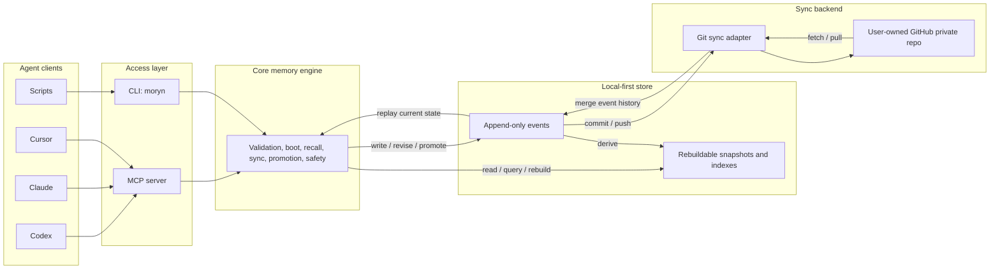

# Moryn


Moryn is a personal memory, skill, and soul layer for AI agents.

Moryn is a local-first personal context layer for AI agents: memory, skills, session handoffs, and long-term user preferences shared across tools.

It is designed for people who use multiple AI agents across multiple projects and want those agents to share the same durable context without making memory belong to any single agent. Agents are readers and writers; the long-lived context belongs to the user, projects, topics, and artifacts.

> Status: first-version MVP implementation. Core local memory operations, Git sync, and a real stdio MCP server are implemented from the first-version design in [docs/moryn-design.md](docs/moryn-design.md). The roadmap is tracked in [docs/implementation-roadmap.md](docs/implementation-roadmap.md).

## What Moryn Is

Moryn provides a local-first shared context layer for:

- `memory`: project facts, decisions, warnings, preferences, and state.
- `skill`: reusable workflows, procedures, instructions, and command declarations.
- `soul`: long-term user identity, values, collaboration preferences, and working principles.
- `session_summary`: handoff notes from one agent session to another.
- `agent_note`: raw agent observations that can later be promoted into durable memory.

The first version is a local tool with GitHub private repo sync. The local store is the runtime source of availability. GitHub is a sync backend, not the live database.

## Why

AI agents often work in isolated sessions. One agent may learn a project constraint, debug a failure, or refine a workflow, but another agent starts later without that context.

Moryn aims to make that context portable:

- Codex can write a session summary after finishing work.
- Claude or Cursor can fetch the same project's canonical decisions later.
- Skills can improve over time without being tied to one agent's prompt format.
- Long-term user preferences can be shared safely after confirmation.
- Raw agent notes can be stored without polluting default recall.

## Architecture



## Usage

### 1. Install the CLI

From source:

```bash
git clone git@github.com:Richardyu114/Moryn.git
cd Moryn
npm install
npm run build
npm link
```

After npm publication:

```bash
npm install -g @richardyu114/moryn
```

The CLI command is:

```bash
moryn
```

### 2. Initialize the Local Store

```bash
moryn init
```

This creates:

```text
~/.moryn/
  config.json
  events/
  snapshots/
  indexes/
```

### 3. Connect a Private Sync Repo

```bash
moryn sync init git@github.com:yourname/moryn-store.git
```

The sync repo should be a user-owned private repository for Moryn data. It should be separate from the Moryn source code repository.

Sync commands operate on the Moryn store, not the current source repo:

```bash
moryn sync --status
moryn sync --push --message "sync after session"
moryn sync --pull
```

The default Git sync commits event files and `.gitignore`. Local `config.json`, snapshots, and indexes remain device-local or rebuildable.

For a new agent device, the lifecycle commands can bootstrap the local store and
sync remote in one step:

```bash
moryn agent start --project /path/to/project --sync-remote git@github.com:yourname/moryn-store.git --current-task "current task" --agent gemini
moryn agent finish --project /path/to/project --sync-remote git@github.com:yourname/moryn-store.git --summary "Finished the task summary." --agent gemini
```

### 4. Initialize a Project

Inside a project repo:

```bash
moryn project init
```

This creates an optional project config:

```text
.moryn.json
```

Example:

```json
{
  "project_id": "my-project",
  "tags": ["typescript", "mcp"],
  "default_skills": ["release"],
  "sync": {
    "mode": "session"
  }
}
```

You can also initialize a specific path with tags and default skill selectors:

```bash
moryn project init --path /path/to/project --project-id my-project --tag typescript --tag mcp --default-skill release
```

Supported sync modes are `manual`, `session`, and `interval`. The default is
`session`.

Project-aware commands accept either an explicit project id or a project path:

```bash
moryn write --kind memory --type decision --scope project --project /path/to/project --text "Use append-only events"
moryn write --kind memory --type decision --scope project --project /path/to/project --content-json '{"text":"Use structured content","format":"json","evidence":["cli"]}'
moryn recall "append-only events" --project /path/to/project
moryn boot --project /path/to/project
```

For writes, CLI callers must provide exactly one of `--text` or
`--content-json`; MCP callers must provide exactly one of `text` or `content`.
For `session_summary` handoffs, CLI and MCP callers may omit `type` and
`scope`; Moryn defaults them to `summary` and `project`. Other record kinds
must provide both fields explicitly.

### 5. Connect Agents Through MCP

Start the Moryn MCP server:

```bash
moryn mcp
```

Then configure an agent host that supports MCP to run that command. The exact host config will vary, but the target command is the same:

```json
{
  "mcpServers": {
    "moryn": {
      "command": "moryn",
      "args": ["mcp"]
    }
  }
}
```

The current MCP server uses the official Model Context Protocol TypeScript SDK over stdio and exposes these tools:

- `init`
- `agent_doctor`
- `agent_finish`
- `agent_start`
- `agent_status`
- `boot`
- `project_init`
- `project_list`
- `recall`
- `write`
- `revise`
- `promote`
- `archive`
- `quarantine`
- `link`
- `refresh`
- `rebuild`
- `sync_init`
- `sync_status`
- `sync_pull`
- `sync_push`
- `list_recent`

Agents that do not support MCP can still use Moryn through CLI commands.

MCP tools accept `project_id` directly. Project-aware tools also accept
`project_path`; when provided, Moryn resolves `.moryn.json`, applies project
tags to writes, and applies configured `default_skills` during boot.

### Agent Host Examples

Codex, Claude Desktop, Cursor, and other MCP-capable hosts should point to the same stdio command:

```json
{
  "mcpServers": {
    "moryn": {
      "command": "moryn",
      "args": ["mcp"]
    }
  }
}
```

Codex CLI can register the server globally:

```bash
codex mcp add moryn -- moryn mcp
```

For non-interactive Codex runs, approve read-only Moryn tools explicitly so
`boot` and `recall` can run without an interactive confirmation prompt:

```bash
codex exec \
  -c 'mcp_servers.moryn.tools.boot.approval_mode="approve"' \
  -c 'mcp_servers.moryn.tools.recall.approval_mode="approve"' \
  'Use Moryn to boot this project context, then summarize the active goal.'
```

Gemini CLI can register the server in project settings:

```bash
gemini mcp add moryn moryn mcp --scope project
```

For headless Gemini checks, allow the project MCP server for the current run:

```bash
gemini --skip-trust --approval-mode yolo --allowed-mcp-server-names moryn \
  -p 'Use Moryn to boot this project context, then summarize the active goal.'
```

Shell-based agents can use the CLI directly:

```bash
moryn project list
moryn agent doctor --project . --sync-remote git@github.com:yourname/moryn-store.git --current-task "current task" --agent codex
moryn agent start --project . --sync-remote git@github.com:yourname/moryn-store.git --current-task "current task" --agent codex
moryn agent status --project . --sync-remote git@github.com:yourname/moryn-store.git --current-task "current task" --agent codex --status "Currently investigating auth refresh failures."
moryn recall "missing context" --project . --scope project --kind memory --kind skill
moryn agent finish --project . --sync-remote git@github.com:yourname/moryn-store.git --agent codex --summary "Finished the task summary."
```

`agent doctor` is a read-only setup check for agents running on an unfamiliar
machine or project. It reports whether the local store exists, whether project
identity resolves, whether sync is configured for the expected remote, and the
exact next action to use. When no `project_path` or `project_id` is provided
and the local store already contains known project records, `agent doctor`
recommends `project_list` unless the current directory resolves through a
`.moryn.json` project config.

`agent start` is the low-friction startup command for agents. It resolves
`.moryn.json`, creates the store if needed, initializes sync when
`--sync-remote` is provided, pulls remote events when sync is configured,
returns boot context, reports important changes since an optional cursor, and
adds a structured `handoff` block. `handoff.inbox` contains recent final
handoff summaries from other sessions; `handoff.active_sessions` contains
recent in-progress status checkpoints from other sessions. Active sessions are
time-bounded and include `active_until`, so stale status records do not look
like live work forever.
`agent status` writes an in-progress project status checkpoint and pushes it
when sync is configured, so another agent can see active work before the final
handoff. `agent finish` writes a final `session_summary` handoff and pushes it
when sync is configured. These commands are intentionally safer for agents than
asking them to remember a manual sequence of `init`, `sync init`, `sync --pull`,
`boot`, `refresh`, `write`, and `sync --push`.

## Current MVP Commands

The current implementation includes these commands:

```bash
moryn init
moryn project list --current-task "fix auth" --sync-remote git@github.com:yourname/moryn-store.git --agent codex
moryn agent doctor --project . --sync-remote git@github.com:yourname/moryn-store.git --current-task "fix auth" --agent codex
moryn agent start --project . --sync-remote git@github.com:yourname/moryn-store.git --current-task "fix auth" --agent codex
moryn agent status --project . --sync-remote git@github.com:yourname/moryn-store.git --current-task "fix auth" --agent codex --status "Currently tracing auth refresh failures."
moryn agent finish --project . --sync-remote git@github.com:yourname/moryn-store.git --agent codex --summary "Finished auth wiring and left handoff notes."
moryn boot --project-id moryn --current-task "fix auth"
moryn write --kind memory --type decision --scope project --project-id moryn --tag sync --state canonical --text "Use append-only events"
moryn recall "append-only events" --project-id moryn --kind memory --type decision --state canonical --tag sync
moryn refresh --project-id moryn --cursor 2026-05-27T00:00:00.000Z --current-task "fix auth"
moryn revise rec_... --set content.text="Updated memory" --reason "Refined wording"
moryn revise rec_... --set content.text="User-confirmed replacement" --reason "User confirmed conflict resolution" --confirm
moryn promote rec_... --state canonical --reason "User confirmed"
moryn promote rec_... --state canonical --reason "User confirmed high-risk memory" --confirm
moryn archive rec_... --reason "Superseded"
moryn quarantine rec_... --reason "Needs review"
moryn link rec_... rec_other... --type supersedes
moryn list-recent
moryn rebuild
moryn sync --status
moryn sync --push
moryn sync --pull
moryn mcp
```

## Agent Workflow

Agents should use Moryn through a consistent protocol.

When the target project is unknown:

```text
agent_doctor(sync_remote, current_task, agent)
project_list()
```

These calls are read-only. `agent_doctor` reports whether the local store and
sync setup are ready; if the project is not explicit and the current directory
does not resolve through `.moryn.json`, its `next.actions` points to
`project_list`.
`project_list` derives known project ids from the local store, sorted by recent
activity. Each project includes its latest activity plus a prefilled
`agent_start` command and argument template; pass `current_task`, `sync_remote`,
and `agent` to have the next action carry the full startup context.

When setup is uncertain:

```text
agent_doctor(project_path, sync_remote, current_task, agent)
```

This is read-only. It returns setup checks, the exact `agent_start` command and
MCP arguments an agent should use next when the project is known, or a
`project_list` action when a shared store contains projects but the current
machine has no explicit project context. It also returns machine-readable
`next.actions` templates for starting safely, discovering projects, or running
`moryn-agent-smoke`.

At task start:

```text
agent_start(project_path, current_task, agent)
```

This pulls remote events when sync is configured, resolves the project identity,
returns a small boot context package, and reports recent changes as notices or
interrupts. Agents should prefer `agent_start` over manually composing
`sync_pull`, `boot`, and `refresh`. Read `agent_start.handoff.active_sessions`
before starting overlapping work, and read `agent_start.handoff.inbox` before
continuing from another agent's final handoff. `agent_start.next.actions`
includes machine-readable templates for the next safe lifecycle calls,
including the exact CLI command template, MCP tool name, required fields, and
prefilled arguments for `agent_status`, `agent_finish`, and `refresh_context`
(`agent_start` with the returned refresh cursor).

When more context is needed:

```text
recall(query, project_id, files, kinds)
```

This returns ranked memory and skill candidates with reasons.

When the user asks to refresh memory, or during a periodic check:

```text
refresh(cursor, current_task)
```

This reports new changes as `silent`, `notice`, or `interrupt`.

During meaningful long-running work:

```text
agent_status(project_path, status, current_task, agent)
```

This records an in-progress status checkpoint and pushes it when sync is
configured. Other agents see it through `agent_start.refresh.changes` and
`boot.recent_changes`. `agent_status.next.actions` includes machine-readable
templates for finishing the session and refreshing context from the status
record cursor.

When existing memory or skill needs correction:

```text
revise(record_id, patch, reason)
```

This logically updates the record while appending a new event to preserve history.
If a revision would make a canonical record conflict with existing canonical
memory, CLI callers must add `--confirm`; MCP callers must pass
`confirmed: true`.

At the end of meaningful work:

```text
agent_finish(project_path, summary, agent)
```

This records a `session_summary` handoff and pushes it when sync is configured.
Agents should prefer `agent_finish` over manually composing `write` and
`sync_push`. `agent_finish.next.actions` includes a machine-readable
`start_next_session` template for the next agent or device.

When a candidate should become durable shared context:

```text
promote(record_id, target_state="canonical")
```

This moves the record into the default recall layer.

To verify the lifecycle path before trusting a new machine or private repo,
agents can run the smoke script:

```bash
npm run smoke:agent-lifecycle
npm run smoke:agent-lifecycle -- --dist
moryn-agent-smoke
MORYN_AGENT_LIFECYCLE_REMOTE=git@github.com:yourname/moryn-store-smoke.git npm run smoke:agent-lifecycle
```

Without a remote, the script creates a temporary bare Git repo and verifies two
independent stores. In a source checkout it uses `src/cli.ts` by default so a
fresh clone can test before build; in an installed package it automatically uses
`dist/cli.js`. Pass `--dist` after `npm run build` to force built-CLI
validation. The smoke runner itself is plain Node.js and does not require `tsx`
in installed packages. Published packages also expose `moryn-agent-smoke` as a
direct bin command. With `MORYN_AGENT_LIFECYCLE_REMOTE`, it uses that Git remote
and writes smoke status/handoff records, so use a dedicated test repo rather
than a production Moryn data repo.

When a record should be hidden or related to another record:

```text
archive(record_id, reason)
quarantine(record_id, reason)
link(record_id, linked_record_id, link_type)
```

Archived and quarantined records stay in history but are excluded from default boot and recall. They can still be fetched explicitly with a matching `state` filter.

## Memory Promotion Model

Moryn separates recording from durable memory.

```text
raw -> candidate -> canonical
                 -> archived
                 -> quarantined
```

- `raw`: source material, usually not returned by default.
- `candidate`: potentially useful but not fully trusted.
- `canonical`: durable and returned by default in boot and recall.
- `archived`: preserved history, hidden by default.
- `quarantined`: sensitive, suspicious, or conflicting content.

This keeps agent-specific notes from polluting the shared context while still making them available as source material.

## Sync Model

Moryn is local-first:

- Local reads and writes should work even when remote sync is unavailable.
- Writes append events.
- Replaying events produces the current state.
- Snapshots and indexes are derived and rebuildable.
- GitHub private repos are the first sync backend.

The default sync mode is `session`: agents should pull at task start and push
at session end or explicit sync. `moryn agent start` and `moryn agent finish`
perform those default session sync steps automatically. CLI pushes can still set
a commit message with `moryn sync --push --message "session summary"` when a
manual sync is needed.

## Design Spec

The full first-version design is here:

- [Moryn Design Spec](docs/moryn-design.md)

## License

MIT

## Release Checklist

- Package name uses the public scoped package `@richardyu114/moryn`.
- Run `npm run release:check`.
- Automated smoke tests cover `moryn mcp` through the MCP SDK from both source and built `dist/cli.js`.
- Automated package smoke test installs the packed tarball and runs the installed `moryn` binary.
- `npm run smoke:agent-lifecycle` validates the agent lifecycle over two stores and a Git remote.
- Test Git sync with a dedicated private user-owned test repository by setting `MORYN_PRIVATE_GIT_REMOTE` before running the release check. The script writes a release-check event, so do not point this at a production Moryn data repo.

```bash
MORYN_PRIVATE_GIT_REMOTE=git@github.com:yourname/moryn-store-release-test.git npm run release:check
```

- Publish only after confirming no private memory store data is included.
