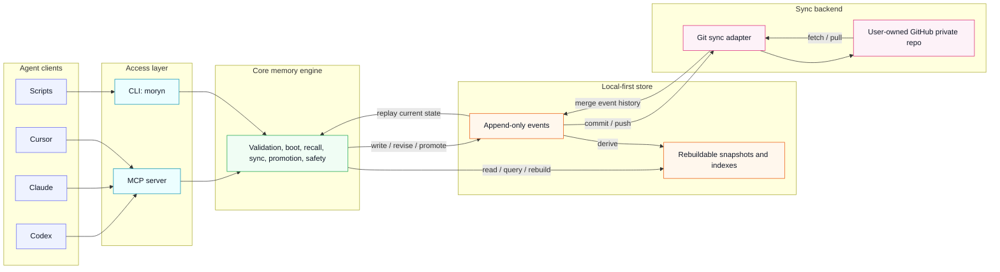

# Moryn Design Spec

Status: Approved for initial design documentation
Date: 2026-05-27

## Summary

Moryn is a personal memory, skill, and soul layer for AI agents. It lets one user run multiple agents across multiple projects while sharing a common operating context. Agents can read relevant context, write session outcomes, propose durable memories, reuse skills, and sync the store across devices.

Moryn is not an agent-specific memory store. Agents are readers and writers. The durable context belongs to the user, projects, topics, and artifacts.

The first version is local-first and syncs through a user-owned GitHub private repository. It uses structured, agent-friendly storage instead of human-oriented note files.

## Goals

- Provide a shared personal context layer for multiple AI agents.
- Support memory, skill, soul, session summary, and agent note records.
- Let agents fetch a small boot context at task start.
- Let agents recall relevant memory and skills on demand.
- Let agents periodically sync and surface only important remote changes.
- Prevent raw agent observations from polluting durable shared memory.
- Sync all stored content across devices through GitHub private repos.
- Keep the core storage format machine-friendly and replayable.
- Avoid requiring embeddings, vector databases, or a cloud service in the first version.

## Non-Goals

- Team or multi-user permission systems.
- Public skill marketplace.
- Full web application.
- Realtime push into an agent's current context.
- Required embedding search.
- Required hosted backend.
- Strong zero-knowledge encryption guarantees.

## Naming

The project name is Moryn.

Moryn is a coined product name that keeps a soft, easy-to-remember feel while avoiding the crowded memory-product naming space. It is broad enough to cover memory, skill, soul, and personal context instead of being limited to agent-specific memory.

Recommended CLI command:

```text
moryn
```

Recommended package name:

```text
@richardyu114/moryn
```

## Product Principles

1. Agent identity is provenance, not ownership.
2. Local storage is the source of runtime availability.
3. GitHub is a sync backend, not the live database.
4. All content written to the Moryn store is syncable by default.
5. Recall is selective even when storage is fully synced.
6. Durable memory requires promotion.
7. Raw session material is useful but should not pollute boot context.
8. The first version must work without semantic embeddings.

## Architecture

Moryn has four layers:

```text
Agent clients
  -> MCP server / CLI
  -> Core memory engine
  -> Local store
  -> GitHub sync adapter
```



### Agent Access Layer

Moryn exposes two first-version entry points:

- MCP server for tool-capable agents.
- CLI for general use, debugging, and agents that can run shell commands.

Both entry points call the same core engine. They must not implement separate memory behavior.

Moryn supports logical updates to memory, skills, and soul records. Those updates are stored as new events instead of in-place edits, so the system keeps an auditable history while still exposing the latest corrected state through snapshots and recall.

### Core Memory Engine

The core engine owns:

- Record validation.
- Event append and replay.
- Logical record revision.
- Boot context generation.
- Recall filtering and ranking.
- Sync cursor evaluation.
- Promotion and state transitions.
- Sensitive content checks.
- Snapshot and index rebuilds.

The core engine treats agent clients as sources. It does not partition memory ownership by agent.

### Local Store

The default store path is:

```text
~/.moryn/
```

The repo under active work may optionally contain:

```text
.moryn.json
```

That file can override project identity, tags, default skills, and sync policy. It is not required.

Recommended local store layout:

```text
~/.moryn/
  config.json
  events/
    <device_id>/
      <yyyy-mm>/
        <event_id>.json
  snapshots/
    user.json
    projects/
      <project_id>.json
    skills/
      index.json
  indexes/
    recall.json
    sync-cursors.json
```

Events are the source of truth. Snapshots and indexes are derived data and can be rebuilt.

### Sync Adapter

The first sync adapter uses Git and GitHub private repos.

The sync adapter owns:

- Remote configuration.
- Fetch and pull.
- Commit and push.
- Local and remote status.
- Event merge.
- Snapshot and index rebuild after merge.

Future adapters can target S3, Supabase, Postgres, or a hosted Moryn service without changing the core record model.

## Project Identity

Project identity resolves in this priority order:

```text
explicit project_id
  > git remote URL hash
  > git repo root path hash
  > current directory name
```

The explicit `project_id` can come from `.moryn.json` or API input.

Git remote URL is preferred across devices because local paths vary.

## Record Model

All durable objects use one record envelope. `kind` and `type` specialize behavior.

Example:

```json
{
  "id": "rec_01h...",
  "kind": "memory",
  "type": "decision",
  "scope": "project",
  "project_id": "moryn",
  "tags": ["sync", "github"],
  "content": {
    "text": "Use GitHub private repos as the first sync backend.",
    "format": "text"
  },
  "state": "canonical",
  "confidence": 0.86,
  "priority": "normal",
  "visibility": "active",
  "created_at": "2026-05-27T00:00:00Z",
  "updated_at": "2026-05-27T00:00:00Z",
  "source": {
    "client": "codex",
    "session_id": "sess_...",
    "model": "gpt-5"
  },
  "provenance": {
    "derived_from": ["rec_..."],
    "reason": "User confirmed the initial sync strategy."
  }
}
```

### Kinds

First-version record kinds:

- `memory`: Facts, decisions, warnings, preferences, and project state.
- `skill`: Reusable workflows, instructions, command declarations, and operating procedures.
- `soul`: Long-term identity, values, collaboration preferences, and working principles.
- `session_summary`: A summary of one agent work session.
- `agent_note`: An agent observation that is useful as source material but not durable memory by default.

### States

States prevent raw or agent-specific observations from polluting shared context:

- `raw`: Original source material.
- `candidate`: Potentially valuable but not fully trusted.
- `canonical`: Durable and returned by default in boot and recall.
- `archived`: Preserved history that is not returned by default.
- `quarantined`: Sensitive, suspicious, conflicting, or low-trust material returned only when explicitly requested.

### Scopes

Supported scopes:

- `global`
- `project`
- `topic`
- `session`
- `artifact`

Scope controls recall boundaries. It does not control whether content is synced.

### Skill Content

Skills can combine procedure text, instructions, commands, and agent-specific adapters.

Example:

```json
{
  "kind": "skill",
  "type": "procedure",
  "content": {
    "purpose": "Release an npm package safely.",
    "instructions": [
      "Check git status.",
      "Run tests.",
      "Update changelog.",
      "Publish only after confirmation."
    ],
    "commands": [
      {
        "name": "test",
        "cmd": "npm test"
      },
      {
        "name": "publish",
        "cmd": "npm publish",
        "requires_confirmation": true
      }
    ],
    "adapters": {
      "codex": {
        "notes": "Use patch-based edits for source changes."
      },
      "claude": {
        "notes": "Use available MCP tools when present."
      }
    }
  }
}
```

Adapter data isolates client behavior. It must not redefine the canonical skill.

## Event Model

All writes append events. Events are immutable facts. Derived views are rebuilt from events.

Moryn still supports modifying records at the logical level. A memory, skill, or soul can be corrected, refined, promoted, archived, or quarantined. Each change appends a new event that references the target record. Replay produces the current state.

Example event:

```json
{
  "event_id": "evt_01h...",
  "op": "upsert_record",
  "record": {
    "id": "rec_01h..."
  },
  "created_at": "2026-05-27T00:00:00Z",
  "source": {
    "client": "codex",
    "device_id": "device_linuxbox"
  }
}
```

Supported first-version operations:

- `upsert_record`
- `revise_record`
- `promote_record`
- `archive_record`
- `quarantine_record`
- `link_records`

Records are not physically deleted in normal operation. Removal is represented through state changes.

Revision event example:

```json
{
  "event_id": "evt_01h...",
  "op": "revise_record",
  "record_id": "rec_01h...",
  "patch": {
    "content.text": "Use GitHub private repos as the first sync backend, with events as the only default synced source of truth.",
    "confidence": 0.92
  },
  "reason": "Clarified sync semantics after review.",
  "created_at": "2026-05-27T00:00:00Z",
  "source": {
    "client": "codex",
    "device_id": "device_linuxbox"
  }
}
```

## MCP Tools and CLI

The MCP server and CLI expose the same semantics.
Library hosts can import all stable selection-source path maps individually
from the package entrypoint, or use the grouped `SELECTION_SOURCE_CONTRACTS`
registry. The registry is organized by `setup`, `core`, `sync`, `lifecycle`,
and `recovery`, and each entry references the same canonical map object exposed
under its individual export name.

Non-JS hosts can query the same registry at runtime:

CLI:

```bash
moryn contracts selection-sources
```

MCP tool: `selection_source_contracts`.

The response shape is:

```json
{
  "contracts": {
    "setup": {
      "store_init": {
        "config_file": "artifacts.config"
      }
    }
  },
  "selection_sources": {
    "contracts": "contracts",
    "group": "contracts.<group>",
    "contract": "contracts.<group>.<contract>",
    "field": "contracts.<group>.<contract>.<field>"
  }
}
```

Library hosts can also call `getSelectionSourceContracts()` or import
`SELECTION_SOURCE_CONTRACTS_SELECTION_SOURCES` from the package entrypoint.

Agents can also query the static operation directory:

CLI:

```bash
moryn contracts operations
```

MCP tool: `operation_contracts`.

The response lists `operations`, keyed `operations_by_id`, grouped
`operations_by_category`, and selection sources for those keyed paths. Each
operation carries CLI/MCP interfaces, `safe_to_run`, `safety`, `required_when`,
and `required_fields`:

```json
{
  "recommended_entrypoint": "agent_enter",
  "operations_by_id": {
    "agent_enter": {
      "operation": "agent_enter",
      "category": "lifecycle",
      "safe_to_run": true,
      "required_fields": [],
      "interfaces": {
        "cli": {
          "command": "moryn agent enter"
        },
        "mcp": {
          "tool": "agent_enter",
          "arguments": {}
        }
      }
    }
  },
  "selection_sources": {
    "operation": "operations_by_id.<operation>",
    "operation_id": "operations_by_id.<operation>.operation",
    "category": "operations_by_category.<category>",
    "category_operation": "operations_by_category.<category>.<operation>",
    "cli_command": "operations_by_id.<operation>.interfaces.cli.command",
    "mcp_tool": "operations_by_id.<operation>.interfaces.mcp.tool",
    "ordered_operation": "operations[]"
  }
}
```

Library hosts can call `getOperationContracts()` or import
`OPERATION_CONTRACTS_SELECTION_SOURCES` from the package entrypoint. The
operation registry is static discovery metadata; after a runtime response
returns `next.actions`, agents should prefer those returned actions because
they include the live project, sync, cursor, and handoff context.

### `init`

Used to initialize the local Moryn store.

CLI:

```bash
moryn init
moryn init --repair
```

MCP tool: `init`.

Successful output includes the local config artifact path and stable field
sources:

```json
{
  "ok": true,
  "store": "/home/user/.moryn",
  "config": {
    "store_version": 1,
    "device_id": "device_...",
    "created_at": "2026-05-27T00:00:00.000Z",
    "updated_at": "2026-05-27T00:00:00.000Z"
  },
  "artifacts": {
    "config": "config.json"
  },
  "selection_sources": {
    "store": "store",
    "config": "config",
    "config_file": "artifacts.config",
    "store_version": "config.store_version",
    "device_id": "config.device_id"
  }
}
```

Library hosts can reuse the exported `STORE_INIT_SELECTION_SOURCES` map from
the package entrypoint as the canonical field-path contract.

The `repair` option is explicit and guarded. It replaces an invalid local
`config.json` while leaving event history untouched.

### `project_init`

Used to create or update `.moryn.json`.

CLI:

```bash
moryn project init --path /path/to/project --project-id moryn --default-skill release
moryn project init --path /path/to/project --project-id moryn --repair
```

MCP tool: `project_init`.

Successful output includes the project config artifact path and stable field
sources:

```json
{
  "ok": true,
  "path": "/workspace/moryn/.moryn.json",
  "config": {
    "project_id": "moryn",
    "tags": ["typescript"],
    "default_skills": ["release"],
    "sync": {
      "mode": "session"
    }
  },
  "artifacts": {
    "config": ".moryn.json"
  },
  "selection_sources": {
    "path": "path",
    "config": "config",
    "config_file": "artifacts.config",
    "project_id": "config.project_id",
    "tags": "config.tags",
    "default_skills": "config.default_skills",
    "sync_mode": "config.sync.mode"
  }
}
```

Library hosts can reuse the exported `PROJECT_INIT_SELECTION_SOURCES` map from
the package entrypoint as the canonical field-path contract.

The `repair` option is explicit and guarded. It replaces an invalid existing
`.moryn.json` only after the caller supplies the intended project fields.

### `boot`

Used when an agent starts work, enters a project, or connects to Moryn.

Input:

```json
{
  "project_path": "/path/to/repo",
  "project_id": "optional",
  "current_task": "optional task description",
  "default_skills": ["optional skill selector"]
}
```

Output:

```json
{
  "profile": {
    "user_preferences": [],
    "user_preferences_by_id": {},
    "soul": [],
    "soul_by_id": {},
    "global_rules": [],
    "global_rules_by_id": {}
  },
  "project": {
    "summary": "",
    "tech_stack": [],
    "active_goals": [],
    "important_decisions": [],
    "important_decisions_by_id": {},
    "warnings": [],
    "warnings_by_id": {}
  },
  "skills": [],
  "skills_by_id": {},
  "task_relevant": [],
  "task_relevant_by_id": {},
  "recent_changes": [],
  "recent_changes_by_id": {},
  "selection_sources": {
    "record": "records_by_id.<record_id>",
    "record_id": "records_by_id.<record_id>.id",
    "user_preference": "profile.user_preferences_by_id.<record_id>",
    "soul": "profile.soul_by_id.<record_id>",
    "global_rule": "profile.global_rules_by_id.<record_id>",
    "important_decision": "project.important_decisions_by_id.<record_id>",
    "warning": "project.warnings_by_id.<record_id>",
    "skill": "skills_by_id.<record_id>",
    "task_relevant": "task_relevant_by_id.<record_id>",
    "recent_change": "recent_changes_by_id.<record_id>"
  },
  "records_by_id": {
    "rec_...": {}
  },
  "sync": {
    "cursor": "cur_...",
    "remote_has_updates": false
  }
}
```

`records_by_id` mirrors only the record objects returned in this boot response
across profile, project, skills, `task_relevant`, and `recent_changes`. It is a
convenience map for dereferencing a known boot record id, not a full-store
index. `selection_sources` names the aggregate keyed boot record and each
section-specific by-id path explicitly. Profile arrays expose
`user_preferences_by_id`, `soul_by_id`, and `global_rules_by_id`; project arrays
expose `important_decisions_by_id` and `warnings_by_id`; top-level arrays
expose `skills_by_id`, `task_relevant_by_id`, and `recent_changes_by_id`. These
local mirrors let agents inspect a known boot preference, soul record, rule,
decision, warning, skill, task-relevant record, or recent change without
scanning the corresponding ordered arrays. Library hosts can reuse the exported
`BOOT_SELECTION_SOURCES` map from the package entrypoint as the canonical
field-path contract.

CLI:

```bash
moryn boot --project . --current-task "fix auth token refresh"
```

CLI `--project` and MCP `project_path` read `.moryn.json`, resolve
`project_id`, and apply configured `default_skills`. MCP hosts can also pass
`project_id` and optional `default_skills` directly. When `current_task` is
provided, boot includes a bounded `task_relevant` list of trusted project
memories that match the task.

### `recall`

Used to retrieve records relevant to a task, file set, tag set, or type.

Input:

```json
{
  "query": "fix auth middleware bug",
  "project_path": "/path/to/repo",
  "project_id": "moryn",
  "files": ["src/auth.ts"],
  "kinds": ["memory", "skill"],
  "types": ["decision", "warning", "procedure"],
  "states": ["canonical"],
  "limit": 10
}
```

Output:

```json
{
  "results": [
    {
      "record": {},
      "score": 0.82,
      "reason": [
        "same_project",
        "tag_match:auth",
        "canonical",
        "recent_warning"
      ]
    }
  ],
  "results_by_id": {
    "rec_...": {
      "record": {},
      "score": 0.82,
      "reason": [
        "same_project",
        "tag_match:auth",
        "canonical",
        "recent_warning"
      ]
    }
  },
  "selection_sources": {
    "result": "results_by_id.<record_id>",
    "record": "results_by_id.<record_id>.record",
    "record_id": "results_by_id.<record_id>.record.id"
  }
}
```

CLI:

```bash
moryn recall "fix auth middleware bug" --project . --kind memory --kind skill
```

Archived and quarantined records are excluded by default. To inspect them,
query by explicit record id with a matching state filter.
`results[]` is the ranked display list, while `results_by_id` mirrors the
returned records by `record.id` so hosts can consume a known result without
array scanning. `selection_sources` names the keyed result, record, and
record-id paths explicitly. Library hosts can reuse the exported
`RECALL_SELECTION_SOURCES` map from the package entrypoint as the canonical
field-path contract.

### `write`

Used to append a new record.

Input:

```json
{
  "kind": "session_summary",
  "type": "summary",
  "scope": "project",
  "project_path": "/path/to/repo",
  "project_id": "moryn",
  "content": {
    "text": "Completed the initial design discussion."
  },
  "state": "raw",
  "source": {
    "client": "codex"
  }
}
```

CLI:

```bash
moryn write --kind session_summary --project . --text "Completed the initial design discussion."
moryn write --kind memory --type decision --scope project --project . --content-json '{"text":"Structured memory","format":"json","evidence":["cli"]}'
```

CLI callers must provide exactly one of `--text` for text content or
`--content-json` for a structured JSON object. MCP callers must provide
exactly one of `text` or `content`.
For `session_summary` handoffs, CLI and MCP callers may omit `type` and
`scope`; Moryn defaults them to `summary` and `project`. Other record kinds
must provide both fields explicitly.

### `revise`

Used to correct, refine, or extend an existing record without rewriting history. This appends a `revise_record` event and updates the current replayed state.

Input:

```json
{
  "record_id": "rec_...",
  "patch": {
    "content.text": "Use GitHub private repos as the first sync backend, with events as the only default synced source of truth.",
    "confidence": 0.92
  },
  "reason": "Clarified sync semantics after review.",
  "confirmed": false
}
```

CLI:

```bash
moryn revise rec_123 --set confidence=0.92 --reason "Clarified sync semantics after review."
moryn revise rec_123 --set content.text="User-confirmed replacement" --reason "User confirmed conflict resolution" --confirm
```

Canonical revisions that would conflict with existing canonical memory require
explicit confirmation. CLI callers pass `--confirm`; MCP callers pass
`confirmed: true`.

### `refresh`

Used for periodic memory refresh after sync or while an agent is running.

Input:

```json
{
  "project_id": "moryn",
  "cursor": "previous_cursor",
  "current_task": "optional"
}
```

Output:

```json
{
  "cursor": "new_cursor",
  "changes": [
    {
      "record_id": "rec_...",
      "importance": "notice",
      "reason": "current_task_match",
      "summary": "A new project decision was recorded.",
      "recommended_action": "call recall with record_id",
      "next_action": {
        "recommended_action": "call_recall_with_record_id",
        "tool": "recall",
        "safe_to_run": true,
        "required_when": "After refresh reports this change and the agent needs the full record content.",
        "required_fields": [],
        "command": "moryn recall --record-id rec_... --project-id moryn",
        "arguments": {
          "record_ids": ["rec_..."],
          "project_id": "moryn"
        },
        "argument_sources": {
          "record_ids": "refresh.changes_by_record_id.<record_id>.record_id"
        },
        "interfaces": {
          "cli": {
            "command": "moryn recall --record-id rec_... --project-id moryn"
          },
          "mcp": {
            "tool": "recall",
            "arguments": {
              "record_ids": ["rec_..."],
              "project_id": "moryn"
            }
          }
        },
        "safety": {
          "safe_to_auto_run": true,
          "requires_user_confirmation": false,
          "requires_authored_input": false,
          "writes_local_config": false,
          "reasons": ["safe_read_or_status_check"]
        },
        "workflow": {
          "version": 1,
          "start": "next_action",
          "continue_from": ["refresh.changes_by_record_id.<record_id>.next_action", "refresh.changes[].next_action"],
          "phases": [
            {
              "phase": "call_recall_with_record_id",
              "order": 1,
              "action_source": "refresh.changes_by_record_id.<record_id>.next_action",
              "tool": "recall",
              "required_when": "After refresh reports this change and the agent needs the full record content.",
              "required_fields": []
            }
          ]
        }
      }
    }
  ],
  "changes_by_record_id": {
    "rec_...": {
      "record_id": "rec_...",
      "importance": "notice",
      "reason": "current_task_match",
      "summary": "A new project decision was recorded.",
      "recommended_action": "call recall with record_id",
      "next_action": {
        "recommended_action": "call_recall_with_record_id",
        "tool": "recall",
        "safe_to_run": true,
        "required_when": "After refresh reports this change and the agent needs the full record content.",
        "required_fields": [],
        "command": "moryn recall --record-id rec_... --project-id moryn",
        "arguments": {
          "record_ids": ["rec_..."],
          "project_id": "moryn"
        },
        "interfaces": {
          "cli": {
            "command": "moryn recall --record-id rec_... --project-id moryn"
          },
          "mcp": {
            "tool": "recall",
            "arguments": {
              "record_ids": ["rec_..."],
              "project_id": "moryn"
            }
          }
        },
        "safety": {
          "safe_to_auto_run": true,
          "requires_user_confirmation": false,
          "requires_authored_input": false,
          "writes_local_config": false,
          "reasons": ["safe_read_or_status_check"]
        },
        "workflow": {
          "version": 1,
          "start": "next_action",
          "continue_from": ["refresh.changes_by_record_id.<record_id>.next_action", "refresh.changes[].next_action"],
          "phases": [
            {
              "phase": "call_recall_with_record_id",
              "order": 1,
              "action_source": "refresh.changes_by_record_id.<record_id>.next_action",
              "tool": "recall",
              "required_when": "After refresh reports this change and the agent needs the full record content.",
              "required_fields": []
            }
          ]
        }
      }
    }
  },
  "selection_sources": {
    "change": "changes_by_record_id.<record_id>",
    "record_id": "changes_by_record_id.<record_id>.record_id",
    "next_action": "changes_by_record_id.<record_id>.next_action"
  },
  "should_interrupt": false
}
```

Reportable non-raw changes include `next_action` so agents can retrieve full
record content through the safe `recall` interface instead of composing CLI or
MCP arguments from the prose `recommended_action`. The ordered `changes[]` list
is mirrored by `changes_by_record_id`, keyed by `record_id`;
`selection_sources` names the keyed change, record-id, and next-action paths;
`next_action.selection_sources` repeats the fully qualified keyed and ordered
next-action paths for agents that receive only the nested action;
`next_action.argument_sources.record_ids` points at the keyed change record id
so hosts can fill recall arguments without scanning workflow phases. Workflow
phases prefer `refresh.changes_by_record_id.<record_id>.next_action` while
retaining `refresh.changes[].next_action` as an ordered compatibility source.
Library hosts can reuse the exported `REFRESH_SELECTION_SOURCES` and
`REFRESH_CHANGE_NEXT_ACTION_SELECTION_SOURCES` maps from the package entrypoint
as canonical field-path contracts.

CLI:

```bash
moryn refresh --project . --cursor previous_cursor --current-task "fix auth"
```

### `sync`

Used for Git-backed startup sync, manual pull, status checks, and push.

CLI:

```bash
moryn sync init git@github.com:yourname/moryn-store.git
moryn sync --status
moryn sync --pull
moryn sync --push
moryn sync --push --message "sync after session"
```

MCP exposes the same sync semantics as separate tools: `sync_init`,
`sync_status`, `sync_pull`, and `sync_push`.

Successful `sync_init`, `sync_pull`, and `sync_push` results include operation
flags and their stable field sources:

```json
{
  "ok": true,
  "committed": true,
  "pushed": true,
  "selection_sources": {
    "ok": "ok",
    "committed": "committed",
    "pushed": "pushed",
    "pulled": "pulled",
    "message": "message"
  }
}
```

Only fields relevant to the operation are present; `selection_sources` names the
full stable result surface so hosts can inspect whichever flags are returned
without operation-specific guessing. Library hosts can reuse the exported
`SYNC_RESULT_SELECTION_SOURCES` map as the canonical field-path contract.

When Git is left in a conflict state after pull or push, `sync_status` returns
structured conflict diagnostics instead of only a dirty worktree flag:

```json
{
  "configured": true,
  "branch": "",
  "remote": "git@github.com:yourname/moryn-store.git",
  "dirty": true,
  "sync_state": "conflict",
  "conflict": {
    "operation": "rebase",
    "files": [
      "events/shared-device/2026-05/evt_conflict.json"
    ],
    "files_by_path": {
      "events/shared-device/2026-05/evt_conflict.json": {
        "path": "events/shared-device/2026-05/evt_conflict.json",
        "status": "unmerged",
        "safe_to_auto_resolve": false,
        "recommended_action": "resolve Git conflicts before retrying sync"
      }
    },
    "safe_to_auto_resolve": false,
    "safe_to_retry_sync": false,
    "recommended_action": "resolve Git conflicts before retrying sync"
  },
  "selection_sources": {
    "configured": "configured",
    "branch": "branch",
    "remote": "remote",
    "dirty": "dirty",
    "sync_state": "sync_state",
    "conflict": "conflict",
    "conflict_file": "conflict.files_by_path.<path>",
    "conflict_file_path": "conflict.files_by_path.<path>.path",
    "ordered_conflict_file": "conflict.files[]",
    "ahead": "ahead",
    "behind": "behind",
    "last_sync": "last_sync",
    "last_commit": "last_commit",
    "error": "error"
  }
}
```

Agents must treat `sync_state: "conflict"` as a stop sign for automatic sync
retry. The status response is safe to inspect, but conflict resolution itself
requires explicit user or host policy. `conflict.files[]` preserves the ordered
display list, while `conflict.files_by_path.<path>` lets agents inspect a known
conflicted event file without scanning the array. `selection_sources` is present
on unconfigured, clean, dirty, conflict, and error status responses so recovery
hosts can read the same fields regardless of sync state.

### `agent_guide`

Used as a read-only workflow contract for agent hosts that need exact lifecycle
instructions before acting. It returns the preferred startup entrypoint
(`agent_enter`), a complete CLI command, MCP arguments, lifecycle steps, and
rules that prevent common hallucinated flows such as guessing project ids or
manually composing `sync_pull`, `boot`, and `refresh`. It also returns
`rules_by_id`, which mirrors those anti-hallucination rule texts by stable id,
and `guardrails[]`: stable, machine-readable constraints with ids, risks,
forbidden behaviors, required behavior, and optional `use_instead` action
templates for safe alternatives. `guardrails_by_id` mirrors those constraints
by id so hosts can fetch known rules such as
`use_returned_actions_verbatim` or
`discover_project_before_lifecycle_writes` without scanning `rules[]` or
`guardrails[]`. It
also returns `workflow`, a machine-readable ordering contract with `start`,
valid `continue_from` sources, and ordered `phases[]` that name the action
source, usage condition, and required fields. Every workflow mirrors those
ordered phases in `phases_by_name`, so hosts can fetch phases such as
`publish_status`, `refresh_context`, or `retry_original_tool_with_selected_project_id`
directly instead of scanning `phases[]`. The `startup` object and
top-level `next` action are complete `agent_enter`
templates with `safe_to_run`, `required_when`, `required_fields`, arguments,
`required_fields_by_name`, single-step `workflow`, and action-local
`selection_sources` for `startup`, `next`, and
`workflow.phases_by_name.start_or_resume`, so hosts can execute the recommended
entrypoint without merging data from lifecycle steps or scanning workflow
phases.
`required_fields_by_name` maps each required field to the matching argument
path, template value, and placeholder such as `<summary>`, so hosts can prompt
for authored input without reverse-engineering `arguments`. Lifecycle action
templates also expose `argument_sources`: authored values use sources such as
`user_input.status`, `user_input.summary`, `user_input.current_task`,
`user_input.remote`, and `user_input.refresh_since`, while runtime refresh
actions point `refresh_since` at `refresh.cursor` or `record.updated_at`.
`lifecycle_by_step` mirrors
`lifecycle[]` by step name, and lifecycle workflows prefer
`lifecycle_by_step.<step>` while keeping `lifecycle[]` as a compatibility
source; hosts can fetch `publish_status`, `finish_handoff`, or
`refresh_context` directly instead of scanning the ordered lifecycle list. Each
guide lifecycle template also includes action-local `selection_sources` for the
keyed `lifecycle_by_step.<step>` entry, the step field, and ordered
`lifecycle[]` fallback, so a selected step remains self-describing outside the
full guide response.
Top-level `selection_sources` names the stable startup, keyed lifecycle action,
keyed rule, and keyed guardrail lookup paths for hosts that should not derive
those paths from prose. Library hosts can reuse the exported
`GUIDE_SELECTION_SOURCES`, `GUIDE_LIFECYCLE_STEP_SELECTION_SOURCES`, and
`GUIDE_ENTRYPOINT_SELECTION_SOURCES` maps from the package entrypoint as
canonical field-path contracts. When
no project is provided, non-startup lifecycle templates require `project_id`
and include `--project-id <project_id>` so agents must use the discovery result
before writing status, finishing, or refreshing.
Every action template also includes an `interfaces` object. `interfaces.cli`
contains the exact command string for shell clients, while `interfaces.mcp`
contains the tool name and JSON arguments for MCP hosts. These fields are
derived from the existing `tool`, `command`, and `arguments` values so agents
can choose their runtime interface without reverse-engineering one transport
from the other. Action templates also include `safety`, a machine-readable
explanation of `safe_to_run` with `safe_to_auto_run`,
`requires_user_confirmation`, `requires_authored_input`, `writes_local_config`,
and stable `reasons`. This lets hosts block local setup writes, high-risk
promotions, or authored lifecycle updates with the right approval path instead
of guessing from prose.

CLI:

```bash
moryn agent guide --project . --sync-remote git@github.com:yourname/moryn-store.git --current-task "fix auth" --agent codex
```

MCP tool: `agent_guide`.

### `agent_enter`

Used as the one-call entrypoint for agents on a new machine or uncertain
project. It runs `agent_doctor` first. If the project is known and safe to
start, it runs `agent_start` and returns boot, refresh, and handoff context. If
the project is unclear but the store has known project records, it returns
`project_list` results with complete `agent_start` action templates for each
project, including command, MCP arguments, safety, usage timing, and workflow.
If the local store is empty and `sync_remote` is
provided, it initializes Git sync and pulls the shared store before choosing
between project discovery and startup. In `discover_projects` mode, each
top-level start action also includes lifecycle templates for status, finish,
and refresh using the selected `project_id`; each of those nested lifecycle
templates carries its own single-step `workflow` and is mirrored in
`lifecycle_by_step` by step name. Each nested lifecycle template also includes
action-local `selection_sources` for
`next.actions_by_project_id.<project_id>.lifecycle_by_step.<step>`, its step
field, and the selected project's ordered `lifecycle[]` fallback. Because every
discovered action is named
`start_session`, the response also includes `next.actions_by_project_id` so
hosts can choose a project by id instead of array position. The top-level
`next` for `discover_projects` declares `project_id` in `required_fields`,
`required_fields_by_name`, and `arguments`, and carries a placeholder
`agent_start` command plus CLI/MCP interfaces; after selection, hosts should
execute `next.actions_by_project_id.<project_id>`. `next.selection_sources`
names the selected project, `project_id`, start action, and lifecycle template
map paths for hosts that should not parse workflow phases. In `start_session` and
`discover_projects` modes, `next.workflow` exposes the ordered runtime action
track and valid follow-up sources so hosts can continue from the live response
without consulting static guide templates. In `start_session`,
`required_end_action_source` and `recommended_refresh_action_source` point
directly at the keyed finish and refresh templates in `next.actions_by_id`.
`next.selection_sources` names the generic keyed action and action-id paths so
hosts can follow returned lifecycle actions without inferring paths from
workflow phases.
Direct `agent_start`,
`agent_status`, and `agent_finish` responses also include `next.workflow`,
derived from their returned `next.actions`, so every lifecycle entrypoint
carries its own follow-up contract. `next.workflow.phases_by_name` mirrors the
ordered phases by name while preserving `phases[]` for display and
compatibility.
Setup and recovery branches use the same shape: `agent_doctor.next` and
`agent_enter` `needs_setup` responses include top-level `required_when`,
`required_fields`, `safety`, and a single-step `next.workflow` for
`project_init`, `project_list`, or `sync_status`, so hosts can recover from
setup uncertainty without parsing prose or sibling action arrays. When
`agent_doctor.next` includes alternate `actions_by_id`, `next.selection_sources`
names the keyed action and action-id paths directly.

CLI:

```bash
moryn agent enter --sync-remote git@github.com:yourname/moryn-store.git --current-task "fix auth" --agent codex
moryn agent enter --project . --sync-remote git@github.com:yourname/moryn-store.git --current-task "fix auth" --agent codex
```

MCP tool: `agent_enter`.

Agents should prefer this when they are entering a project or shared store and
do not know whether they need setup diagnosis, project discovery, or full
startup context. It reduces multi-step orchestration errors by returning a
single `mode`: `start_session`, `discover_projects`, or `needs_setup`. If an
explicit `project_path` does not exist, lifecycle commands return `needs_setup`
with `project_init`; they do not silently derive a new project id from the typo.
If an explicit `project_id` is not present in a populated store, they return
`discover_projects`/`project_list` so the agent selects a known project before
writing lifecycle records. If `project_path` resolves `.moryn.json` with a
different project id than explicit `project_id`, they return a project id
conflict instead of choosing one silently; the setup action keeps `project_path`
and omits the conflicting `project_id`. If sync status reports unresolved Git
conflicts, `agent_enter` returns `needs_setup` with `sync_status` as the next
read-only action instead of starting a lifecycle session. Direct `agent_start`, `agent_status`, and
`agent_finish` calls reject missing project context in populated stores unless
the current directory resolves through `.moryn.json`; agents should use
`agent_enter` for discovery before writing lifecycle records. Direct lifecycle
calls also classify explicit project mistakes as recoverable structured errors:
`PROJECT_PATH_NOT_FOUND` for a missing `project_path` and
`PROJECT_ID_NOT_FOUND` for a `project_id` that is not known in the populated
store. Their `recommended_action` values point agents to project initialization,
project listing, or corrected retry arguments. These error envelopes also carry
`error.next_action` with `tool`, `command`, `arguments`, `interfaces`,
`required_when`, `required_fields`, `required_fields_by_name`,
`argument_sources`, `selection_sources`, `workflow`, `safety`, and
`safe_to_run`, so agents can recover from the envelope without parsing prose or
guessing placeholder values.
When a recovery action still needs authored setup input, `argument_sources`
maps placeholders such as `remote`, `path`, or `project_id` to
`user_input.remote`, `user_input.path`, or `user_input.project_id`.
`next_action.selection_sources` names both `error.next_action` and
`warning.next_action` container paths plus keyed `required_fields_by_name`,
`argument_sources`, and `workflow.phases_by_name` paths, so hosts can locate
the recovery contract without inferring whether the action came from an error
or a warning. Library hosts can reuse the exported
`NEXT_ACTION_SELECTION_SOURCES` map from the package entrypoint as the
canonical field-path contract.
Most recovery actions are single-step workflows;
`RECORD_NOT_FOUND` uses a two-step workflow so agents first run the safe
`list_recent` action and then retry the original tool with the selected returned
id from `list_recent.records_by_id.<record_id>.id`. `argument_sources` mirrors
the retry replacement map at the top level so hosts can fill selected arguments
without scanning workflow phases. The ordered
`list_recent.records[].id` path remains available for display and fallback.
Normal `list_recent` responses also expose `selection_sources` for the keyed
record and record-id paths.
Warning recovery actions use the same `warning.next_action.interfaces`
shape, `warning.next_action.safety`, `warning.next_action.selection_sources`,
and explicit `warning.next_action.workflow` metadata. Candidate-promotion
warnings include
`candidate_record_id` plus `argument_sources.record_id: "write.record.id"`;
their workflow phase uses `write.record.id` as the `record_id` replacement
source, so agents promote the candidate returned by the original write instead
of repeating the write or guessing an id. For
`PROJECT_PATH_NOT_FOUND`, the `next_action.arguments.path` value is the exact
missing path when it can be derived from the error. For `PROJECT_ID_NOT_FOUND`,
`next_action.rejected_arguments.project_id` preserves the rejected id and
`next_action.candidate_project_ids` lists known choices while
`next_action.arguments` remains valid for the target recovery tool.
`PROJECT_CONTEXT_REQUIRED` also includes `candidate_project_ids` when the
populated store can name known projects. Both project-selection recovery
workflows include a second `retry_original_tool_with_selected_project_id`
phase sourced from `project_list.projects_by_id.<project_id>.project_id`;
the same source is mirrored as `next_action.argument_sources.project_id`.
`project_list.projects[].project_id` remains an ordered fallback source. Direct
`agent_start`, `agent_status`, and `agent_finish` CLI/MCP wrappers pass their
original tool, command, and JSON arguments into that retry phase so agents can
add the selected `project_id` without reconstructing write commands from
prose. When a lifecycle command resolves project context from `.moryn.json`,
its returned `next.actions` are prefilled with the resolved `project_id` so
they can be reused outside the original cwd.
When an action lists `required_fields`, the same required field appears in
`arguments` with a `<field>` placeholder; agents should replace those JSON
argument values rather than parse the CLI command template. Lifecycle action
templates also include `required_when`, a short usage condition that tells an
agent when to choose that action instead of inferring intent from array order or
action names.
Runtime lifecycle responses with unique follow-up action ids also expose
`next.actions_by_id`, keyed by action id, alongside the ordered `next.actions`
array. Project-discovery responses use `next.actions_by_project_id` because the
candidate actions share the same `start_session` action id; their top-level
`next` still marks `project_id` as required so a lightweight host knows the
selection variable before dereferencing the keyed map, and
`next.selection_sources` names the selected project/action paths directly.
Workflow phases prefer
keyed `next.actions_by_id.<action>` or
`next.actions_by_project_id.<project_id>` sources so hosts can execute a known
action without scanning the array or reconstructing action names.
Runtime lifecycle actions additionally carry action-local `selection_sources`
for the keyed `next.actions_by_id.<action>` entry, the action-id field, and the
ordered `next.actions[]` fallback. This lets a host pass a single action object
between planning and execution without losing the stable source path. Library
hosts can reuse the exported `LIFECYCLE_NEXT_SELECTION_SOURCES`,
`LIFECYCLE_ACTION_SELECTION_SOURCES`, `DISCOVER_PROJECT_SELECTION_SOURCES`, and
`DISCOVERED_LIFECYCLE_STEP_SELECTION_SOURCES` maps from the package entrypoint
as canonical field-path contracts.
Direct `project_list` responses also expose top-level `projects_by_id`, keyed
by `project_id`, where each keyed project mirrors its ordered `projects[]`
entry. `selection_sources` names the selected project, project id, and next
action paths directly. Project-list workflow phases prefer
`project_list.projects_by_id.<project_id>.next` while retaining
`project_list.projects[].next` as an ordered compatibility source. Each nested
`next.selection_sources` repeats those fully qualified keyed and ordered action
paths for hosts that only receive the selected action.
Lifecycle, guide, setup, project-discovery, error-recovery, and warning-recovery
action templates also expose `interfaces.cli.command`,
`interfaces.mcp.tool`/`interfaces.mcp.arguments`, `safety`, and single-step
`workflow` metadata, so CLI and MCP hosts can execute the same recommendation
without translating field names by memory.

### `agent_doctor`

Used as a read-only setup check for agents on a new machine or unfamiliar
project. It reports local store readiness, project resolution, sync
configuration, and the exact next action to use. If no `project_path` or
`project_id` is provided, the store already has project-scoped records, and
project resolution did not come from `.moryn.json`, it recommends
`project_list` instead of `agent_start`.

CLI:

```bash
moryn agent doctor --project . --sync-remote git@github.com:yourname/moryn-store.git --current-task "fix auth" --agent codex
```

MCP tool: `agent_doctor`.

Agents should call this when they are unsure whether Moryn has been initialized
or connected to the shared sync repo. The command must not initialize stores,
write memory, pull, or push; it is safe to run before asking for approval to
mutate local or remote state. Its `next.actions` includes `list_projects`,
`start_session`, or `run_lifecycle_smoke` templates as appropriate, so agents
can discover a shared project, start, or verify the shared Git path without
inferring commands from prose. It also returns a `readiness` summary:
`safe_to_start` is true only when the selected next tool is `agent_start`, and
`blocking_checks` lists warning-level checks that prevent lifecycle startup.
The top-level `checks_by_name` mirrors `checks[]` by check name, and
`readiness.blocking_checks_by_name` mirrors only the blocking warning checks, so
agents can read `checks_by_name.sync` or
`readiness.blocking_checks_by_name.sync` without scanning arrays.
`selection_sources` names the keyed check, keyed blocking check, and selected
`next` action paths explicitly. When the selected `next` object carries
alternate `actions_by_id`, its own `selection_sources` names the keyed action
and action-id paths as well; `readiness.next_selection_sources` mirrors those
paths, or `{}` when the selected action has no keyed alternates. The same
selection source maps are exported as `DOCTOR_SELECTION_SOURCES` and
`LIFECYCLE_NEXT_SELECTION_SOURCES` from the package entrypoint for library
hosts that need canonical field paths. The readiness
summary repeats the selected next tool, command, `safe_to_run`, `required_when`,
required fields, `required_fields_by_name`, `safety`, transport `interfaces`,
and `workflow` plus arguments, `argument_sources`, and selection sources so a
lightweight agent can follow readiness without merging data from the full
`next` object. If `run_lifecycle_smoke` requires a remote, the action and
command both carry the `<remote>` placeholder and `arguments.remote` is
prefilled as `"<remote>"`.

### `project_list`

Used as a read-only project discovery entrypoint for agents that have a Moryn
store but do not know which project to start. It derives project ids from
visible project-scoped records, sorted by recent activity, and returns each
project's latest activity plus a prefilled `agent_start` argument template.

CLI:

```bash
moryn project list
moryn project list --limit 10
moryn project list --current-task "fix auth" --sync-remote git@github.com:yourname/moryn-store.git --agent codex
```

MCP tool: `project_list`.

Agents should call this before `agent_start` when the user references a shared
store but does not provide a project path or project id. `project_list` accepts
optional `current_task`, `sync_remote`, and `agent` fields so each returned
project includes a complete `agent_start` action template with command, MCP
arguments, `interfaces`, `safety`, `required_when`, required fields, and a
single-step `workflow`.
The response keeps `projects[]` as the ordered display list and also returns
`projects_by_id` for direct keyed selection. Each
`projects_by_id.<project_id>` value mirrors the matching `projects[]` record,
including its `next` template; that nested `next` template carries
`selection_sources` for the keyed project, project id, keyed action, and ordered
fallback paths.
When surfaced through `agent_enter`, these project actions also carry
post-selection lifecycle templates and `next.actions_by_project_id`. The
surrounding `next` object declares `project_id` as the required selection field
and provides placeholder CLI/MCP interfaces plus `selection_sources`, so agents
can continue without reconstructing commands from prose or relying on array
position.

### `agent_start`

Used as the default agent startup entrypoint. It resolves project identity,
pulls remote event history when session sync is enabled, returns `boot` context,
and returns `refresh` changes since an optional cursor.

CLI:

```bash
moryn agent start --project . --current-task "fix auth" --agent codex
moryn agent start --project . --sync-remote git@github.com:yourname/moryn-store.git --current-task "fix auth" --agent codex
moryn agent start --project . --current-task "fix auth" --refresh-since 2026-05-27T00:00:00.000Z --agent gemini
```

MCP tool: `agent_start`.

Agents should prefer this over separately calling `sync_pull`, `boot`, and
`refresh`. If sync is not configured or the remote is unavailable, the command
still returns local boot/refresh context and includes a structured sync error.
Partial lifecycle sync failures keep the legacy string field (`pull_error`,
`push_error`, `sync_init_error`, or `sync_pull_error`) and also include a
matching `*_error_details` object with the same structured error contract used
by CLI and MCP failures: `code`, `message`, `recoverable`,
`recommended_action`, and optional `next_action`.
If the local sync state is already conflicted, or a pull leaves Git in a
conflicted state, `agent_start` fails before boot/refresh with `SYNC_CONFLICT`
and a `sync_status` recovery action. `agent_status` and `agent_finish` perform
the same conflict guard before appending lifecycle records. This prevents agents
from parsing conflict-marked event files or writing new lifecycle records into
an unresolved sync state.
When `--sync-remote` or MCP `sync_remote` is provided, `agent_start` creates the
local store if needed and initializes Git sync before pulling. The response also
includes `handoff.inbox` for recent final `session_summary` records from other
sessions and `handoff.active_sessions` for recent `type=status` checkpoints
that have not expired or been superseded by a final summary from the same
agent. Active sessions use a 120-minute window and include `active_until` so
stale status records do not look like live work forever. Each handoff entry
includes the record id, text, originating agent identity, timestamp, and a
recommended action so agents do not have to infer coordination state from
`recent_changes`. Each entry also includes a safe `next_action` for the exact
`recall` call that fetches the full session summary or status record, with
CLI/MCP interfaces, `safety`, `required_when`, `argument_sources`, action-local
`selection_sources`, and workflow metadata. `argument_sources.record_ids` points
at the matching keyed handoff entry's `record_id`, and
`next_action.selection_sources` names the selected keyed entry, record-id,
next-action, and ordered fallback paths, so agents can fill recall arguments
without scanning workflow phases. Agents should follow that action instead of
manually composing a recall call from the handoff prose. When `handoff.recommended_action` is not `continue_current_task`,
top-level `handoff.next_action` mirrors the first active-session action or, if no
active sessions exist, the first inbox action. The response also mirrors the
ordered handoff arrays as `handoff.active_sessions_by_record_id` and
`handoff.inbox_by_record_id`, keyed by `record_id`; `handoff.selection_sources`
names the keyed entry, record-id, and next-action paths for both inbox and
active-session entries. Handoff entry workflows prefer those keyed paths and
retain the ordered arrays as compatibility sources; each nested
`next_action.selection_sources` repeats the selected path set for hosts that
only receive the action. Library hosts can reuse the exported
`HANDOFF_SELECTION_SOURCES` map from the package entrypoint as the canonical
handoff field-path contract. The `next.actions` field returns
machine-readable lifecycle templates so agents do
not have to infer follow-up tool calls from prose: each action includes the MCP
tool name, CLI command template, required fields, prefilled arguments, and
`safe_to_run`. Each template also carries `required_when` so an agent can choose
between status, finish, refresh, discovery, and smoke-test actions without using
array order as policy. The templates include status checkpoints, finish handoff,
and refresh context (`agent_start` with `refresh_since` set to the returned
cursor). Runtime responses with unique follow-up actions also duplicate these
templates in `next.actions_by_id` by action id, and workflow phases point to
those keyed paths when the action id is known. Actions that only start, discover,
inspect, or refresh lifecycle
context are `safe_to_run: true`; actions that write agent-authored status or
summary content are `safe_to_run: false`. Required authored values are still
present in
`arguments` as `<status>` and `<summary>` placeholders so MCP clients can update
only those fields before calling the next tool; `argument_sources` mirrors those
replacement fields so clients do not have to infer them from placeholders.
Project setup templates use the same shape when a project path is missing:
`arguments.path` is `"<path>"` and `argument_sources.path` is
`"user_input.path"`.

### `agent_finish`

Used as the default agent handoff entrypoint. It writes a project-scoped
`session_summary` and pushes remote event history when session sync is enabled.

CLI:

```bash
moryn agent finish --project . --agent codex --summary "Finished auth wiring and left handoff notes."
moryn agent finish --project . --sync-remote git@github.com:yourname/moryn-store.git --agent codex --summary "Finished auth wiring and left handoff notes."
```

MCP tool: `agent_finish`.

Agents should prefer this over separately calling `write` and `sync_push`. The
handoff summary is intentionally visible to the next agent through
`agent_start.refresh.changes` and `boot.recent_changes`. When `--sync-remote`
or MCP `sync_remote` is provided, `agent_finish` creates the local store if
needed and initializes Git sync before writing and pushing the handoff. Its
`next.actions` includes a `start_next_session` template so another agent can
restart through `agent_start` without inferring arguments from prose. That
restart template is also available as `next.actions_by_id.start_next_session`,
is marked `safe_to_run: true`, and is named by
`next.recommended_start_action_id` for direct keyed lookup, with
`next.recommended_start_action_source` exposing the exact JSON path.
`next.selection_sources` names the generic keyed action and action-id paths. It carries `required_when` for next-session
startup; when the next task is unknown, `arguments.current_task` is set to
`"<current_task>"` and `argument_sources.current_task` is set to
`"user_input.current_task"`.

### `agent_status`

Used as the default in-progress agent checkpoint. It writes a project-scoped
`session_summary` with `type=status` and pushes remote event history when
session sync is enabled.

CLI:

```bash
moryn agent status --project . --sync-remote git@github.com:yourname/moryn-store.git --agent codex --current-task "fix auth" --status "Currently tracing auth refresh failures."
```

MCP tool: `agent_status`.

Agents should prefer this over manually composing `write` and `sync_push` for
in-progress coordination. Status records are intentionally visible to the next
agent through `agent_start.refresh.changes` and `boot.recent_changes`, while
remaining distinguishable from final handoffs by `type=status`. Its
`next.actions` includes templates for `finish_session` and `refresh_context`
using the status record timestamp as the next refresh cursor; `finish_session`
is `safe_to_run: false` and carries `arguments.summary: "<summary>"`, while
`refresh_context` is `safe_to_run: true`. Both actions are also available under
`next.actions_by_id`, are named by `next.recommended_finish_action_id` and
`next.recommended_refresh_action_id`, expose exact JSON paths through
`next.recommended_finish_action_source` and
`next.recommended_refresh_action_source`, include `next.selection_sources` for
the generic keyed action and action-id paths, and include `required_when` so agents can distinguish a
handoff write from an automatic context refresh. Their `argument_sources` map
`summary` to `user_input.summary` and `refresh_since` to `record.updated_at`.

### `rebuild`

Used to regenerate snapshots and indexes from event history.

CLI:

```bash
moryn rebuild
```

Output includes the regenerated artifact paths:

```json
{
  "ok": true,
  "records": 12,
  "projects": ["moryn"],
  "skills": 2,
  "artifacts": {
    "snapshots": {
      "user": "snapshots/user.json",
      "projects_by_id": {
        "moryn": "snapshots/projects/moryn.json"
      },
      "skills": "snapshots/skills/index.json"
    },
    "indexes": {
      "recall": "indexes/recall.json",
      "sync_cursors": "indexes/sync-cursors.json"
    }
  },
  "selection_sources": {
    "record_count": "records",
    "project_ids": "projects",
    "skill_count": "skills",
    "artifacts": "artifacts",
    "user_snapshot": "artifacts.snapshots.user",
    "project_snapshots": "artifacts.snapshots.projects_by_id",
    "skills_snapshot": "artifacts.snapshots.skills",
    "recall_index": "artifacts.indexes.recall",
    "sync_cursors_index": "artifacts.indexes.sync_cursors"
  }
}
```

Agents should use `artifacts.snapshots.projects_by_id.<project_id>` and the
named `selection_sources` paths when they need to inspect a derived snapshot or
index after rebuild. Library hosts can reuse the exported
`REBUILD_SELECTION_SOURCES` map from the package entrypoint as the canonical
field-path contract.

### `promote`

Used to move records between states.

Input:

```json
{
  "record_id": "rec_...",
  "target_state": "canonical",
  "reason": "User confirmed this as a stable project decision.",
  "confirmed": true
}
```

CLI:

```bash
moryn promote rec_123 --state canonical
moryn promote rec_123 --state canonical --reason "User confirmed high-risk memory" --confirm
```

### `archive`

Used to preserve a record in history while hiding it from default boot and
recall.

CLI:

```bash
moryn archive rec_123 --reason "Superseded"
```

### `quarantine`

Used to mark a record as sensitive, suspicious, conflicting, or unsafe for
default recall.

CLI:

```bash
moryn quarantine rec_123 --reason "Needs review"
```

### `link`

Used to append a relationship from one record to another.

CLI:

```bash
moryn link rec_123 rec_456 --type supersedes
```

### `list_recent`

Used for audit and review.

CLI:

```bash
moryn list-recent --limit 20
```

Output:

```json
{
  "records": [
    {
      "id": "rec_..."
    }
  ],
  "records_by_id": {
    "rec_...": {
      "id": "rec_..."
    }
  },
  "selection_sources": {
    "record": "records_by_id.<record_id>",
    "record_id": "records_by_id.<record_id>.id"
  }
}
```

`records` preserves the ordered recent-record list. `records_by_id` mirrors
only those returned records so agents can dereference a selected id without
rescanning the ordered array. `selection_sources` names the keyed record and
record-id paths explicitly. Library hosts can reuse the exported
`LIST_RECENT_SELECTION_SOURCES` map from the package entrypoint as the
canonical field-path contract.

## Agent Usage Contract

Agents should follow this contract:

1. If the agent does not know the workflow, call `agent_guide` and follow its returned tools, commands, and arguments.
2. On a new machine, fresh store, or uncertain setup, call `agent_enter` first, then follow its `mode`, `next.workflow`, and `next.actions_by_id` when present.
3. If using lower-level tools and the target project is unclear, call `project_list` and use the returned `agent_start` arguments.
4. Pass the shared private Git remote through `--sync-remote` or MCP `sync_remote`.
5. Call `agent_start` at task start.
6. Inspect `agent_start.handoff.active_sessions` before overlapping another agent's work.
7. Inspect `agent_start.handoff.inbox` before continuing from another agent's final handoff.
8. Call `recall` when context is missing or uncertain.
9. Call `agent_status` during meaningful long-running work or before handing off an unfinished thread, then follow `agent_status.next.recommended_finish_action_source` or `agent_status.next.recommended_refresh_action_source`.
10. Call the `refresh_context` next action, or call `agent_start` again with a previous cursor, when the user asks to refresh memory.
11. For each reportable non-raw refresh change that needs full context, prefer `refresh.changes_by_record_id.<record_id>.next_action` or follow `refresh.changes[].next_action` instead of manually composing a `recall` call.
12. When `agent_start.handoff.next_action` exists, use it for the prioritized recall action; for a different handoff entry, prefer `handoff.inbox_by_record_id.<record_id>.next_action` or `handoff.active_sessions_by_record_id.<record_id>.next_action`, and fill `record_ids` from `next_action.argument_sources.record_ids`, instead of manually composing a `recall` call.
13. For lifecycle follow-up actions, prefer `next.actions_by_id.<action>` and fill replaceable arguments from `action.argument_sources` instead of parsing command strings or placeholders.
14. Call `agent_finish` at the end of meaningful work, then expose `agent_finish.next.recommended_start_action_source` to the next agent or device.
15. Use `revise` when an existing memory, skill, or soul record needs correction or refinement.
16. When a canonical write returns `warning.next_action.recommended_action: "ask_user_then_promote_candidate"`, take the candidate id from `write.record.id` or `warning.next_action.candidate_record_id`, ask the user, then run the returned promote action with confirmation instead of repeating the write.
17. Write raw notes as `agent_note`, not canonical memory.
18. Do not promote long-term preferences, soul records, or global skills without user confirmation.
19. Treat sync `interrupt` results as a reason to pause and inspect related records.
20. Run `npm run smoke:agent-lifecycle` before trusting a new machine or sync repo; set `MORYN_AGENT_LIFECYCLE_REMOTE` to validate an actual private Git remote.

Cross-agent handoff depends on the lifecycle commands, not agent awareness of
each other. Codex, Gemini, and other agents can run on separate machines if they
share the same Moryn sync repo: `agent_status` writes in-progress checkpoints,
`agent_finish` writes final session facts, and the next `agent_start`
initializes local state if needed, pulls remote events, and returns relevant
updates through boot, refresh, and the structured handoff inbox.

Moryn cannot force-push new content into a running agent context. Agents or host
applications must call `agent_start`, `refresh`, or `recall`.

The lifecycle smoke script runs the same cross-device protocol through the CLI:
Codex writes a status to one store, Gemini starts from another store and sees
it, Gemini finishes with a handoff, then Codex starts again and sees the
handoff. By default it creates a temporary local bare Git repo. With
`MORYN_AGENT_LIFECYCLE_REMOTE` or `--remote`, it validates the actual Git remote
that agents will share. In a source checkout it runs `src/cli.ts` by default
for fresh clones; in an installed package it automatically uses `dist/cli.js`.
After `npm run build`, pass `--dist` to force built-CLI validation. The smoke
runner itself is plain Node.js so installed packages do not need `tsx`, and
published packages expose it as the direct `moryn-agent-smoke` bin.

## Boot, Recall, and Sync Return Strategy

Moryn returns layered context instead of full history.

### Boot

`boot` returns a small, trusted context package.

Default contents:

- Global canonical soul and user preference summaries.
- Current project canonical summary.
- Current project high-priority decisions, warnings, and blockers.
- Project default skills.
- Recent important change summaries.
- Sync cursor and remote update status.

Default exclusions:

- Large session logs.
- Ordinary raw notes.
- Long history.
- Unrelated global skills.
- Archived or quarantined records.

Target size: 2,000 to 4,000 tokens.

### Recall

`recall` returns ranked candidates with reasons.

Default ranking order:

```text
scope:
  same project > global > topic > other project

state:
  canonical > high-confidence candidate > raw

type:
  blocker/warning > decision > preference > summary > note

task relevance:
  file match > tag match > text match > recency

source:
  user-confirmed > rule-promoted > agent-proposed
```

Default result count: 5 to 20 records.

### Sync

`sync` answers this question:

```text
Since the last cursor, is there anything this agent should notice?
```

Importance levels:

- `silent`: Ordinary raw or session updates.
- `notice`: Current project canonical or high-confidence candidate changes.
- `interrupt`: Current task blocker, warning, conflict, or high-priority decision.

Target size: under 1,000 tokens.

## Write and Promotion Rules

Moryn separates recording from durable promotion.

Default states:

- `session_summary`: `raw` or `candidate`.
- `agent_note`: `raw`.
- `memory`: `candidate`, except low-risk verified project facts.
- `skill`: `candidate`.
- `soul`: requires confirmation before `canonical`.

Allowed automatic canonical cases:

- Project name and path metadata.
- Verified tech stack information.
- User explicitly says to remember something.
- Confirmed project decisions.
- Verified build, test, or run commands.

Required confirmation cases:

- Long-term user preferences.
- Identity, values, or soul records.
- Cross-project skills.
- Security or deployment rules.
- Permission or credential handling rules.
- Any record that conflicts with existing canonical memory.
- Any high-impact agent inference.

Promotion event example:

```json
{
  "state": "canonical",
  "promotion": {
    "method": "user-confirmed",
    "promoted_at": "2026-05-27T00:00:00Z",
    "reason": "User confirmed this as the MVP sync strategy."
  }
}
```

## Sync and Conflict Handling

### Sync Flow

```text
write
  -> append local event
  -> update local snapshot/index
  -> optionally commit

sync pull
  -> git fetch
  -> merge remote events
  -> rebuild affected snapshots/indexes

sync push
  -> commit local events
  -> pull or rebase
  -> push
```

### Event Partitioning

Events are partitioned by device to reduce Git conflicts:

```text
events/
  device_macbook/
    2026-05/
      evt_01.json
  device_linuxbox/
    2026-05/
      evt_02.json
```

Each event is a separate JSON file. Personal scale is small enough that this is practical, and it greatly reduces write conflicts.

### Snapshot and Index Conflicts

Snapshots and indexes are derived. The default Git sync should commit events only. Snapshots and indexes can be rebuilt locally after pull. If a future mode chooses to sync generated snapshots for performance, conflicts must be resolved by rebuilding them from events instead of asking the user to manually resolve generated data.

### Semantic Conflicts

If two records disagree, keep both records and mark the conflict at the memory layer.

Example:

```json
{
  "conflict": {
    "kind": "semantic",
    "with": ["rec_..."],
    "resolution": "needs_review"
  }
}
```

First-version conflict detection can be rule-based:

- Same project.
- Same type.
- High tag overlap.
- Both records are canonical.
- Records update the same subject.

## Sync Modes

Supported modes:

- `manual`: Push only when explicitly requested.
- `session`: Pull at boot and push at session end or explicit sync.
- `interval`: Periodic commit and push.

Default mode:

```text
session
```

## Search Strategy

The first version uses rule-based retrieval with optional semantic search.

Default retrieval stages:

1. Filter by structured fields.
2. Rank by local heuristics.
3. Let the agent inspect returned reasons.

Optional future retrieval:

1. Add embeddings as an index-level feature.
2. Keep events as the source of truth.
3. Do not require embeddings for correctness.

Optional embedding metadata:

```json
{
  "embedding": {
    "provider": "openai",
    "model": "text-embedding-model",
    "vector_id": "vec_..."
  }
}
```

## Privacy and Security

Moryn syncs all stored content by default, so the tool must reduce accidental sensitive writes.

First-version safeguards:

- GitHub private repo is user-owned and user-configured.
- Secret pattern scan before write.
- Sensitive detections default to `quarantined`.
- Quarantined records are excluded from boot and default recall.
- All records include source and provenance.
- Promotion of soul, global skill, and security rules requires confirmation.
- Normal deletion uses archive or quarantine, not destructive deletion.

Important boundary:

GitHub private repos are not zero-knowledge encrypted storage. If secrets enter Git history, removing them later is difficult. Moryn should prevent obvious credentials from entering the event log.

Sensitive patterns to detect:

- API keys and tokens.
- Password fields.
- Private keys.
- Large `.env` content.
- Cookies.
- Authorization headers.

## Error Handling

CLI runtime failures and MCP tool failures return structured JSON errors.
MCP protocol-level validation errors can still be reported by the MCP host
before Moryn tool logic runs.

Example:

```json
{
  "ok": false,
  "error": {
    "code": "SYNC_REMOTE_UNAVAILABLE",
    "message": "Remote sync is unavailable; local store is still usable.",
    "recoverable": true,
    "recommended_action": "continue locally and retry sync later",
    "next_action": {
      "recommended_action": "check_sync_status_before_retrying_remote_operation",
      "tool": "sync_status",
      "command": "moryn sync --status",
      "arguments": {},
      "safe_to_run": true
    }
  }
}
```

Recoverable project-context errors may include a machine-readable `next_action`
for agents that should not infer the recovery command from prose:

```json
{
  "ok": false,
  "error": {
    "code": "PROJECT_CONTEXT_REQUIRED",
    "message": "Project context required: this store already has known projects (moryn). Run project_list or agent_enter, then retry with project_path/project_id.",
    "recoverable": true,
    "recommended_action": "run moryn project list or moryn agent enter, then retry with --project-id or --project",
    "next_action": {
      "recommended_action": "discover_projects_before_lifecycle_write",
      "tool": "project_list",
      "command": "moryn project list",
      "arguments": {},
      "argument_sources": {
        "project_id": "project_list.projects_by_id.<project_id>.project_id"
      },
      "candidate_project_ids": [
        "moryn"
      ],
      "workflow": {
        "version": 1,
        "start": "next_action",
        "continue_from": [
          "error.next_action",
          "warning.next_action",
          "project_list.projects_by_id.<project_id>.project_id",
          "project_list.projects[].project_id"
        ],
        "phases": [
          {
            "phase": "list_projects_and_retry_with_known_project_id",
            "order": 1,
            "action_source": "next_action",
            "tool": "project_list",
            "required_when": "After a project_id is rejected, before retrying with a known project id.",
            "required_fields": []
          },
          {
            "phase": "retry_original_tool_with_selected_project_id",
            "order": 2,
            "action_source": "project_list.projects_by_id.<project_id>.project_id",
            "tool": "agent_start",
            "command": "moryn agent start --project-id <project_id_from_project_list> --current-task 'avoid typo id' --agent codex",
            "arguments": {
              "project_id": "<project_id_from_project_list>",
              "current_task": "avoid typo id",
              "agent": {
                "client": "codex"
              }
            },
            "replace_arguments": {
              "project_id": "project_list.projects_by_id.<project_id>.project_id"
            },
            "required_when": "After choosing the correct project id from project_list results, retry the original tool with that selected project id.",
            "required_fields": ["project_id"]
          }
        ]
      },
      "safe_to_run": true
    }
  }
}
```

Uninitialized store errors also carry a recovery action. The action is
machine-readable but not marked safe to run automatically because `init` writes
local store files:

```json
{
  "ok": false,
  "error": {
    "code": "STORE_NOT_INITIALIZED",
    "message": "Store not initialized",
    "recoverable": true,
    "recommended_action": "run moryn init",
    "next_action": {
      "recommended_action": "initialize_store",
      "tool": "init",
      "command": "moryn init",
      "arguments": {},
      "safe_to_run": false
    }
  }
}
```

Invalid local store config errors carry a guarded repair action. The command is
not marked safe to run automatically because it replaces the device-local
`config.json`:

```json
{
  "ok": false,
  "error": {
    "code": "INVALID_STORE_CONFIG",
    "message": "Invalid store config: /home/user/.moryn/config.json: Unexpected end of JSON input",
    "recoverable": true,
    "recommended_action": "fix or repair config.json, then run moryn init",
    "next_action": {
      "recommended_action": "repair_local_store_config",
      "tool": "init",
      "command": "moryn init --repair",
      "arguments": {
        "repair": true
      },
      "safe_to_run": false
    }
  }
}
```

Invalid project config errors carry a guarded repair action. The command is
parameterized with the failing project path when Moryn can derive it from the
`.moryn.json` path, but remains `safe_to_run: false` because it replaces project
configuration and needs a user-approved project id:

```json
{
  "ok": false,
  "error": {
    "code": "INVALID_PROJECT_CONFIG",
    "message": "Invalid project config: /workspace/moryn/.moryn.json: project_id must be non-empty",
    "recoverable": true,
    "recommended_action": "fix .moryn.json or pass an explicit project id",
    "next_action": {
      "recommended_action": "repair_project_config_or_retry_with_explicit_project_id",
      "tool": "project_init",
      "command": "moryn project init --path /workspace/moryn --repair",
      "arguments": {
        "path": "/workspace/moryn",
        "repair": true
      },
      "safe_to_run": false
    }
  }
}
```

Confirmation-required errors carry a retry template only when the failing CLI or
MCP wrapper can pass the original tool context into the error envelope. The
retry action includes `confirmed: true` in arguments and `--confirm` in the CLI
command, but remains `safe_to_run: false` because a user must approve the
promotion or revision first:

```json
{
  "ok": false,
  "error": {
    "code": "CONFIRMATION_REQUIRED",
    "message": "Confirmation required: canonical state requires explicit user confirmation",
    "recoverable": true,
    "recommended_action": "ask the user to confirm before retrying with confirmed=true or --confirm",
    "next_action": {
      "recommended_action": "ask_user_then_retry_with_confirmation",
      "tool": "promote",
      "command": "moryn promote rec_123 --state canonical --confirm",
      "arguments": {
        "record_id": "rec_123",
        "target_state": "canonical",
        "confirmed": true
      },
      "safe_to_run": false
    }
  }
}
```

High-risk canonical writes do not fail. Moryn records them as candidates and
returns a warning with a promotion action for the created candidate, so agents do
not repeat the original write or assume the record became canonical:

```json
{
  "record": {
    "id": "rec_123",
    "state": "candidate"
  },
  "selection_sources": {
    "record": "record",
    "record_id": "record.id",
    "warning_next_action": "warning.next_action"
  },
  "warning": {
    "code": "CONFIRMATION_REQUIRED",
    "reason": "canonical state requires explicit user confirmation",
    "next_action": {
      "recommended_action": "ask_user_then_promote_candidate",
      "tool": "promote",
      "command": "moryn promote rec_123 --state canonical --reason 'User confirmed' --confirm",
      "candidate_record_id": "rec_123",
      "arguments": {
        "record_id": "rec_123",
        "target_state": "canonical",
        "reason": "User confirmed",
        "confirmed": true
      },
      "argument_sources": {
        "record_id": "write.record.id"
      },
      "workflow": {
        "version": 1,
        "start": "next_action",
        "continue_from": [
          "error.next_action",
          "warning.next_action",
          "write.record.id"
        ],
        "phases": [
          {
            "phase": "ask_user_then_promote_candidate",
            "order": 1,
            "action_source": "write.record.id",
            "tool": "promote",
            "required_when": "After the user explicitly confirms that the candidate should become canonical.",
            "required_fields": ["record_id"],
            "replace_arguments": {
              "record_id": "write.record.id"
            }
          }
        ]
      },
      "safe_to_run": false
    }
  }
}
```

All successful mutation responses expose top-level `selection_sources` so hosts
can select ids without inferring paths. `write` names `record`, `record.id`, and
`warning.next_action`. `revise`, `promote`, `archive`, and `quarantine` name
`event`, `event.event_id`, and `event.record_id`; `link` additionally names
`event.linked_record_id`. When a sensitive `revise` also emits a quarantine
event, the response names `quarantine_event` and `quarantine_event.event_id`.
These paths are intentionally shallow and stable because mutation results are
often passed directly into the next operation. Library hosts can reuse the
exported `WRITE_SELECTION_SOURCES`, `MUTATION_EVENT_SELECTION_SOURCES`,
`LINK_EVENT_SELECTION_SOURCES`, and `SENSITIVE_REVISE_SELECTION_SOURCES` maps
from the package entrypoint as canonical field-path contracts.

Rebuildable index errors return a safe derived-view rebuild action:

```json
{
  "ok": false,
  "error": {
    "code": "INDEX_STALE",
    "message": "Index stale: rebuild derived views before retrying",
    "recoverable": true,
    "recommended_action": "run moryn rebuild",
    "next_action": {
      "recommended_action": "rebuild_derived_views",
      "tool": "rebuild",
      "command": "moryn rebuild",
      "arguments": {},
      "safe_to_run": true
    }
  }
}
```

Missing sync configuration returns a setup action with a remote placeholder.
Agents must fill the user-owned remote before running it:

```json
{
  "ok": false,
  "error": {
    "code": "SYNC_NOT_CONFIGURED",
    "message": "Sync not configured",
    "recoverable": true,
    "recommended_action": "run moryn sync init <remote>",
    "next_action": {
      "recommended_action": "configure_sync_remote",
      "tool": "sync_init",
      "command": "moryn sync init <remote>",
      "arguments": {
        "remote": "<remote>"
      },
      "argument_sources": {
        "remote": "user_input.remote"
      },
      "safe_to_run": false
    }
  }
}
```

Remote sync unavailable errors return a safe read-only status action. Agents
should inspect sync health before retrying remote operations, while continuing
local boot, recall, and write workflows:

```json
{
  "ok": false,
  "error": {
    "code": "SYNC_REMOTE_UNAVAILABLE",
    "message": "fatal: 'origin' does not appear to be a git repository",
    "recoverable": true,
    "recommended_action": "continue locally and retry sync later",
    "next_action": {
      "recommended_action": "check_sync_status_before_retrying_remote_operation",
      "tool": "sync_status",
      "command": "moryn sync --status",
      "arguments": {},
      "safe_to_run": true
    }
  }
}
```

Sync conflict errors return a safe read-only status action. Agents should
inspect Git sync state before retrying pull/push or attempting manual conflict
resolution:

```json
{
  "ok": false,
  "error": {
    "code": "SYNC_CONFLICT",
    "message": "CONFLICT (add/add): Merge conflict in events/device/2026-05/evt.json",
    "recoverable": true,
    "recommended_action": "inspect Git sync state before retrying",
    "next_action": {
      "recommended_action": "inspect_sync_conflict_before_retrying",
      "tool": "sync_status",
      "command": "moryn sync --status",
      "arguments": {},
      "safe_to_run": true
    }
  }
}
```

Missing record errors keep the rejected id in metadata and point agents at
recent records before retrying a mutation. When the failed CLI/MCP entrypoint
provided context, the second workflow phase names the original tool, command,
and arguments with only the rejected record id replaced by
`<record_id_from_list_recent>`:

```json
{
  "ok": false,
  "error": {
    "code": "RECORD_NOT_FOUND",
    "message": "Record not found: rec_missing",
    "recoverable": true,
    "recommended_action": "check the record id or call recall/list-recent to find it",
    "next_action": {
      "recommended_action": "list_recent_records_and_retry_with_known_record_id",
      "tool": "list_recent",
      "command": "moryn list-recent",
      "arguments": {},
      "argument_sources": {
        "record_id": "list_recent.records_by_id.<record_id>.id"
      },
      "rejected_arguments": {
        "record_id": "rec_missing"
      },
      "workflow": {
        "version": 1,
        "start": "next_action",
        "continue_from": [
          "error.next_action",
          "warning.next_action",
          "list_recent.records_by_id.<record_id>.id",
          "list_recent.records[].id"
        ],
        "phases": [
          {
            "phase": "list_recent_records_and_retry_with_known_record_id",
            "order": 1,
            "action_source": "next_action",
            "tool": "list_recent",
            "required_when": "After a record id is rejected, before retrying with a replacement record id.",
            "required_fields": []
          },
          {
            "phase": "retry_original_tool_with_selected_record_id",
            "order": 2,
            "action_source": "list_recent.records_by_id.<record_id>.id",
            "tool": "promote",
            "command": "moryn promote <record_id_from_list_recent> --state canonical",
            "arguments": {
              "record_id": "<record_id_from_list_recent>",
              "target_state": "canonical"
            },
            "replace_arguments": {
              "record_id": "list_recent.records_by_id.<record_id>.id"
            },
            "required_when": "After choosing the correct record id from list_recent results, retry the original tool with that selected id.",
            "required_fields": ["record_id"]
          }
        ]
      },
      "safe_to_run": true
    }
  }
}
```

Project-scoped writes that omit project context return a read-only discovery
action. The recovery call has valid `project_list` arguments and preserves the
rejected scope in metadata, so agents do not invent a `project_id`:

```json
{
  "ok": false,
  "error": {
    "code": "INVALID_ARGUMENT",
    "message": "Invalid argument: project_id is required for project scope",
    "recoverable": true,
    "recommended_action": "fix the command arguments and retry",
    "next_action": {
      "recommended_action": "discover_project_context_before_project_scoped_write",
      "tool": "project_list",
      "command": "moryn project list",
      "arguments": {},
      "rejected_arguments": {
        "scope": "project"
      },
      "safe_to_run": true
    }
  }
}
```

When a direct lifecycle call uses a missing explicit project path, the recovery
action is parameterized from the error message:

```json
{
  "ok": false,
  "error": {
    "code": "PROJECT_PATH_NOT_FOUND",
    "message": "Project path does not exist: /workspace/missing. Run project_init for a new project, or pass the correct project_path/project_id.",
    "recoverable": true,
    "recommended_action": "run moryn project init --path <path> for a new project or retry with the correct --project/--project-id",
    "next_action": {
      "recommended_action": "initialize_project_or_retry_corrected_context",
      "tool": "project_init",
      "command": "moryn project init --path /workspace/missing",
      "arguments": {
        "path": "/workspace/missing"
      },
      "safe_to_run": false
    }
  }
}
```

When a direct lifecycle call uses an unknown project id in a populated store,
the recovery action keeps the `project_list` call arguments valid and puts the
rejected id plus known choices in metadata:

```json
{
  "ok": false,
  "error": {
    "code": "PROJECT_ID_NOT_FOUND",
    "message": "Project id is not known in this store: morym. Run project_list and choose one of: moryn.",
    "recoverable": true,
    "recommended_action": "run moryn project list or moryn agent enter, then retry with a known --project-id",
    "next_action": {
      "recommended_action": "list_projects_and_retry_with_known_project_id",
      "tool": "project_list",
      "command": "moryn project list",
      "arguments": {},
      "rejected_arguments": {
        "project_id": "morym"
      },
      "candidate_project_ids": [
        "moryn"
      ],
      "safe_to_run": true
    }
  }
}
```

When a direct lifecycle call passes a project path whose `.moryn.json` project id
conflicts with the explicit `project_id`, the recovery action preserves the
rejected id and supplies the config id as the only retry candidate. The action is
not marked safe to run automatically because `agent_enter` may start a session
and write lifecycle records:

```json
{
  "ok": false,
  "error": {
    "code": "PROJECT_ID_CONFLICT",
    "message": "Project id conflict: project_path resolves to moryn, but project_id was other. Use the .moryn.json project_id or update the project config.",
    "recoverable": true,
    "recommended_action": "pass the project id from .moryn.json or update the project config",
    "next_action": {
      "recommended_action": "retry_with_project_config_id_or_update_project_config",
      "tool": "agent_enter",
      "command": "moryn agent enter --project-id moryn",
      "arguments": {
        "project_id": "moryn"
      },
      "rejected_arguments": {
        "project_id": "other"
      },
      "candidate_project_ids": [
        "moryn"
      ],
      "safe_to_run": false
    }
  }
}
```

First-version error codes:

- `STORE_NOT_INITIALIZED`
- `CONFIRMATION_REQUIRED`
- `INVALID_PROJECT_CONFIG`
- `PROJECT_CONTEXT_REQUIRED`
- `PROJECT_PATH_NOT_FOUND`
- `PROJECT_ID_NOT_FOUND`
- `PROJECT_ID_CONFLICT`
- `INVALID_STORE_CONFIG`
- `INVALID_ARGUMENT`
- `INVALID_RECORD`
- `SENSITIVE_CONTENT_DETECTED`
- `INDEX_STALE`
- `RECORD_NOT_FOUND`
- `SYNC_NOT_CONFIGURED`
- `PERMISSION_DENIED`
- `SYNC_CONFLICT`
- `SYNC_REMOTE_UNAVAILABLE`
- `INTERNAL_ERROR`

Principles:

- Local read and write remain usable when remote sync fails.
- Index damage is recoverable by rebuilding from events.
- Sensitive content does not become canonical by default.
- Git conflicts never overwrite event history automatically.

## Testing Strategy

The first version should test the core engine more heavily than the MCP wrapper.

Unit tests:

- Record schema validation.
- Event append and replay.
- Snapshot rebuild.
- Index rebuild.
- Boot state and scope filtering.
- Recall ranking.
- Sync cursor increments.
- Sensitive content detection.
- Promotion state transitions.
- Archive and quarantine exclusion.

Integration tests:

- Git sync using a temporary local bare repo.
- Pull and merge events from two simulated devices.
- Rebuild generated snapshots after merge.
- CLI commands call the same core engine as MCP tools.

End-to-end scenarios:

1. Agent A writes a session summary. Agent B syncs and receives a notice.
2. Agent A writes a blocker. Agent B is working on a related task and receives an interrupt.
3. Agent A writes a raw note. It does not appear in boot.
4. User promotes a candidate decision. It appears in boot and recall.
5. Remote sync is unavailable. Local boot, recall, and write still work.
6. Agent A calls `agent_finish`; Agent B on another device calls `agent_start` and sees the handoff.

## MVP Success Criteria

The MVP is successful when this flow works:

1. Agent A calls `moryn agent start --project . --sync-remote git@github.com:yourname/moryn-store.git --current-task "..."`.
2. Agent A finishes work and calls `moryn agent finish --project . --sync-remote git@github.com:yourname/moryn-store.git --summary "..."`.
3. The user promotes a project decision to canonical.
4. `agent_finish` pushes events to a GitHub private repo.
5. Agent B enters the same project on another device and calls `moryn agent start --project . --sync-remote git@github.com:yourname/moryn-store.git --current-task "..."`.
6. `agent_start` pulls remote events and returns boot/refresh context.
7. Agent B sees the canonical project decision.
8. A related blocker or warning written by another agent appears as a sync interrupt.

## Implementation Defaults

- Language: TypeScript.
- Runtime: Node.js.
- CLI command: `moryn`.
- Package name: `@richardyu114/moryn`.
- Store path: `~/.moryn`.
- Project config: optional `.moryn.json`.
- Sync backend: GitHub private repo through SSH or user-configured Git credentials.
- Sync mode: `session`.
- Retrieval: rule-based by default, optional embeddings later.

## Open Design Boundaries

These are intentionally deferred beyond the first product version:

- Hosted sync service.
- Public skill marketplace.
- Web UI.
- Encrypted remote storage.
- Semantic conflict resolution through LLMs.
- Required vector search.
- Team sharing and permission models.
