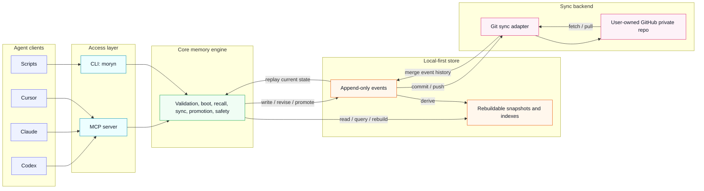

# Moryn Design Spec

Status: Approved for initial design documentation
Date: 2026-05-27

## Summary

Moryn is a personal memory, skill, and soul layer for AI agents. It lets one user run multiple agents across multiple projects while sharing a common operating context. Agents can read relevant context, write session outcomes, propose durable memories, reuse skills, and sync the store across devices.

Moryn is not an agent-specific memory store. Agents are readers and writers. The durable context belongs to the user, projects, topics, and artifacts.

The first version is local-first and syncs through a user-owned GitHub private repository. It uses structured, agent-friendly storage instead of human-oriented note files.

## Goals

- Provide a shared personal context layer for multiple AI agents.
- Support memory, skill, soul, session summary, and agent note records.
- Let agents fetch a small boot context at task start.
- Let agents recall relevant memory and skills on demand.
- Let agents periodically sync and surface only important remote changes.
- Prevent raw agent observations from polluting durable shared memory.
- Sync all stored content across devices through GitHub private repos.
- Keep the core storage format machine-friendly and replayable.
- Avoid requiring embeddings, vector databases, or a cloud service in the first version.

## Non-Goals

- Team or multi-user permission systems.
- Public skill marketplace.
- Full web application.
- Realtime push into an agent's current context.
- Required embedding search.
- Required hosted backend.
- Strong zero-knowledge encryption guarantees.

## Naming

The project name is Moryn.

Moryn is a coined product name that keeps a soft, easy-to-remember feel while avoiding the crowded memory-product naming space. It is broad enough to cover memory, skill, soul, and personal context instead of being limited to agent-specific memory.

Recommended CLI command:

```text
moryn
```

Recommended package name:

```text
@richardyu114/moryn
```

## Product Principles

1. Agent identity is provenance, not ownership.
2. Local storage is the source of runtime availability.
3. GitHub is a sync backend, not the live database.
4. All content written to the Moryn store is syncable by default.
5. Recall is selective even when storage is fully synced.
6. Durable memory requires promotion.
7. Raw session material is useful but should not pollute boot context.
8. The first version must work without semantic embeddings.

## Architecture

Moryn has four layers:

```text
Agent clients
  -> MCP server / CLI
  -> Core memory engine
  -> Local store
  -> GitHub sync adapter
```



### Agent Access Layer

Moryn exposes two first-version entry points:

- MCP server for tool-capable agents.
- CLI for general use, debugging, and agents that can run shell commands.

Both entry points call the same core engine. They must not implement separate memory behavior.

Moryn supports logical updates to memory, skills, and soul records. Those updates are stored as new events instead of in-place edits, so the system keeps an auditable history while still exposing the latest corrected state through snapshots and recall.

### Core Memory Engine

The core engine owns:

- Record validation.
- Event append and replay.
- Logical record revision.
- Boot context generation.
- Recall filtering and ranking.
- Sync cursor evaluation.
- Promotion and state transitions.
- Sensitive content checks.
- Snapshot and index rebuilds.

The core engine treats agent clients as sources. It does not partition memory ownership by agent.

### Local Store

The default store path is:

```text
~/.moryn/
```

The repo under active work may optionally contain:

```text
.moryn.json
```

That file can override project identity, tags, default skills, and sync policy. It is not required.

Recommended local store layout:

```text
~/.moryn/
  config.json
  events/
    <device_id>/
      <yyyy-mm>/
        <event_id>.json
  snapshots/
    user.json
    projects/
      <project_id>.json
    skills/
      index.json
  indexes/
    recall.json
    sync-cursors.json
```

Events are the source of truth. Snapshots and indexes are derived data and can be rebuilt.

### Sync Adapter

The first sync adapter uses Git and GitHub private repos.

The sync adapter owns:

- Remote configuration.
- Fetch and pull.
- Commit and push.
- Local and remote status.
- Event merge.
- Snapshot and index rebuild after merge.

Future adapters can target S3, Supabase, Postgres, or a hosted Moryn service without changing the core record model.

## Project Identity

Project identity resolves in this priority order:

```text
explicit project_id
  > git remote URL hash
  > git repo root path hash
  > current directory name
```

The explicit `project_id` can come from `.moryn.json` or API input.

Git remote URL is preferred across devices because local paths vary.

## Record Model

All durable objects use one record envelope. `kind` and `type` specialize behavior.

Example:

```json
{
  "id": "rec_01h...",
  "kind": "memory",
  "type": "decision",
  "scope": "project",
  "project_id": "moryn",
  "tags": ["sync", "github"],
  "content": {
    "text": "Use GitHub private repos as the first sync backend.",
    "format": "text"
  },
  "state": "canonical",
  "confidence": 0.86,
  "priority": "normal",
  "visibility": "active",
  "created_at": "2026-05-27T00:00:00Z",
  "updated_at": "2026-05-27T00:00:00Z",
  "source": {
    "client": "codex",
    "session_id": "sess_...",
    "model": "gpt-5"
  },
  "provenance": {
    "derived_from": ["rec_..."],
    "reason": "User confirmed the initial sync strategy."
  }
}
```

### Kinds

First-version record kinds:

- `memory`: Facts, decisions, warnings, preferences, and project state.
- `skill`: Reusable workflows, instructions, command declarations, and operating procedures.
- `soul`: Long-term identity, values, collaboration preferences, and working principles.
- `session_summary`: A summary of one agent work session.
- `agent_note`: An agent observation that is useful as source material but not durable memory by default.

### States

States prevent raw or agent-specific observations from polluting shared context:

- `raw`: Original source material.
- `candidate`: Potentially valuable but not fully trusted.
- `canonical`: Durable and returned by default in boot and recall.
- `archived`: Preserved history that is not returned by default.
- `quarantined`: Sensitive, suspicious, conflicting, or low-trust material returned only when explicitly requested.

### Scopes

Supported scopes:

- `global`
- `project`
- `topic`
- `session`
- `artifact`

Scope controls recall boundaries. It does not control whether content is synced.

### Skill Content

Skills can combine procedure text, instructions, commands, and agent-specific adapters.

Example:

```json
{
  "kind": "skill",
  "type": "procedure",
  "content": {
    "purpose": "Release an npm package safely.",
    "instructions": [
      "Check git status.",
      "Run tests.",
      "Update changelog.",
      "Publish only after confirmation."
    ],
    "commands": [
      {
        "name": "test",
        "cmd": "npm test"
      },
      {
        "name": "publish",
        "cmd": "npm publish",
        "requires_confirmation": true
      }
    ],
    "adapters": {
      "codex": {
        "notes": "Use patch-based edits for source changes."
      },
      "claude": {
        "notes": "Use available MCP tools when present."
      }
    }
  }
}
```

Adapter data isolates client behavior. It must not redefine the canonical skill.

## Event Model

All writes append events. Events are immutable facts. Derived views are rebuilt from events.

Moryn still supports modifying records at the logical level. A memory, skill, or soul can be corrected, refined, promoted, archived, or quarantined. Each change appends a new event that references the target record. Replay produces the current state.

Example event:

```json
{
  "event_id": "evt_01h...",
  "op": "upsert_record",
  "record": {
    "id": "rec_01h..."
  },
  "created_at": "2026-05-27T00:00:00Z",
  "source": {
    "client": "codex",
    "device_id": "device_linuxbox"
  }
}
```

Supported first-version operations:

- `upsert_record`
- `revise_record`
- `promote_record`
- `archive_record`
- `quarantine_record`
- `link_records`

Records are not physically deleted in normal operation. Removal is represented through state changes.

Revision event example:

```json
{
  "event_id": "evt_01h...",
  "op": "revise_record",
  "record_id": "rec_01h...",
  "patch": {
    "content.text": "Use GitHub private repos as the first sync backend, with events as the only default synced source of truth.",
    "confidence": 0.92
  },
  "reason": "Clarified sync semantics after review.",
  "created_at": "2026-05-27T00:00:00Z",
  "source": {
    "client": "codex",
    "device_id": "device_linuxbox"
  }
}
```

## MCP Tools and CLI

The MCP server and CLI expose the same semantics.

### `init`

Used to initialize the local Moryn store.

CLI:

```bash
moryn init
```

MCP tool: `init`.

### `project_init`

Used to create or update `.moryn.json`.

CLI:

```bash
moryn project init --path /path/to/project --project-id moryn --default-skill release
```

MCP tool: `project_init`.

### `boot`

Used when an agent starts work, enters a project, or connects to Moryn.

Input:

```json
{
  "project_path": "/path/to/repo",
  "project_id": "optional",
  "current_task": "optional task description",
  "default_skills": ["optional skill selector"]
}
```

Output:

```json
{
  "profile": {
    "user_preferences": [],
    "soul": [],
    "global_rules": []
  },
  "project": {
    "summary": "",
    "tech_stack": [],
    "active_goals": [],
    "important_decisions": [],
    "warnings": []
  },
  "skills": [],
  "task_relevant": [],
  "recent_changes": [],
  "sync": {
    "cursor": "cur_...",
    "remote_has_updates": false
  }
}
```

CLI:

```bash
moryn boot --project . --current-task "fix auth token refresh"
```

CLI `--project` and MCP `project_path` read `.moryn.json`, resolve
`project_id`, and apply configured `default_skills`. MCP hosts can also pass
`project_id` and optional `default_skills` directly. When `current_task` is
provided, boot includes a bounded `task_relevant` list of trusted project
memories that match the task.

### `recall`

Used to retrieve records relevant to a task, file set, tag set, or type.

Input:

```json
{
  "query": "fix auth middleware bug",
  "project_path": "/path/to/repo",
  "project_id": "moryn",
  "files": ["src/auth.ts"],
  "kinds": ["memory", "skill"],
  "types": ["decision", "warning", "procedure"],
  "states": ["canonical"],
  "limit": 10
}
```

Output:

```json
{
  "results": [
    {
      "record": {},
      "score": 0.82,
      "reason": [
        "same_project",
        "tag_match:auth",
        "canonical",
        "recent_warning"
      ]
    }
  ]
}
```

CLI:

```bash
moryn recall "fix auth middleware bug" --project . --kind memory --kind skill
```

Archived and quarantined records are excluded by default. To inspect them,
query by explicit record id with a matching state filter.

### `write`

Used to append a new record.

Input:

```json
{
  "kind": "session_summary",
  "type": "summary",
  "scope": "project",
  "project_path": "/path/to/repo",
  "project_id": "moryn",
  "content": {
    "text": "Completed the initial design discussion."
  },
  "state": "raw",
  "source": {
    "client": "codex"
  }
}
```

CLI:

```bash
moryn write --kind session_summary --project . --text "Completed the initial design discussion."
moryn write --kind memory --type decision --scope project --project . --content-json '{"text":"Structured memory","format":"json","evidence":["cli"]}'
```

CLI callers must provide exactly one of `--text` for text content or
`--content-json` for a structured JSON object. MCP callers must provide
exactly one of `text` or `content`.
For `session_summary` handoffs, CLI and MCP callers may omit `type` and
`scope`; Moryn defaults them to `summary` and `project`. Other record kinds
must provide both fields explicitly.

### `revise`

Used to correct, refine, or extend an existing record without rewriting history. This appends a `revise_record` event and updates the current replayed state.

Input:

```json
{
  "record_id": "rec_...",
  "patch": {
    "content.text": "Use GitHub private repos as the first sync backend, with events as the only default synced source of truth.",
    "confidence": 0.92
  },
  "reason": "Clarified sync semantics after review.",
  "confirmed": false
}
```

CLI:

```bash
moryn revise rec_123 --set confidence=0.92 --reason "Clarified sync semantics after review."
moryn revise rec_123 --set content.text="User-confirmed replacement" --reason "User confirmed conflict resolution" --confirm
```

Canonical revisions that would conflict with existing canonical memory require
explicit confirmation. CLI callers pass `--confirm`; MCP callers pass
`confirmed: true`.

### `refresh`

Used for periodic memory refresh after sync or while an agent is running.

Input:

```json
{
  "project_id": "moryn",
  "cursor": "previous_cursor",
  "current_task": "optional"
}
```

Output:

```json
{
  "cursor": "new_cursor",
  "changes": [
    {
      "record_id": "rec_...",
      "importance": "notice",
      "reason": "current_task_match",
      "summary": "A new project decision was recorded.",
      "recommended_action": "call recall with record_id"
    }
  ],
  "should_interrupt": false
}
```

CLI:

```bash
moryn refresh --project . --cursor previous_cursor --current-task "fix auth"
```

### `sync`

Used for Git-backed startup sync, manual pull, status checks, and push.

CLI:

```bash
moryn sync init git@github.com:yourname/moryn-store.git
moryn sync --status
moryn sync --pull
moryn sync --push
moryn sync --push --message "sync after session"
```

MCP exposes the same sync semantics as separate tools: `sync_init`,
`sync_status`, `sync_pull`, and `sync_push`.

### `agent_guide`

Used as a read-only workflow contract for agent hosts that need exact lifecycle
instructions before acting. It returns the preferred startup entrypoint
(`agent_enter`), a complete CLI command, MCP arguments, lifecycle steps, and
rules that prevent common hallucinated flows such as guessing project ids or
manually composing `sync_pull`, `boot`, and `refresh`. When no project is
provided, non-startup lifecycle templates require `project_id` and include
`--project-id <project_id>` so agents must use the discovery result before
writing status, finishing, or refreshing.

CLI:

```bash
moryn agent guide --project . --sync-remote git@github.com:yourname/moryn-store.git --current-task "fix auth" --agent codex
```

MCP tool: `agent_guide`.

### `agent_enter`

Used as the one-call entrypoint for agents on a new machine or uncertain
project. It runs `agent_doctor` first. If the project is known and safe to
start, it runs `agent_start` and returns boot, refresh, and handoff context. If
the project is unclear but the store has known project records, it returns
`project_list` results with complete `agent_start` command and MCP argument
templates for each project. If the local store is empty and `sync_remote` is
provided, it initializes Git sync and pulls the shared store before choosing
between project discovery and startup. In `discover_projects` mode, each
top-level start action also includes lifecycle templates for status, finish,
and refresh using the selected `project_id`.

CLI:

```bash
moryn agent enter --sync-remote git@github.com:yourname/moryn-store.git --current-task "fix auth" --agent codex
moryn agent enter --project . --sync-remote git@github.com:yourname/moryn-store.git --current-task "fix auth" --agent codex
```

MCP tool: `agent_enter`.

Agents should prefer this when they are entering a project or shared store and
do not know whether they need setup diagnosis, project discovery, or full
startup context. It reduces multi-step orchestration errors by returning a
single `mode`: `start_session`, `discover_projects`, or `needs_setup`. If an
explicit `project_path` does not exist, lifecycle commands return `needs_setup`
with `project_init`; they do not silently derive a new project id from the typo.
If an explicit `project_id` is not present in a populated store, they return
`discover_projects`/`project_list` so the agent selects a known project before
writing lifecycle records. If `project_path` resolves `.moryn.json` with a
different project id than explicit `project_id`, they return a project id
conflict instead of choosing one silently; the setup action keeps `project_path`
and omits the conflicting `project_id`. Direct `agent_start`, `agent_status`, and
`agent_finish` calls reject missing project context in populated stores unless
the current directory resolves through `.moryn.json`; agents should use
`agent_enter` for discovery before writing lifecycle records. Direct lifecycle
calls also classify explicit project mistakes as recoverable structured errors:
`PROJECT_PATH_NOT_FOUND` for a missing `project_path` and
`PROJECT_ID_NOT_FOUND` for a `project_id` that is not known in the populated
store. Their `recommended_action` values point agents to project initialization,
project listing, or corrected retry arguments. These error envelopes also carry
`error.next_action` with `tool`, `command`, `arguments`, and `safe_to_run`, so
agents can recover from the envelope without parsing prose. For
`PROJECT_PATH_NOT_FOUND`, the `next_action.arguments.path` value is the exact
missing path when it can be derived from the error. For `PROJECT_ID_NOT_FOUND`,
`next_action.rejected_arguments.project_id` preserves the rejected id and
`next_action.candidate_project_ids` lists known choices while
`next_action.arguments` remains valid for the target recovery tool.
`PROJECT_CONTEXT_REQUIRED` also includes `candidate_project_ids` when the
populated store can name known projects. When a lifecycle command resolves
project context from `.moryn.json`, its returned `next.actions` are prefilled
with the resolved `project_id` so they can be reused outside the original cwd.

### `agent_doctor`

Used as a read-only setup check for agents on a new machine or unfamiliar
project. It reports local store readiness, project resolution, sync
configuration, and the exact next action to use. If no `project_path` or
`project_id` is provided, the store already has project-scoped records, and
project resolution did not come from `.moryn.json`, it recommends
`project_list` instead of `agent_start`.

CLI:

```bash
moryn agent doctor --project . --sync-remote git@github.com:yourname/moryn-store.git --current-task "fix auth" --agent codex
```

MCP tool: `agent_doctor`.

Agents should call this when they are unsure whether Moryn has been initialized
or connected to the shared sync repo. The command must not initialize stores,
write memory, pull, or push; it is safe to run before asking for approval to
mutate local or remote state. Its `next.actions` includes `list_projects`,
`start_session`, or `run_lifecycle_smoke` templates as appropriate, so agents
can discover a shared project, start, or verify the shared Git path without
inferring commands from prose.

### `project_list`

Used as a read-only project discovery entrypoint for agents that have a Moryn
store but do not know which project to start. It derives project ids from
visible project-scoped records, sorted by recent activity, and returns each
project's latest activity plus a prefilled `agent_start` argument template.

CLI:

```bash
moryn project list
moryn project list --limit 10
moryn project list --current-task "fix auth" --sync-remote git@github.com:yourname/moryn-store.git --agent codex
```

MCP tool: `project_list`.

Agents should call this before `agent_start` when the user references a shared
store but does not provide a project path or project id. `project_list` accepts
optional `current_task`, `sync_remote`, and `agent` fields so each returned
project includes a complete `agent_start` command and MCP argument template.
When surfaced through `agent_enter`, these project actions also carry
post-selection lifecycle templates so agents can continue without reconstructing
commands from prose.

### `agent_start`

Used as the default agent startup entrypoint. It resolves project identity,
pulls remote event history when session sync is enabled, returns `boot` context,
and returns `refresh` changes since an optional cursor.

CLI:

```bash
moryn agent start --project . --current-task "fix auth" --agent codex
moryn agent start --project . --sync-remote git@github.com:yourname/moryn-store.git --current-task "fix auth" --agent codex
moryn agent start --project . --current-task "fix auth" --refresh-since 2026-05-27T00:00:00.000Z --agent gemini
```

MCP tool: `agent_start`.

Agents should prefer this over separately calling `sync_pull`, `boot`, and
`refresh`. If sync is not configured or the remote is unavailable, the command
still returns local boot/refresh context and includes a structured sync error.
When `--sync-remote` or MCP `sync_remote` is provided, `agent_start` creates the
local store if needed and initializes Git sync before pulling. The response also
includes `handoff.inbox` for recent final `session_summary` records from other
sessions and `handoff.active_sessions` for recent `type=status` checkpoints
that have not expired or been superseded by a final summary from the same
agent. Active sessions use a 120-minute window and include `active_until` so
stale status records do not look like live work forever. Each handoff entry
includes the record id, text, originating agent identity, timestamp, and a
recommended action so agents do not have to infer coordination state from
`recent_changes`. The
`next.actions` field returns machine-readable lifecycle templates so agents do
not have to infer follow-up tool calls from prose: each action includes the MCP
tool name, CLI command template, required fields, and prefilled arguments. The
templates include status checkpoints, finish handoff, and refresh context
(`agent_start` with `refresh_since` set to the returned cursor).

### `agent_finish`

Used as the default agent handoff entrypoint. It writes a project-scoped
`session_summary` and pushes remote event history when session sync is enabled.

CLI:

```bash
moryn agent finish --project . --agent codex --summary "Finished auth wiring and left handoff notes."
moryn agent finish --project . --sync-remote git@github.com:yourname/moryn-store.git --agent codex --summary "Finished auth wiring and left handoff notes."
```

MCP tool: `agent_finish`.

Agents should prefer this over separately calling `write` and `sync_push`. The
handoff summary is intentionally visible to the next agent through
`agent_start.refresh.changes` and `boot.recent_changes`. When `--sync-remote`
or MCP `sync_remote` is provided, `agent_finish` creates the local store if
needed and initializes Git sync before writing and pushing the handoff. Its
`next.actions` includes a `start_next_session` template so another agent can
restart through `agent_start` without inferring arguments from prose.

### `agent_status`

Used as the default in-progress agent checkpoint. It writes a project-scoped
`session_summary` with `type=status` and pushes remote event history when
session sync is enabled.

CLI:

```bash
moryn agent status --project . --sync-remote git@github.com:yourname/moryn-store.git --agent codex --current-task "fix auth" --status "Currently tracing auth refresh failures."
```

MCP tool: `agent_status`.

Agents should prefer this over manually composing `write` and `sync_push` for
in-progress coordination. Status records are intentionally visible to the next
agent through `agent_start.refresh.changes` and `boot.recent_changes`, while
remaining distinguishable from final handoffs by `type=status`. Its
`next.actions` includes templates for `finish_session` and `refresh_context`
using the status record timestamp as the next refresh cursor.

### `rebuild`

Used to regenerate snapshots and indexes from event history.

CLI:

```bash
moryn rebuild
```

### `promote`

Used to move records between states.

Input:

```json
{
  "record_id": "rec_...",
  "target_state": "canonical",
  "reason": "User confirmed this as a stable project decision.",
  "confirmed": true
}
```

CLI:

```bash
moryn promote rec_123 --state canonical
moryn promote rec_123 --state canonical --reason "User confirmed high-risk memory" --confirm
```

### `archive`

Used to preserve a record in history while hiding it from default boot and
recall.

CLI:

```bash
moryn archive rec_123 --reason "Superseded"
```

### `quarantine`

Used to mark a record as sensitive, suspicious, conflicting, or unsafe for
default recall.

CLI:

```bash
moryn quarantine rec_123 --reason "Needs review"
```

### `link`

Used to append a relationship from one record to another.

CLI:

```bash
moryn link rec_123 rec_456 --type supersedes
```

### `list_recent`

Used for audit and review.

CLI:

```bash
moryn list-recent --limit 20
```

## Agent Usage Contract

Agents should follow this contract:

1. If the agent does not know the workflow, call `agent_guide` and follow its returned tools, commands, and arguments.
2. On a new machine, fresh store, or uncertain setup, call `agent_enter` first, then follow its `mode` and `next.actions`.
3. If using lower-level tools and the target project is unclear, call `project_list` and use the returned `agent_start` arguments.
4. Pass the shared private Git remote through `--sync-remote` or MCP `sync_remote`.
5. Call `agent_start` at task start.
6. Inspect `agent_start.handoff.active_sessions` before overlapping another agent's work.
7. Inspect `agent_start.handoff.inbox` before continuing from another agent's final handoff.
8. Call `recall` when context is missing or uncertain.
9. Call `agent_status` during meaningful long-running work or before handing off an unfinished thread, then follow `agent_status.next.actions` for finish or refresh.
10. Call the `refresh_context` next action, or call `agent_start` again with a previous cursor, when the user asks to refresh memory.
11. Call `agent_finish` at the end of meaningful work, then expose `agent_finish.next.actions` to the next agent or device.
12. Use `revise` when an existing memory, skill, or soul record needs correction or refinement.
13. Write raw notes as `agent_note`, not canonical memory.
14. Do not promote long-term preferences, soul records, or global skills without user confirmation.
15. Treat sync `interrupt` results as a reason to pause and inspect related records.
16. Run `npm run smoke:agent-lifecycle` before trusting a new machine or sync repo; set `MORYN_AGENT_LIFECYCLE_REMOTE` to validate an actual private Git remote.

Cross-agent handoff depends on the lifecycle commands, not agent awareness of
each other. Codex, Gemini, and other agents can run on separate machines if they
share the same Moryn sync repo: `agent_status` writes in-progress checkpoints,
`agent_finish` writes final session facts, and the next `agent_start`
initializes local state if needed, pulls remote events, and returns relevant
updates through boot, refresh, and the structured handoff inbox.

Moryn cannot force-push new content into a running agent context. Agents or host
applications must call `agent_start`, `refresh`, or `recall`.

The lifecycle smoke script runs the same cross-device protocol through the CLI:
Codex writes a status to one store, Gemini starts from another store and sees
it, Gemini finishes with a handoff, then Codex starts again and sees the
handoff. By default it creates a temporary local bare Git repo. With
`MORYN_AGENT_LIFECYCLE_REMOTE` or `--remote`, it validates the actual Git remote
that agents will share. In a source checkout it runs `src/cli.ts` by default
for fresh clones; in an installed package it automatically uses `dist/cli.js`.
After `npm run build`, pass `--dist` to force built-CLI validation. The smoke
runner itself is plain Node.js so installed packages do not need `tsx`, and
published packages expose it as the direct `moryn-agent-smoke` bin.

## Boot, Recall, and Sync Return Strategy

Moryn returns layered context instead of full history.

### Boot

`boot` returns a small, trusted context package.

Default contents:

- Global canonical soul and user preference summaries.
- Current project canonical summary.
- Current project high-priority decisions, warnings, and blockers.
- Project default skills.
- Recent important change summaries.
- Sync cursor and remote update status.

Default exclusions:

- Large session logs.
- Ordinary raw notes.
- Long history.
- Unrelated global skills.
- Archived or quarantined records.

Target size: 2,000 to 4,000 tokens.

### Recall

`recall` returns ranked candidates with reasons.

Default ranking order:

```text
scope:
  same project > global > topic > other project

state:
  canonical > high-confidence candidate > raw

type:
  blocker/warning > decision > preference > summary > note

task relevance:
  file match > tag match > text match > recency

source:
  user-confirmed > rule-promoted > agent-proposed
```

Default result count: 5 to 20 records.

### Sync

`sync` answers this question:

```text
Since the last cursor, is there anything this agent should notice?
```

Importance levels:

- `silent`: Ordinary raw or session updates.
- `notice`: Current project canonical or high-confidence candidate changes.
- `interrupt`: Current task blocker, warning, conflict, or high-priority decision.

Target size: under 1,000 tokens.

## Write and Promotion Rules

Moryn separates recording from durable promotion.

Default states:

- `session_summary`: `raw` or `candidate`.
- `agent_note`: `raw`.
- `memory`: `candidate`, except low-risk verified project facts.
- `skill`: `candidate`.
- `soul`: requires confirmation before `canonical`.

Allowed automatic canonical cases:

- Project name and path metadata.
- Verified tech stack information.
- User explicitly says to remember something.
- Confirmed project decisions.
- Verified build, test, or run commands.

Required confirmation cases:

- Long-term user preferences.
- Identity, values, or soul records.
- Cross-project skills.
- Security or deployment rules.
- Permission or credential handling rules.
- Any record that conflicts with existing canonical memory.
- Any high-impact agent inference.

Promotion event example:

```json
{
  "state": "canonical",
  "promotion": {
    "method": "user-confirmed",
    "promoted_at": "2026-05-27T00:00:00Z",
    "reason": "User confirmed this as the MVP sync strategy."
  }
}
```

## Sync and Conflict Handling

### Sync Flow

```text
write
  -> append local event
  -> update local snapshot/index
  -> optionally commit

sync pull
  -> git fetch
  -> merge remote events
  -> rebuild affected snapshots/indexes

sync push
  -> commit local events
  -> pull or rebase
  -> push
```

### Event Partitioning

Events are partitioned by device to reduce Git conflicts:

```text
events/
  device_macbook/
    2026-05/
      evt_01.json
  device_linuxbox/
    2026-05/
      evt_02.json
```

Each event is a separate JSON file. Personal scale is small enough that this is practical, and it greatly reduces write conflicts.

### Snapshot and Index Conflicts

Snapshots and indexes are derived. The default Git sync should commit events only. Snapshots and indexes can be rebuilt locally after pull. If a future mode chooses to sync generated snapshots for performance, conflicts must be resolved by rebuilding them from events instead of asking the user to manually resolve generated data.

### Semantic Conflicts

If two records disagree, keep both records and mark the conflict at the memory layer.

Example:

```json
{
  "conflict": {
    "kind": "semantic",
    "with": ["rec_..."],
    "resolution": "needs_review"
  }
}
```

First-version conflict detection can be rule-based:

- Same project.
- Same type.
- High tag overlap.
- Both records are canonical.
- Records update the same subject.

## Sync Modes

Supported modes:

- `manual`: Push only when explicitly requested.
- `session`: Pull at boot and push at session end or explicit sync.
- `interval`: Periodic commit and push.

Default mode:

```text
session
```

## Search Strategy

The first version uses rule-based retrieval with optional semantic search.

Default retrieval stages:

1. Filter by structured fields.
2. Rank by local heuristics.
3. Let the agent inspect returned reasons.

Optional future retrieval:

1. Add embeddings as an index-level feature.
2. Keep events as the source of truth.
3. Do not require embeddings for correctness.

Optional embedding metadata:

```json
{
  "embedding": {
    "provider": "openai",
    "model": "text-embedding-model",
    "vector_id": "vec_..."
  }
}
```

## Privacy and Security

Moryn syncs all stored content by default, so the tool must reduce accidental sensitive writes.

First-version safeguards:

- GitHub private repo is user-owned and user-configured.
- Secret pattern scan before write.
- Sensitive detections default to `quarantined`.
- Quarantined records are excluded from boot and default recall.
- All records include source and provenance.
- Promotion of soul, global skill, and security rules requires confirmation.
- Normal deletion uses archive or quarantine, not destructive deletion.

Important boundary:

GitHub private repos are not zero-knowledge encrypted storage. If secrets enter Git history, removing them later is difficult. Moryn should prevent obvious credentials from entering the event log.

Sensitive patterns to detect:

- API keys and tokens.
- Password fields.
- Private keys.
- Large `.env` content.
- Cookies.
- Authorization headers.

## Error Handling

CLI runtime failures and MCP tool failures return structured JSON errors.
MCP protocol-level validation errors can still be reported by the MCP host
before Moryn tool logic runs.

Example:

```json
{
  "ok": false,
  "error": {
    "code": "SYNC_REMOTE_UNAVAILABLE",
    "message": "Remote sync is unavailable; local store is still usable.",
    "recoverable": true,
    "recommended_action": "continue locally and retry sync later"
  }
}
```

Recoverable project-context errors may include a machine-readable `next_action`
for agents that should not infer the recovery command from prose:

```json
{
  "ok": false,
  "error": {
    "code": "PROJECT_CONTEXT_REQUIRED",
    "message": "Project context required: this store already has known projects (moryn). Run project_list or agent_enter, then retry with project_path/project_id.",
    "recoverable": true,
    "recommended_action": "run moryn project list or moryn agent enter, then retry with --project-id or --project",
    "next_action": {
      "recommended_action": "discover_projects_before_lifecycle_write",
      "tool": "project_list",
      "command": "moryn project list",
      "arguments": {},
      "candidate_project_ids": [
        "moryn"
      ],
      "safe_to_run": true
    }
  }
}
```

Uninitialized store errors also carry a recovery action. The action is
machine-readable but not marked safe to run automatically because `init` writes
local store files:

```json
{
  "ok": false,
  "error": {
    "code": "STORE_NOT_INITIALIZED",
    "message": "Store not initialized",
    "recoverable": true,
    "recommended_action": "run moryn init",
    "next_action": {
      "recommended_action": "initialize_store",
      "tool": "init",
      "command": "moryn init",
      "arguments": {},
      "safe_to_run": false
    }
  }
}
```

Confirmation-required errors carry a retry template only when the failing CLI or
MCP wrapper can pass the original tool context into the error envelope. The
retry action includes `confirmed: true` in arguments and `--confirm` in the CLI
command, but remains `safe_to_run: false` because a user must approve the
promotion or revision first:

```json
{
  "ok": false,
  "error": {
    "code": "CONFIRMATION_REQUIRED",
    "message": "Confirmation required: canonical state requires explicit user confirmation",
    "recoverable": true,
    "recommended_action": "ask the user to confirm before retrying with confirmed=true or --confirm",
    "next_action": {
      "recommended_action": "ask_user_then_retry_with_confirmation",
      "tool": "promote",
      "command": "moryn promote rec_123 --state canonical --confirm",
      "arguments": {
        "record_id": "rec_123",
        "target_state": "canonical",
        "confirmed": true
      },
      "safe_to_run": false
    }
  }
}
```

High-risk canonical writes do not fail. Moryn records them as candidates and
returns a warning with a promotion action for the created candidate, so agents do
not repeat the original write or assume the record became canonical:

```json
{
  "record": {
    "id": "rec_123",
    "state": "candidate"
  },
  "warning": {
    "code": "CONFIRMATION_REQUIRED",
    "reason": "canonical state requires explicit user confirmation",
    "next_action": {
      "recommended_action": "ask_user_then_promote_candidate",
      "tool": "promote",
      "command": "moryn promote rec_123 --state canonical --reason 'User confirmed' --confirm",
      "arguments": {
        "record_id": "rec_123",
        "target_state": "canonical",
        "reason": "User confirmed",
        "confirmed": true
      },
      "safe_to_run": false
    }
  }
}
```

Rebuildable index errors return a safe derived-view rebuild action:

```json
{
  "ok": false,
  "error": {
    "code": "INDEX_STALE",
    "message": "Index stale: rebuild derived views before retrying",
    "recoverable": true,
    "recommended_action": "run moryn rebuild",
    "next_action": {
      "recommended_action": "rebuild_derived_views",
      "tool": "rebuild",
      "command": "moryn rebuild",
      "arguments": {},
      "safe_to_run": true
    }
  }
}
```

Missing sync configuration returns a setup action with a remote placeholder.
Agents must fill the user-owned remote before running it:

```json
{
  "ok": false,
  "error": {
    "code": "SYNC_NOT_CONFIGURED",
    "message": "Sync not configured",
    "recoverable": true,
    "recommended_action": "run moryn sync init <remote>",
    "next_action": {
      "recommended_action": "configure_sync_remote",
      "tool": "sync_init",
      "command": "moryn sync init <remote>",
      "arguments": {
        "remote": "<remote>"
      },
      "safe_to_run": false
    }
  }
}
```

Missing record errors keep the rejected id in metadata and point agents at
recent records before retrying a mutation:

```json
{
  "ok": false,
  "error": {
    "code": "RECORD_NOT_FOUND",
    "message": "Record not found: rec_missing",
    "recoverable": true,
    "recommended_action": "check the record id or call recall/list-recent to find it",
    "next_action": {
      "recommended_action": "list_recent_records_and_retry_with_known_record_id",
      "tool": "list_recent",
      "command": "moryn list-recent",
      "arguments": {},
      "rejected_arguments": {
        "record_id": "rec_missing"
      },
      "safe_to_run": true
    }
  }
}
```

When a direct lifecycle call uses a missing explicit project path, the recovery
action is parameterized from the error message:

```json
{
  "ok": false,
  "error": {
    "code": "PROJECT_PATH_NOT_FOUND",
    "message": "Project path does not exist: /workspace/missing. Run project_init for a new project, or pass the correct project_path/project_id.",
    "recoverable": true,
    "recommended_action": "run moryn project init --path <path> for a new project or retry with the correct --project/--project-id",
    "next_action": {
      "recommended_action": "initialize_project_or_retry_corrected_context",
      "tool": "project_init",
      "command": "moryn project init --path /workspace/missing",
      "arguments": {
        "path": "/workspace/missing"
      },
      "safe_to_run": false
    }
  }
}
```

When a direct lifecycle call uses an unknown project id in a populated store,
the recovery action keeps the `project_list` call arguments valid and puts the
rejected id plus known choices in metadata:

```json
{
  "ok": false,
  "error": {
    "code": "PROJECT_ID_NOT_FOUND",
    "message": "Project id is not known in this store: morym. Run project_list and choose one of: moryn.",
    "recoverable": true,
    "recommended_action": "run moryn project list or moryn agent enter, then retry with a known --project-id",
    "next_action": {
      "recommended_action": "list_projects_and_retry_with_known_project_id",
      "tool": "project_list",
      "command": "moryn project list",
      "arguments": {},
      "rejected_arguments": {
        "project_id": "morym"
      },
      "candidate_project_ids": [
        "moryn"
      ],
      "safe_to_run": true
    }
  }
}
```

First-version error codes:

- `STORE_NOT_INITIALIZED`
- `CONFIRMATION_REQUIRED`
- `INVALID_PROJECT_CONFIG`
- `PROJECT_CONTEXT_REQUIRED`
- `PROJECT_PATH_NOT_FOUND`
- `PROJECT_ID_NOT_FOUND`
- `PROJECT_ID_CONFLICT`
- `INVALID_STORE_CONFIG`
- `INVALID_ARGUMENT`
- `INVALID_RECORD`
- `SENSITIVE_CONTENT_DETECTED`
- `INDEX_STALE`
- `RECORD_NOT_FOUND`
- `SYNC_NOT_CONFIGURED`
- `PERMISSION_DENIED`
- `SYNC_CONFLICT`
- `SYNC_REMOTE_UNAVAILABLE`
- `INTERNAL_ERROR`

Principles:

- Local read and write remain usable when remote sync fails.
- Index damage is recoverable by rebuilding from events.
- Sensitive content does not become canonical by default.
- Git conflicts never overwrite event history automatically.

## Testing Strategy

The first version should test the core engine more heavily than the MCP wrapper.

Unit tests:

- Record schema validation.
- Event append and replay.
- Snapshot rebuild.
- Index rebuild.
- Boot state and scope filtering.
- Recall ranking.
- Sync cursor increments.
- Sensitive content detection.
- Promotion state transitions.
- Archive and quarantine exclusion.

Integration tests:

- Git sync using a temporary local bare repo.
- Pull and merge events from two simulated devices.
- Rebuild generated snapshots after merge.
- CLI commands call the same core engine as MCP tools.

End-to-end scenarios:

1. Agent A writes a session summary. Agent B syncs and receives a notice.
2. Agent A writes a blocker. Agent B is working on a related task and receives an interrupt.
3. Agent A writes a raw note. It does not appear in boot.
4. User promotes a candidate decision. It appears in boot and recall.
5. Remote sync is unavailable. Local boot, recall, and write still work.
6. Agent A calls `agent_finish`; Agent B on another device calls `agent_start` and sees the handoff.

## MVP Success Criteria

The MVP is successful when this flow works:

1. Agent A calls `moryn agent start --project . --sync-remote git@github.com:yourname/moryn-store.git --current-task "..."`.
2. Agent A finishes work and calls `moryn agent finish --project . --sync-remote git@github.com:yourname/moryn-store.git --summary "..."`.
3. The user promotes a project decision to canonical.
4. `agent_finish` pushes events to a GitHub private repo.
5. Agent B enters the same project on another device and calls `moryn agent start --project . --sync-remote git@github.com:yourname/moryn-store.git --current-task "..."`.
6. `agent_start` pulls remote events and returns boot/refresh context.
7. Agent B sees the canonical project decision.
8. A related blocker or warning written by another agent appears as a sync interrupt.

## Implementation Defaults

- Language: TypeScript.
- Runtime: Node.js.
- CLI command: `moryn`.
- Package name: `@richardyu114/moryn`.
- Store path: `~/.moryn`.
- Project config: optional `.moryn.json`.
- Sync backend: GitHub private repo through SSH or user-configured Git credentials.
- Sync mode: `session`.
- Retrieval: rule-based by default, optional embeddings later.

## Open Design Boundaries

These are intentionally deferred beyond the first product version:

- Hosted sync service.
- Public skill marketplace.
- Web UI.
- Encrypted remote storage.
- Semantic conflict resolution through LLMs.
- Required vector search.
- Team sharing and permission models.
