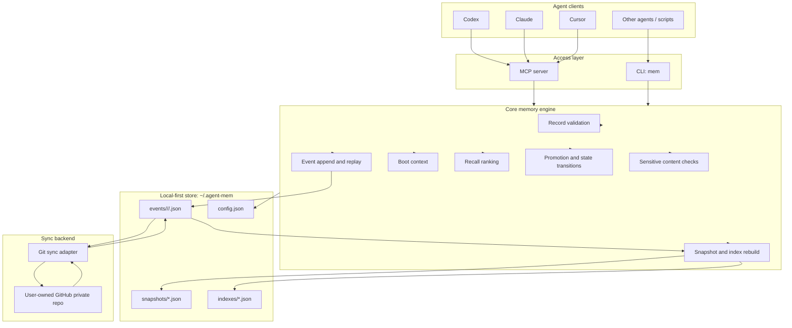

# Memora Design Spec

Status: Approved for initial design documentation
Date: 2026-05-27

## Summary

Memora is a personal memory, skill, and soul layer for AI agents. It lets one user run multiple agents across multiple projects while sharing a common operating context. Agents can read relevant context, write session outcomes, propose durable memories, reuse skills, and sync the store across devices.

Memora is not an agent-specific memory store. Agents are readers and writers. The durable context belongs to the user, projects, topics, and artifacts.

The first version is local-first and syncs through a user-owned GitHub private repository. It uses structured, agent-friendly storage instead of human-oriented note files.

## Goals

- Provide a shared personal context layer for multiple AI agents.
- Support memory, skill, soul, session summary, and agent note records.
- Let agents fetch a small boot context at task start.
- Let agents recall relevant memory and skills on demand.
- Let agents periodically sync and surface only important remote changes.
- Prevent raw agent observations from polluting durable shared memory.
- Sync all stored content across devices through GitHub private repos.
- Keep the core storage format machine-friendly and replayable.
- Avoid requiring embeddings, vector databases, or a cloud service in the first version.

## Non-Goals

- Team or multi-user permission systems.
- Public skill marketplace.
- Full web application.
- Realtime push into an agent's current context.
- Required embedding search.
- Required hosted backend.
- Strong zero-knowledge encryption guarantees.

## Naming

The project name is Memora.

Memora is a coined product name derived from memory and memoria. It is broad enough to cover memory, skill, soul, and personal context instead of being limited to agent-specific memory.

Recommended CLI command:

```text
mem
```

Recommended package name:

```text
memora
```

If a public package namespace conflicts, use a scoped package.

## Product Principles

1. Agent identity is provenance, not ownership.
2. Local storage is the source of runtime availability.
3. GitHub is a sync backend, not the live database.
4. All content written to the Memora store is syncable by default.
5. Recall is selective even when storage is fully synced.
6. Durable memory requires promotion.
7. Raw session material is useful but should not pollute boot context.
8. The first version must work without semantic embeddings.

## Architecture

Memora has four layers:

```text
Agent clients
  -> MCP server / CLI
  -> Core memory engine
  -> Local store
  -> GitHub sync adapter
```



### Agent Access Layer

Memora exposes two first-version entry points:

- MCP server for tool-capable agents.
- CLI for general use, debugging, and agents that can run shell commands.

Both entry points call the same core engine. They must not implement separate memory behavior.

### Core Memory Engine

The core engine owns:

- Record validation.
- Event append and replay.
- Boot context generation.
- Recall filtering and ranking.
- Sync cursor evaluation.
- Promotion and state transitions.
- Sensitive content checks.
- Snapshot and index rebuilds.

The core engine treats agent clients as sources. It does not partition memory ownership by agent.

### Local Store

The default store path is:

```text
~/.agent-mem/
```

The repo under active work may optionally contain:

```text
.agent-mem.json
```

That file can override project identity, tags, default skills, and sync policy. It is not required.

Recommended local store layout:

```text
~/.agent-mem/
  config.json
  events/
    <device_id>/
      <yyyy-mm>/
        <event_id>.json
  snapshots/
    user.json
    projects/
      <project_id>.json
    skills/
      index.json
  indexes/
    recall.json
    sync-cursors.json
```

Events are the source of truth. Snapshots and indexes are derived data and can be rebuilt.

### Sync Adapter

The first sync adapter uses Git and GitHub private repos.

The sync adapter owns:

- Remote configuration.
- Fetch and pull.
- Commit and push.
- Local and remote status.
- Event merge.
- Snapshot and index rebuild after merge.

Future adapters can target S3, Supabase, Postgres, or a hosted Memora service without changing the core record model.

## Project Identity

Project identity resolves in this priority order:

```text
explicit project_id
  > git remote URL hash
  > git repo root path hash
  > current directory name
```

The explicit `project_id` can come from `.agent-mem.json` or API input.

Git remote URL is preferred across devices because local paths vary.

## Record Model

All durable objects use one record envelope. `kind` and `type` specialize behavior.

Example:

```json
{
  "id": "rec_01h...",
  "kind": "memory",
  "type": "decision",
  "scope": "project",
  "project_id": "memora",
  "tags": ["sync", "github"],
  "content": {
    "text": "Use GitHub private repos as the first sync backend.",
    "format": "text"
  },
  "state": "canonical",
  "confidence": 0.86,
  "priority": "normal",
  "visibility": "active",
  "created_at": "2026-05-27T00:00:00Z",
  "updated_at": "2026-05-27T00:00:00Z",
  "source": {
    "client": "codex",
    "session_id": "sess_...",
    "model": "gpt-5"
  },
  "provenance": {
    "derived_from": ["rec_..."],
    "reason": "User confirmed the initial sync strategy."
  }
}
```

### Kinds

First-version record kinds:

- `memory`: Facts, decisions, warnings, preferences, and project state.
- `skill`: Reusable workflows, instructions, command declarations, and operating procedures.
- `soul`: Long-term identity, values, collaboration preferences, and working principles.
- `session_summary`: A summary of one agent work session.
- `agent_note`: An agent observation that is useful as source material but not durable memory by default.

### States

States prevent raw or agent-specific observations from polluting shared context:

- `raw`: Original source material.
- `candidate`: Potentially valuable but not fully trusted.
- `canonical`: Durable and returned by default in boot and recall.
- `archived`: Preserved history that is not returned by default.
- `quarantined`: Sensitive, suspicious, conflicting, or low-trust material returned only when explicitly requested.

### Scopes

Supported scopes:

- `global`
- `project`
- `topic`
- `session`
- `artifact`

Scope controls recall boundaries. It does not control whether content is synced.

### Skill Content

Skills can combine procedure text, instructions, commands, and agent-specific adapters.

Example:

```json
{
  "kind": "skill",
  "type": "procedure",
  "content": {
    "purpose": "Release an npm package safely.",
    "instructions": [
      "Check git status.",
      "Run tests.",
      "Update changelog.",
      "Publish only after confirmation."
    ],
    "commands": [
      {
        "name": "test",
        "cmd": "npm test"
      },
      {
        "name": "publish",
        "cmd": "npm publish",
        "requires_confirmation": true
      }
    ],
    "adapters": {
      "codex": {
        "notes": "Use patch-based edits for source changes."
      },
      "claude": {
        "notes": "Use available MCP tools when present."
      }
    }
  }
}
```

Adapter data isolates client behavior. It must not redefine the canonical skill.

## Event Model

All writes append events. Events are immutable facts. Derived views are rebuilt from events.

Example event:

```json
{
  "event_id": "evt_01h...",
  "op": "upsert_record",
  "record": {
    "id": "rec_01h..."
  },
  "created_at": "2026-05-27T00:00:00Z",
  "source": {
    "client": "codex",
    "device_id": "device_linuxbox"
  }
}
```

Supported first-version operations:

- `upsert_record`
- `promote_record`
- `archive_record`
- `quarantine_record`
- `link_records`

Records are not physically deleted in normal operation. Removal is represented through state changes.

## MCP Tools and CLI

The MCP server and CLI expose the same semantics.

### `boot`

Used when an agent starts work, enters a project, or connects to Memora.

Input:

```json
{
  "project_path": "/path/to/repo",
  "project_id": "optional",
  "client": "codex",
  "current_task": "optional task description"
}
```

Output:

```json
{
  "profile": {
    "user_preferences": [],
    "soul": [],
    "global_rules": []
  },
  "project": {
    "summary": "",
    "tech_stack": [],
    "active_goals": [],
    "important_decisions": [],
    "warnings": []
  },
  "skills": [],
  "recent_changes": [],
  "sync": {
    "cursor": "cur_...",
    "remote_has_updates": false
  }
}
```

CLI:

```bash
mem boot --project .
```

### `recall`

Used to retrieve records relevant to a task, file set, tag set, or type.

Input:

```json
{
  "query": "fix auth middleware bug",
  "project_id": "memora",
  "files": ["src/auth.ts"],
  "kinds": ["memory", "skill"],
  "types": ["decision", "warning", "procedure"],
  "limit": 10
}
```

Output:

```json
{
  "results": [
    {
      "record": {},
      "score": 0.82,
      "reason": [
        "same_project",
        "tag_match:auth",
        "canonical",
        "recent_warning"
      ]
    }
  ]
}
```

CLI:

```bash
mem recall "fix auth middleware bug" --project . --kind memory --kind skill
```

### `write`

Used to append a new record.

Input:

```json
{
  "kind": "session_summary",
  "type": "summary",
  "scope": "project",
  "project_id": "memora",
  "content": {
    "text": "Completed the initial design discussion."
  },
  "state": "raw",
  "source": {
    "client": "codex"
  }
}
```

CLI:

```bash
mem write --kind session_summary --project . --text "Completed the initial design discussion."
```

### `sync`

Used for startup sync, periodic sync, manual fetch, pull, and push.

Input:

```json
{
  "project_id": "memora",
  "cursor": "previous_cursor",
  "current_task": "optional",
  "mode": "check"
}
```

Output:

```json
{
  "cursor": "new_cursor",
  "changes": [
    {
      "record_id": "rec_...",
      "importance": "notice",
      "summary": "A new project decision was recorded.",
      "recommended_action": "call recall with record_id"
    }
  ],
  "should_interrupt": false
}
```

CLI:

```bash
mem sync --project . --mode check
mem sync --project . --pull
mem sync --push
```

### `promote`

Used to move records between states.

Input:

```json
{
  "record_id": "rec_...",
  "target_state": "canonical",
  "reason": "User confirmed this as a stable project decision."
}
```

CLI:

```bash
mem promote rec_123 --state canonical
mem promote rec_123 --state archived
```

### `list_recent`

Used for audit and review.

CLI:

```bash
mem list-recent --project . --limit 20
```

## Agent Usage Contract

Agents should follow this contract:

1. Call `boot` at task start.
2. Call `recall` when context is missing or uncertain.
3. Call `sync` periodically or when the user asks to refresh memory.
4. Write a `session_summary` at the end of meaningful work.
5. Write raw notes as `agent_note`, not canonical memory.
6. Do not promote long-term preferences, soul records, or global skills without user confirmation.
7. Treat sync `interrupt` results as a reason to pause and inspect related records.

Memora cannot force-push new content into a running agent context. Agents or host applications must call sync or recall.

## Boot, Recall, and Sync Return Strategy

Memora returns layered context instead of full history.

### Boot

`boot` returns a small, trusted context package.

Default contents:

- Global canonical soul and user preference summaries.
- Current project canonical summary.
- Current project high-priority decisions, warnings, and blockers.
- Project default skills.
- Recent important change summaries.
- Sync cursor and remote update status.

Default exclusions:

- Large session logs.
- Ordinary raw notes.
- Long history.
- Unrelated global skills.
- Archived or quarantined records.

Target size: 2,000 to 4,000 tokens.

### Recall

`recall` returns ranked candidates with reasons.

Default ranking order:

```text
scope:
  same project > global > topic > other project

state:
  canonical > high-confidence candidate > raw

type:
  blocker/warning > decision > preference > summary > note

task relevance:
  file match > tag match > text match > recency

source:
  user-confirmed > rule-promoted > agent-proposed
```

Default result count: 5 to 20 records.

### Sync

`sync` answers this question:

```text
Since the last cursor, is there anything this agent should notice?
```

Importance levels:

- `silent`: Ordinary raw or session updates.
- `notice`: Current project canonical or high-confidence candidate changes.
- `interrupt`: Current task blocker, warning, conflict, or high-priority decision.

Target size: under 1,000 tokens.

## Write and Promotion Rules

Memora separates recording from durable promotion.

Default states:

- `session_summary`: `raw` or `candidate`.
- `agent_note`: `raw`.
- `memory`: `candidate`, except low-risk verified project facts.
- `skill`: `candidate`.
- `soul`: requires confirmation before `canonical`.

Allowed automatic canonical cases:

- Project name and path metadata.
- Verified tech stack information.
- User explicitly says to remember something.
- Confirmed project decisions.
- Verified build, test, or run commands.

Required confirmation cases:

- Long-term user preferences.
- Identity, values, or soul records.
- Cross-project skills.
- Security or deployment rules.
- Permission or credential handling rules.
- Any record that conflicts with existing canonical memory.
- Any high-impact agent inference.

Promotion event example:

```json
{
  "state": "canonical",
  "promotion": {
    "method": "user-confirmed",
    "promoted_at": "2026-05-27T00:00:00Z",
    "reason": "User confirmed this as the MVP sync strategy."
  }
}
```

## Sync and Conflict Handling

### Sync Flow

```text
write
  -> append local event
  -> update local snapshot/index
  -> optionally commit

sync pull
  -> git fetch
  -> merge remote events
  -> rebuild affected snapshots/indexes

sync push
  -> commit local events
  -> pull or rebase
  -> push
```

### Event Partitioning

Events are partitioned by device to reduce Git conflicts:

```text
events/
  device_macbook/
    2026-05/
      evt_01.json
  device_linuxbox/
    2026-05/
      evt_02.json
```

Each event is a separate JSON file. Personal scale is small enough that this is practical, and it greatly reduces write conflicts.

### Snapshot and Index Conflicts

Snapshots and indexes are derived. The default Git sync should commit events only. Snapshots and indexes can be rebuilt locally after pull. If a future mode chooses to sync generated snapshots for performance, conflicts must be resolved by rebuilding them from events instead of asking the user to manually resolve generated data.

### Semantic Conflicts

If two records disagree, keep both records and mark the conflict at the memory layer.

Example:

```json
{
  "conflict": {
    "kind": "semantic",
    "with": ["rec_..."],
    "resolution": "needs_review"
  }
}
```

First-version conflict detection can be rule-based:

- Same project.
- Same type.
- High tag overlap.
- Both records are canonical.
- Records update the same subject.

## Sync Modes

Supported modes:

- `manual`: Push only when explicitly requested.
- `session`: Pull at boot and push at session end or explicit sync.
- `interval`: Periodic commit and push.

Default mode:

```text
session
```

## Search Strategy

The first version uses rule-based retrieval with optional semantic search.

Default retrieval stages:

1. Filter by structured fields.
2. Rank by local heuristics.
3. Let the agent inspect returned reasons.

Optional future retrieval:

1. Add embeddings as an index-level feature.
2. Keep events as the source of truth.
3. Do not require embeddings for correctness.

Optional embedding metadata:

```json
{
  "embedding": {
    "provider": "openai",
    "model": "text-embedding-model",
    "vector_id": "vec_..."
  }
}
```

## Privacy and Security

Memora syncs all stored content by default, so the tool must reduce accidental sensitive writes.

First-version safeguards:

- GitHub private repo is user-owned and user-configured.
- Secret pattern scan before write.
- Sensitive detections default to `quarantined`.
- Quarantined records are excluded from boot and default recall.
- All records include source and provenance.
- Promotion of soul, global skill, and security rules requires confirmation.
- Normal deletion uses archive or quarantine, not destructive deletion.

Important boundary:

GitHub private repos are not zero-knowledge encrypted storage. If secrets enter Git history, removing them later is difficult. Memora should prevent obvious credentials from entering the event log.

Sensitive patterns to detect:

- API keys and tokens.
- Password fields.
- Private keys.
- Large `.env` content.
- Cookies.
- Authorization headers.

## Error Handling

All interfaces return structured errors.

Example:

```json
{
  "ok": false,
  "error": {
    "code": "SYNC_REMOTE_UNAVAILABLE",
    "message": "Remote sync is unavailable; local store is still usable.",
    "recoverable": true,
    "recommended_action": "continue_with_local_context"
  }
}
```

First-version error codes:

- `STORE_NOT_INITIALIZED`
- `INVALID_RECORD`
- `SENSITIVE_CONTENT_DETECTED`
- `SYNC_REMOTE_UNAVAILABLE`
- `SYNC_CONFLICT`
- `INDEX_STALE`
- `PERMISSION_DENIED`

Principles:

- Local read and write remain usable when remote sync fails.
- Index damage is recoverable by rebuilding from events.
- Sensitive content does not become canonical by default.
- Git conflicts never overwrite event history automatically.

## Testing Strategy

The first version should test the core engine more heavily than the MCP wrapper.

Unit tests:

- Record schema validation.
- Event append and replay.
- Snapshot rebuild.
- Index rebuild.
- Boot state and scope filtering.
- Recall ranking.
- Sync cursor increments.
- Sensitive content detection.
- Promotion state transitions.
- Archive and quarantine exclusion.

Integration tests:

- Git sync using a temporary local bare repo.
- Pull and merge events from two simulated devices.
- Rebuild generated snapshots after merge.
- CLI commands call the same core engine as MCP tools.

End-to-end scenarios:

1. Agent A writes a session summary. Agent B syncs and receives a notice.
2. Agent A writes a blocker. Agent B is working on a related task and receives an interrupt.
3. Agent A writes a raw note. It does not appear in boot.
4. User promotes a candidate decision. It appears in boot and recall.
5. Remote sync is unavailable. Local boot, recall, and write still work.

## MVP Success Criteria

The MVP is successful when this flow works:

1. Agent A calls `mem boot --project .`.
2. Agent A finishes work and writes a session summary plus candidate memory.
3. The user promotes a project decision to canonical.
4. `mem sync --push` pushes events to a GitHub private repo.
5. Another device runs `mem sync --pull`.
6. Agent B enters the same project and calls `boot`.
7. Agent B sees the canonical project decision.
8. A related blocker or warning written by another agent appears as a sync interrupt.

## Implementation Defaults

- Language: TypeScript.
- Runtime: Node.js.
- CLI command: `mem`.
- Package name: `memora` or a scoped package if needed.
- Store path: `~/.agent-mem`.
- Project config: optional `.agent-mem.json`.
- Sync backend: GitHub private repo through SSH or user-configured Git credentials.
- Sync mode: `session`.
- Retrieval: rule-based by default, optional embeddings later.

## Open Design Boundaries

These are intentionally deferred beyond the first implementation plan:

- Hosted sync service.
- Public skill marketplace.
- Web UI.
- Encrypted remote storage.
- Semantic conflict resolution through LLMs.
- Required vector search.
- Team sharing and permission models.
